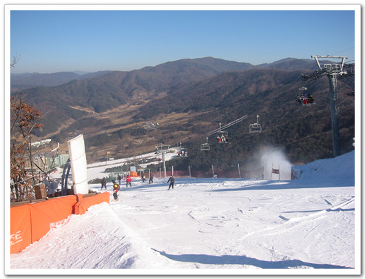

# 올해 두번째 간 스키장

작년까지는 매주마다 스키장을 갔었는데, 올해는 아직 한번밖에 못 갔었다.

용평 개장하던 주에 가서 당초예상했던 리프트권 안 끊고 걸어올라가 타는 것이 아닌, 리트권을 끊는 바람에, 1시간씩 줄 서느라 지쳐, 4번밖에 못타고 서울로 복귀했었지요.

이번엔 성우. 작년에 서울리조트에서 같이 한번 탔던 정용익 부부와 함께 성우에서 타기로 했지요.

내 명차에 탈 사람은 여자친구와 심상민.

스키장 갈 때면 항상 그랬던 것 처럼 새벽 3시에 일어나 세면세족을 한 후, 심상민과 여자친구를 깨우고 출발을 했다. 심상민이 신당동이기에 그 쪽으로 가는데, 청계천 복원공사로 길이 조금 바뀌어있었다. 그래서 잘못 들어선게 내부순환로. 한번 들어서니 내려가는 게 없이 홍제동까지 가서 내려왔다. 상민이를 태운 시각은 4시 반.

여자친구는 기껏 깨웠더니만, 감기걸려 못간다는 전화가 와, 상민이만 태우고 갔다. 도로는 6번 국도.

둔내에 도착한 시각 7시. 해장국을 먹은 후, 성우에 들어서니 7시 반. 성우가 새벽스키를 안 하는 탓에 8시 반에야 개장을 하더군요. 잠시 30분 차에서 취침을 한 후, 장비 착용 후, 보딩 개시.

토요일이라 사람이 많을 줄 알았는데, 예년에 비해, 사람이 별로 없더군요. 리프트도 한 5분정도만 기다리면 탈 수 있더라구요..

[null](../6166947.html#6166947_1)

