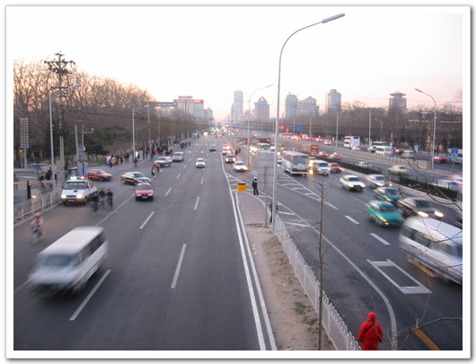

# 북경 자전거는 보이지 않았다

마지막 황제의 마지막 장면쯤에서 4차선 도로를 가득 메운 자전거가 있었다. 그곳에 푸이 역시 자전거를 타고 있었다.

그리고 영화 북경자전거에서는 자전거를 뺏기기 않기 위해 날라오는 발길질을 온 몸으로 다 막아내어 결국 자전거를 지켜내고 절뚝거리는 몸으로 큰 도로에 나섰을 때 그곳엔 큰 빌딩들과 씽씽 달리는 차들이 있을 뿐 더 이상 자전거가 도로의 주인이 아니었던 장면이 이곳 북경에 와보니, 느껴지는군요.

자전거 전용 도로가 있지만, 그곳 역시 자동차가 어느새인가 점거를 해 버렸구나 하는 생각이 드네요.

[null](../6166948.html#6166948_1)

