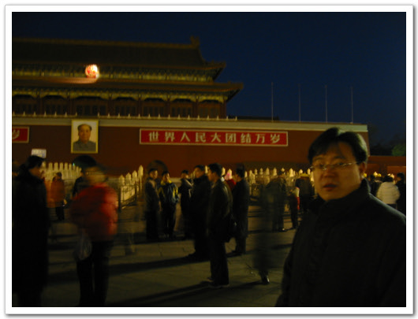

# 천안문 국기게양식의 사람구경을 가다

천안문광장의 국기 게양식을 보기 위해, 아침 일찍 호텔에서 나갔지요.

일출시간에 맞춰 게양식을 한다고 하여, 호텔에서 6시에 출발을 했습니다.

사실 이 국기 게양식보다는 하강식이 더 유명하다고 하더라구요.

한비야의 중국견문록인가에서 읽은 것 같은데, 중국 곳곳의 촌로들이 이 국기하강식을 보기 위해, 북경으로 온다고들 합니다. 그 사람들로서는 그 큰 땅덩어리니까, 우리가 다른 나라 가는 거랑 별 다를 바가 없겠죠. 서안에서 기차타고 올려면, 일주일 넘게 걸리기도 하니까요.

천안문 광장에 도착한 시간이 6시 반. 그때부터 제법 많은 사람들이 있더군요. 곧 국기게양식이 있을 줄 알았는데, 한참 후인 7시 반에야 게양식을 하더군요. 7시까지는 천안문광장 출입이 통제되어 있어, 그 때까지 천안문광장에는 지키는 군인들밖에 없었는데, 7시쯤에서 천안문광장을 개방하니, 물밑듯이 사람이 쏟아져, 순식간에 천안문 광장을 채우는게 기억이 남네요..

앗! 그런데, 이 꼭두새벽에 정성두씨는 천안문에 왠일이지?

