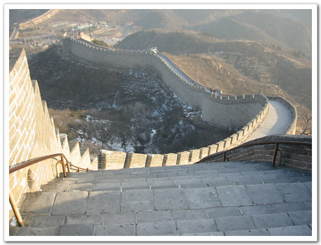

# 만리장성의 깔딱고개

북경에 와서 만리장성을 못 보면 안되지..

새벽 일찍 일어나, 만리장성이 있는 빠다링으로 향했지요.

덕성문에서 12원주고 919번 버스를 타습니다.

6시 50분쯤에 버스를 타고, 빠다링창청에 도착하니, 8시 20분.

꽤 먼거리군요.

빠다링창청의 왼쪽편에 올라가서 내려다보며 찍은 겁니다. 여행안내책에는 이 부분이 깔딱고개라 하더군요. 위에 보면, 계단 밑이 보이지 않는.. 경사가 꽤 되죠?

이 가파른 장성을 지어올린 그 시대 사람들이 새삼 안쓰럽더군요.

[null](../6166954.html#6166954_1)

