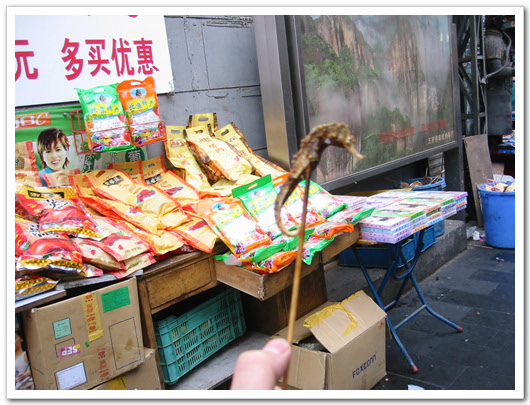

# 해마 꼬치구이

베이징 왕푸징의 명물, 꼬치구이 거리.

그 중에서도 가장 특색있던 것이, 바로 이 해마구이와 전갈구이더군요.

그래서, 한번 해마는 어떤 맛일까 하여 해마 한마리를 골랐습니다.

다른 꼬치들은 2원,3원 이렇게 적혀 있길래 이것도 2원정도 하겠구나 하고 골랐는데, 상당히 비싸더군요. 가격표가 잘 보이는곳에 붙어 있었는데, 자그만치 15원. 우리돈 2000원이죠. 기껏해야 5cm 밖에 안되는 건데, 15원씩이나 하다니... 그래서, 해마밖에 못 먹고, 전갈은 다음 기회로 돌렸습니다.

바싹 튀겨서 그런가, 그냥 별 맛은 없더군요. 그냥 튀김맛.

[null](../6166955.html#6166955_1)

