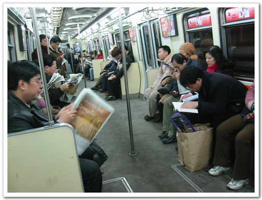

# 북경 지하철

북경 지하철안의 풍경입니다.

시간은 출근시간. 우리랑 별 다를 바 없는 풍경이지요.

신문보는 사람, 책 읽는 사람, 자는 사람등등..

북경에는 지하철이 두개 있지요.

1호선과 순환선.

만들어지기로는 우리보다 먼저인 50년대에 만들어졌다고 하는데, 그 이후 별 진전이 없어, 지금은 낙후된 모습이더군요.

요금은 3원(우리돈 500원정도)인데, 티켓은 종이로 되어 있고, 들어갈 때 티켓을 개표원에게 주면 되는 거더군요.

[null](../6166956.html#6166956_1)

