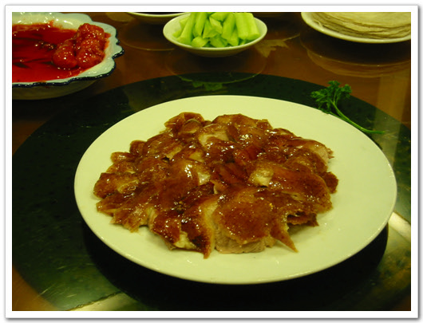

# 북경에서 먹어본 북경오리

북경오리, 본토발음으로 베이징카오야.

이것을 중국 출장 8번째만에 먹어보게 되었습니다.

요리하는데 걸리는 시간 50분. 물론 그 동안 마냥 기다린 것은 아니고, 다른 음식들을 먹고 있었지요.

껍질이 바짝구워져, 기름지면서도 고소한 맛이 일품이더군요.

북경오리 이게 살을 먹는게 아니라, 주로 껍질을 먹는 거라, 접시에 담겨온 것은 별로 많아 보이지 않았는데, 기름져서 그런가, 5명이며 다 못 먹고 남겼지요. 물론 전에 다른 음식으로 배를 채워서 그렇기도 하지만요..

[null](../6166958.html#6166958_1)

