# 대만 타이난에서의 마지막 날

10시 반에 타이난으로 이동하기로 하였다. 다른 사람들도 오늘은 조금 늦게 일어나기로 했다. 난 7시에 일어났다. 혼자 움직일 수 있는 이 기회를 놓치지 않기 위해.. 아침을 먹고 무작정 밖으로 나갔다. 이곳 까오슝에서 대해서는 아무 정보가 없었다. 호텔에도 까오슝 지도 복사한 것 밖에 없고, 그 밖에 정보가 없었다. 웹사이트를 뒤져봐도, 까우슝에서 대한 정보는 안보이더군. 그래서 어디가 번화가이고, 구경할 게 있는지는 몰라, 그냥 도보로 호텔 주위만 탐색하기로 했다.

-이곳 citizen호텔의 아침식사. 별로 맛은 없는 편이다.

호텔에서 뒤쪽으로 초등학교가 있었다. 학교 건물모양은 우리와 다르게 지어져 있더군. 우리의 학교모양이 일제시대 그 모양 그대로 가서인가 보다.

-이게 초등학교로 보이는 학교 정문

-청소시간인지 웬 얼라가 쓰레기 치우고 있더군.

호텔 주위는 별로 번화가같아 보이지는 않았다. 분위기는 그냥 청계천정도 되어 보이고, 전자제품 판매점들은 많이 보였다.

-왼쪽에 보이는 것이 호텔 바로 뒤에 있는 농산물 상가

-호텔주위의 모습들

월요일 아침이면 우리 같으면, 엄청난 정체가 있겠지만, 여기는 그런 것은 없어보였다. 차가 우리보다 없어서 그런가 아니면 다른 이유가 있는 지는 모르겠다.

-주차금지를 나타내는 표지, 停

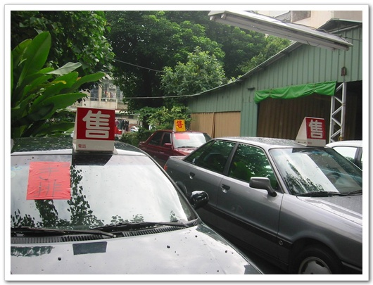

-차 위에 올려져 있는 푯말은 뭔지 모르겠다. 주차중인이란 소리인가?

대륙은 자전거가 주를 이루는 방면, 이곳은 자전거는 그다지 보이지 않고, 스쿠터가 많이 보인다. 치마입고 스쿠터 젊은 여자들이 많아 보기 좋더군.

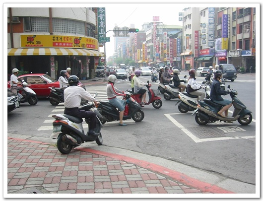

-신호를 기다리는 스쿠터들

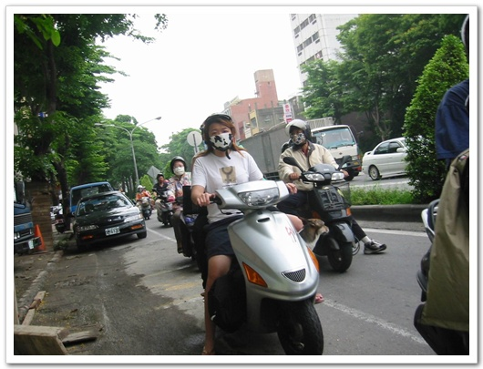

-마스크로 사스를 막고자하는 여인네

-택시의 명칭은 대륙과 마찬가지로 出租汽車를 쓰더군

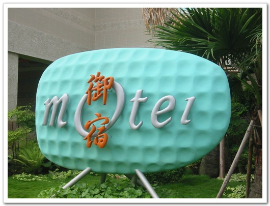

-모텔도 보이고..

-쌍용자동차도 보이는군

집에서 밥을 해 먹지 않고, 거의 밖에서 사 먹는 나라나, 식당이 참 많다. 그리고 식당이 우리처럼 점심부터 시작하는 것이 아니라, 아침부터 하나 보다. 그래서 아침에 이렇게 식당에서 아침을 먹는 사람들이 많다.

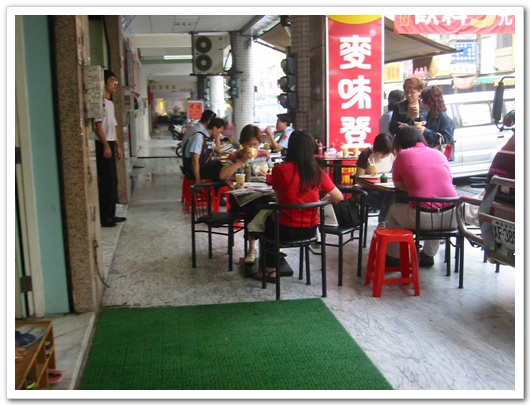

-아침먹는 사람들

-이거는 문구점같은데,. 저게 무슨 글자인지는 모르겠다.

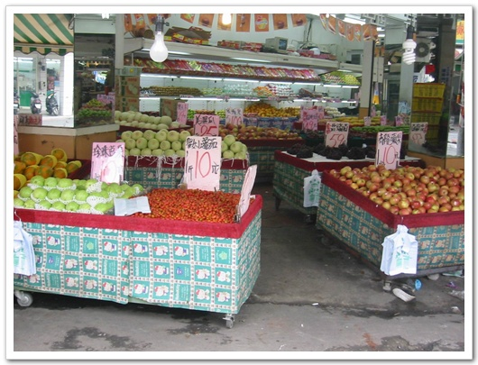

-과일 가게다. 사과가 10원, 우리돈으로 350원 정도 하는군. 우리보다 쪼금 싼 것 같군.

-맨발로 점포 앞을 청소하는 아저씨

-주차장앞의 청소원. 월주차료가 2500원, 우리돈으로 9만원. 엄청 비싸군.

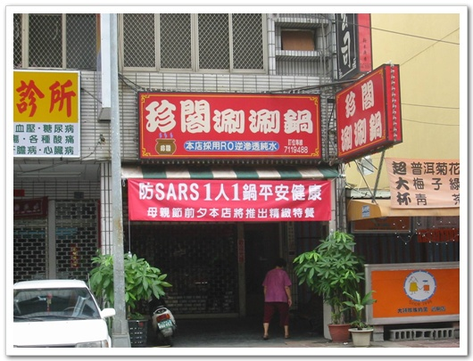

-뭔소리지는 모르겠지만, 사스때문에 뭐한다는 소리인가?

공원을 발견했다. 월요일 아침이라 그런가, 공원에는 거의 사람이 없었고, 있는 사람도 할아버지 할머니 몇명만 있더군. 공원에는 자전거, 오토바이, 애완동물 출입이 금지였고, 출입구 자체를 자전거가 못 들어가게 만들어 놨더군.

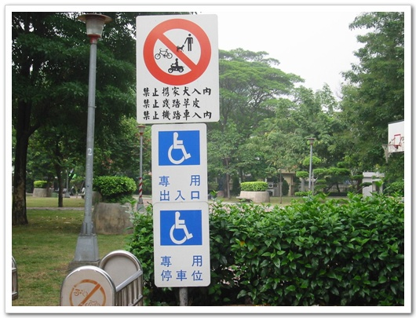

-출입금지 대상

-한산한 공원

-놀이기구에서 쉬고있는 노인

-공원 끝자락엔 할머니들이 조금 있군.

-편의점을 대만에서는 편리점이라고 사용한다.

정말 더운 날씨더군. 후덥찌근한게, 피부가 찐득찐득하다. 이렇게 해서 호텔 주위 반경 3km 정도을 도보로 탐색했다. 탐색시간 한시간 반. 호텔로 들어와 샤워를 하고 나갈 준비를 했다.

10시반에 출발하기로 했는데, 오늘도 사람들이 느긋하다. 10시 40분쯤 되었나? 미셜한테서 왜 안 내려오느냐는 전화를 받았다. 스티븐의 방에 가니 짐 챙기고 있었다. 출발시간 11시쯤 되었다. 도로를 따라, 테스트를 시작했다.

중간에 또 우리의 재밌는 운전사 피터가 차를 세운 곳은 바로 이곳. 사람은 아무도 없었다.

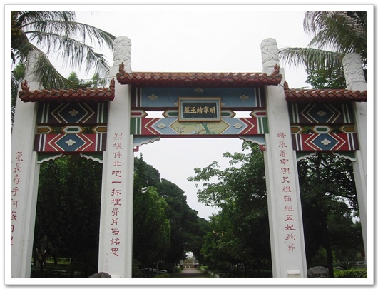

-명나라때 무슨 묘인가 보던데, 타이완이 명대에 중국에 복속되었다고 하니, 그거랑 관련있을려나?

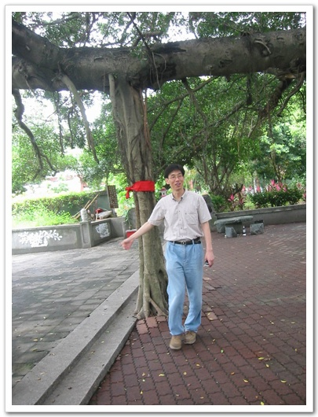

-묘 앞에 있는 신기하게 생긴 나무. 왠 줄기가 땅 밑으로 뻗어있지?

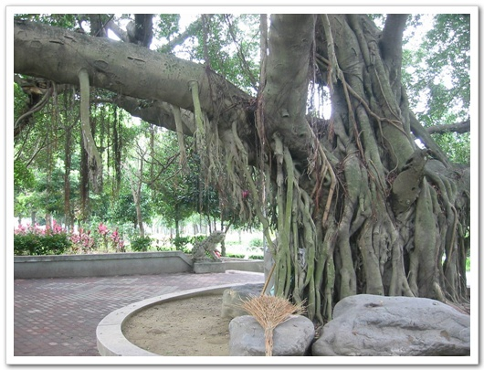

-어째 다른 줄기들도 위로 향하지 않고, 밑을 향한다.

-이 신기한 나무의 행동에 대해 심도깊은 토의를 하고 있는 네 사람

-무덤을 지키고 조각상. 구슬만 시뻘겋게 색칠을 해놨다.

다시 테스트를 시작했다. 지나가면서 보니, 대만에는 이런게 많았다. 중국에서도 몇번 보기는 했었지만.. 무슨 양식장 같다. 저 왼쪽을 물을 돌리는 것은 아마도 양식장에 산소를 공급하기 위해, 물을 공기에 접촉시키는 게 아닐 까 싶다.

-추측상, 양식장

1시. 점심 먹을 때가 된다. 하루 세끼를 기름진 것으로 먹다보니, 밥 때가 되어도 배가 고프지는 않았다. 오늘의 점은 피터가 타이난시에서 조금 떨어진 해변가라고 한 곳. 시장같은 것이 있었다. 여기서 점심 꺼리를 골랐다.

-인상좋은 주인 아저씨

-이것 저것을 고르고

-맛있는 것을 보고 흡족해하는 피터. 큰멸치튀김, 게튀김, 오뎅튀김, 오징어튀김, 명태알튀김, 새우튀김, 소라 등이 있었다.

마실 것도 옆에서 샀다.

-나와 스티븐은 맨 왼쪽 꺼, 아트는 두번째 것을 골랐다.

-이 음료수의 성분이 뭔지를 물어보는 아트

-나와 스티븐이 고른 것은 올챙이 알이다

-더 자세히 보면 이렇다. 맛있게 생겼군..

-바다가 보이는 이 곳에 앉아 먹기로 했다. 낚시하고 있는 아저씨에게 피터가 여기 어디냐고 물어보니, 아직 까오슝이라고 하더군.

-뭐 떡고물 없나 우리 옆에서 기대하고 있는 개

아까 산 것들을 먹기 시작하는데, 마침 순두부파는 아저씨가 지나갔다. 그래서 샀다.

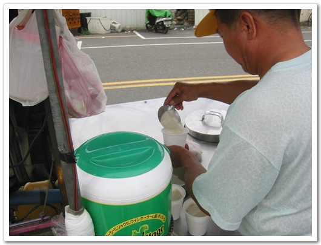

-순두부, 우리처럼 간장이 아닌 달짝찌근한 소스에 먹었다.

-맛있게 먹는 모습

점심을 먹고나서, 또 이동을 시작했다. 해안 도로를 따라 쭉 올라가는 길이다. 바다가 보이는 경치는 좋았지만, 내가 앉은 자리가 그쪽이 아니어서 사진에 닮을 수가 없었다. 오른쪽에 보이는 것. 공동묘지 같았다.

-대만인들은 묘지를 이렇게 평지에 쓰나 보다.

1시쯤 간 후, 근처 유적지에서 잠깐 화장실에 들르기로 했다. 날씨가 더워서 그런가, 돌아다니는 사람은 없었다.

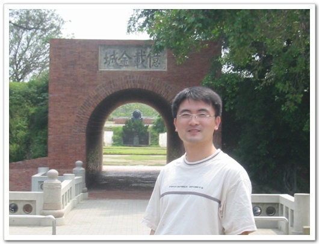

-그냥 한번 찍었봤는데, 왜 이리 살이 쩠나? 맛기행을 하다 보니, 살만 피둥피둥 찌는구나.

날씨가 맑아, 오늘 드디어 그저께 보았다 장면을 선명하게 찍을 수 있었다.

-"제일명", 왼쪽 붙은 사진을 보니, 이 아낙은 박카스를 파나 보다.

타이난 위로부터는 쭈욱 야자열매재배하고 지역들 있었다.

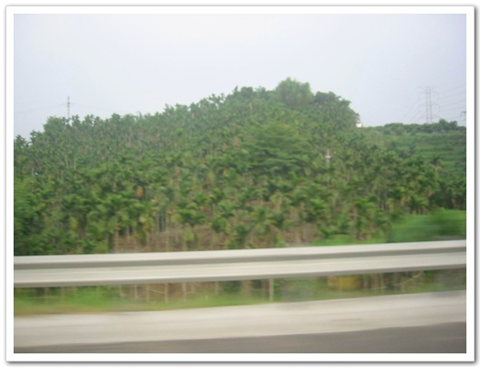

-바로 앞에 심어져 있는 것들이 파인애들..

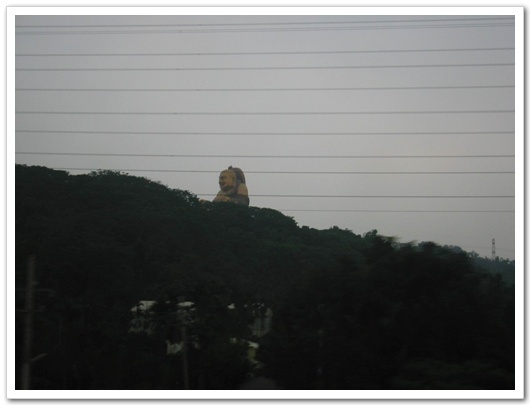

-왼 산에 저렇게 커다란 동상을 만들어놨군.

-산을 지나고 나서 보니, 저렇게 생겼군.

7시쯤 타이쭝에 도착했다.

-타이쭝 호텔에서 다시 만난 1팀과 2팀.

[null](../6166961.html#6166961_1)

