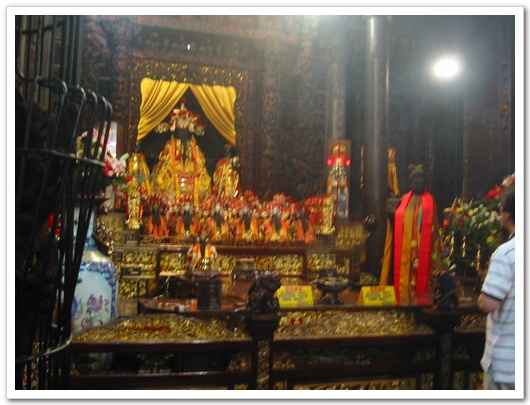
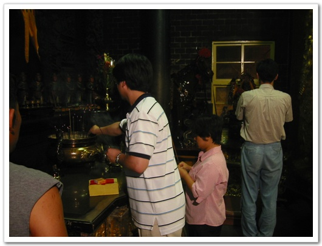

# 대만 카오슝에서 만난 삼장법사

7시에 일어나 목욕재개를 하고, 밥 먹을 준비를 하고, 8시에 1층 로비로 내려갔는데, 아무도 밥 먹으로 오지 않았다. 그래도 한 10분간 호텔내부를 탐색했다. 별 건 없었다.

-내가 묵은 이 호텔을 밖에서 본 것

-호텔 앞 풍경

다시 10층 내 방으로 올라가 스티븐에게 전화하여, 8시 반에 밥 먹기로 하고, 8시 반에 밥 먹으로 내려갔다.

-내 방에서 바라본 풍경, 저 높이 있는 게 85층짜리 건물이란다.

아침을 먹고, 까오슝 일대 필드테스트 시작. 오늘도 Tomas가 우리를 안내했다. 정해진 길을 가는 게 아니어서, 전적으로Tomas 마음대로 돌아다니는 거였다. 덕분에 필드테스트를 관광처럼 할 수 있었다. 가다가 유명한 곳이 나오면, 잠깐 차를멈추고 구경해보라고 권했다. 한 두시간쯤 하다가 잠깐 멈춘 곳. 관우를 모시는 사찰인 것 같았다.

-이게 메인 사찰

-호수에 있는 뭔지는 모르겠지만 있는 상

-호수 전체

피터가 사진 찍어주겠다고 하여, 서 보라고 하여, 포즈를 취했다. 관우상, 중국발음은 꽌꽁 이라고 한다.

-찍고 보니 눈을 감았군. 어떠한가 순박하게 생긴 내 모습이..

점심은 조금 더 한 다음, 근처 골프장에서 먹었다.

-여기가 골프장 풍경

점심 후 졸면서, 테스트를 했다. 무릎에 노트북을 얹고, 흔들리는 차에서 하루 종일을 하려니, 꽤나 피곤하더군. 광대한 지역을돌아다녔다. 내 계획대로 움직인 것은 아니어서, 얼마큼 움직이고 있는지는 잘 모르겠지만, 암튼 엄청 돌아다닌 것 같다.

-커다란 다리도 지나고

-야자열매 재배지도 지나고

-지도로 표시하면 이 지역들을 지났다.

저녁을 먹은 후, Tomas가 안내한 곳은 어딘지는 모르겠지만, 신들을 모시는 사찰이었다.

-이렇게 생겼다

-내부 모습

중국이나 대만이나 사찰이 우리처럼, 다른 건물들과 떨어져 있는 게 아니라, 건물들 사이에 같이 있었다. 이곳에 첫발을 디딘 일행들이다.

향을 사서, 이곳사람들처럼 향을 꼽고 삼배도 해보고, 가짜 돈을 사서 태워도 보고 하였다. 가짜돈을 태우는 화덕 앞에 두면,화덕쪽으로 공기다 빨려들어가 돈이 한장씩 화덕으로 넘어가 타게 된다. 아마 저렇게 돈이 넘어오기를 바라는 뜻인것 같다.

-향 앞에 제를 올리는 아트

-그리고 스티븐

타고 있는 내 가짜돈, 그리고 돈 타고 있는 것을 구경하는 스티븐을 볼려는 밑에는 눌러봐라.

조금 있으니, 화약 터트리는 소리가 나기 시작하더니, 인상적인 의식을 하는 거였다. 사찰에 모시는 신들이 있는데, 짐작에 생긴것들이 동물 비슷하게 생겨, 아마 12간지의 신들이 아닌가 싶다. 그 신들이 회의를 하기 위해 이 사찰에 들어오는 의식을 하는것, 이런 것 구경하기 쉽지 않다고 하는군. 한 사찰에서만 하는 게 아니라, 그 신들이 다른 사찰로 돌아다니기 때문에, 때를맞추기 힘들어, 우리가 이런 것을 볼 수 있는 것은 아주 운이 좋은 거라고 하였다. 시끄러운 화약소리와 타악기 소리에 맞추어신들을 경호하는 장수들이 입장을 하고, 그 이 후에 각 신들이 입장하는 거였다. 장수들 입장하는 게 제일 볼만했다. 모여라꿈동산에 출현하는 듯한 큰 인형을 사람이 쓰고 춤 비슷하게 추는 거였다.

-이 장수가 제일 컸다. 한 3미터 정도 되는 것 같았다.

그 다음에는 손오공들이 입장하기 시작했다.

그 다음에는 삼장법사

-맨 뒤에 따로오면서, 악귀가 못 따라 오도록 하는 것 같다는군..

다들 넋을 잃고 구경했다. 카메라 메모리가 다 해, 이전에 찍은 것들을 지우면서 찍었다.

