# 대만 까오슝에서의 필드테스트

대만 3일째 되는날, 타이페이에서 까오슝으로 가면서, 드라이빙테스트를 하기로 했다. 3일째가 되니, 슬슬 몸이 무거워지기 시작했다. 9시에 KPT로 가서, 떠날 준비를 하였다.

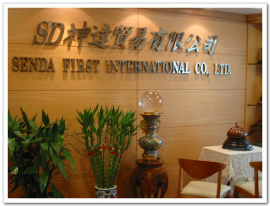

-이곳이 KPT, 아직 명판은 SENDA라는 이름을 쓰고 있다.

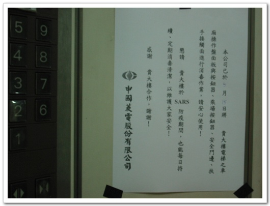

-KPT가 있는 건물 엘리베이터에 붙어 있는, 사스 안내문.

배터리가 충전되어 있지 않아, 한 30분간 충전시키느라 11시에 출발했다. 도중에 차량용 INVERTER를 사기로 하고. 집에 있는 인버터를 다음부터는 가지고 다녀야겠다는 생각이 든다.

드디어 출발, 차는 미츠시비 밴인데, 스타렉스랑 똑같이 생겼다. 아마 스타렉스디자인을 미츠시비에 샀나 보다. 내부도 상당히 좋더군. 이 차를 보니, 나도 나중에 12인승 봉고차를 타고 싶다는 생각이 들더군. 같은 차를 탄 사람은 운전사 피터, 여직원 미셜, 아트, 스티븐, 나 이렇게 5명이다. 아트와 스티븐은 서로 테스트, 나는 혼자 우리폰과, 노키아 폰을 가지고 테스트하면서, 로깅을 받았다.

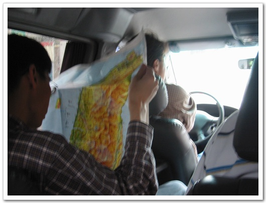

-art의 지도를 보며 위치를 보는 모습

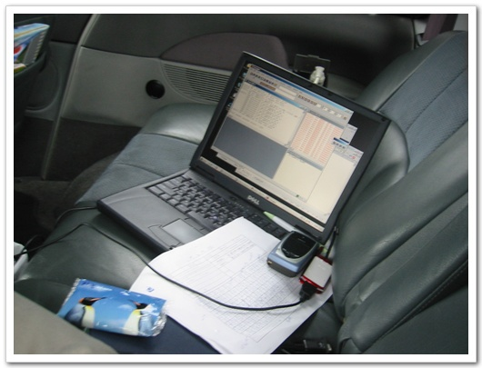

-로그를 받고 있는 내 컴퓨터

대만의 풍경은 우리와 별로 다르지 않았다. 산의 모양도 건물의 모양도 비슷하여, 그냥 경부선타고 부산가는 듯한 느낌이었다.

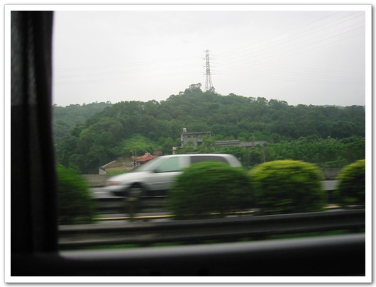

-가는 도중 찍은 산의 모양

점심을 먹기 위해 타이쭝 근처 소도시에 들어섰다. 여기서 본 낯설은 광경. 바로 이 모습이다.

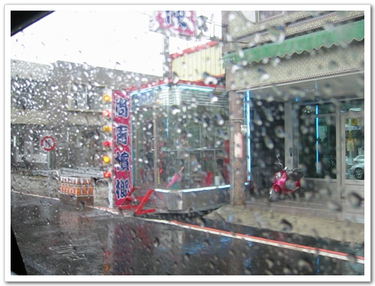

왠 반짝반짝 조명이 있는 유리방안에 왠 여자가 한명씩 있는 거다. 대로변에. 입고 있는 의상을 봐서 혹시 몸파는 여자인가 했는데, 껌파는 여자라고 하면서, 미셜이 껌 한통을 사더군.

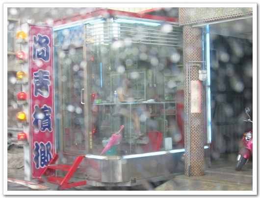

\- 이 여자는 그래도 다 갖춰 입었는데, 다른 여자는 수영복 차림이더군. 아깝게 못 찍었다. 비도 오고 움직이는 차라 제대로 초점 맞추기고 힘들더군.

근처에 있는 이 식당에 점심을 먹었다.

메뉴는 대만식 돈까스.

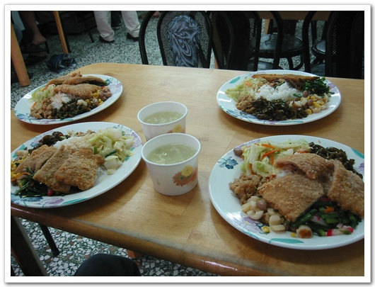

-그럭저럭 괜찮은 맛이다.

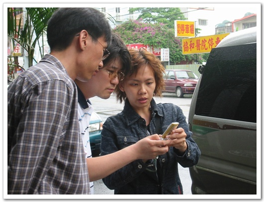

-식사후 미셜이 제기한 문제점을 듣고 있는 art와 stephen

점심 식사후 계속 고속도로를 타고 가면서 테스트를 했다.

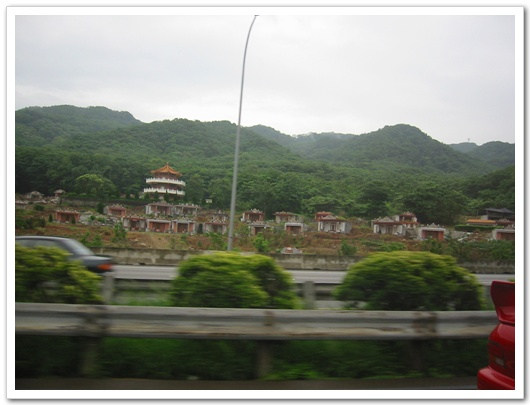

\- 그나마 제일 특이하게 보인 건물

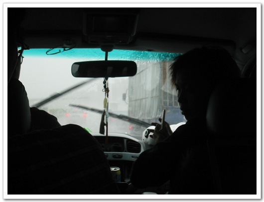

-우기라서 앞이 제대로 보이지 않을 정도로 비가 왔다.

1시간 정도 더 내려간 후, 간식을 먹자고 peter가 차를 세웠다. 멈춘 곳은 창화라는 곳이다. 이곳의 별미로 미트볼 정도되는 게 있는데, 그걸 먹었다.

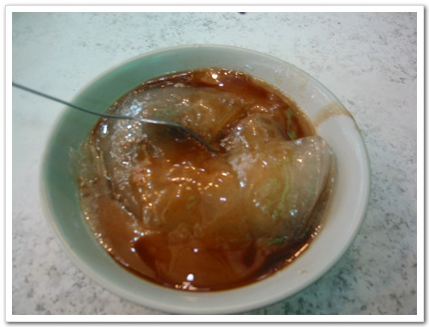

-이게 바로 그거다.

처음 봤을 때, 생긴 것으로 봐서, 무슨 짐승 골일 거라 생각했었는데, 먹어보니 도가니맛이었다. 반투명색에 쫄깃한데, 꼭 도가니 같았는데, 알고 보니 전분으로 만든 것이라고 하였다. 맛은 꽤 훌륭했다. 이게 30원이니, 우리돈으로 1200원 정도 하는군.

7시쯤 까오슝에 도착을 했고, 호텔을 Citizen Hotel이란 곳이었다. 별 4개짜리 호텔인데, 너무 과평가한 것 같다. 전반적으로 대만이 호텔 수준을 상향조정해서 사용하나 보다. 호텔에 check-in을 하려하니 우선 체온 검사를 했다. 로비에는 역시 사스 안내문이 있었고, 무슨 내용인지는 나중에 해석을 해 봐야겠다. 하루에 1400원이니, 우리돈으로 7만원 정도하는군. 방 내부는 썩 괜찮았다. 랜도 제공되었고, TV도 새거고, 채널도 많고, 게다가 채널 15번에는 포르노가 나왔고, 76번에는 일본 성인 방송이 방송되더군.

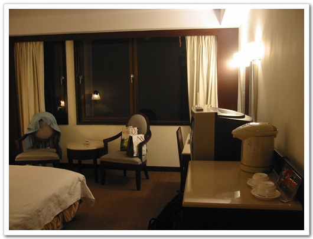

-내 방 모습

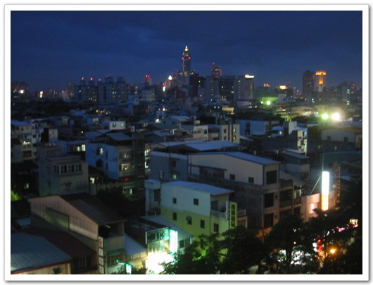

-내 방에서 바라본 바깥 풍경

피터는 이곳에서 자기 친구인 토마스를 불렀고, 이 토마스가 우리를 까오슝 시내를 안내했다. 우선 저녁 식사를 하러 갔다. 한 30여분을 갔나? 해저 터널을 지나 섬으로 갔다. 거기에 우리의 자갈치 시장 비슷한게 있는데, 거기서 먹었다.

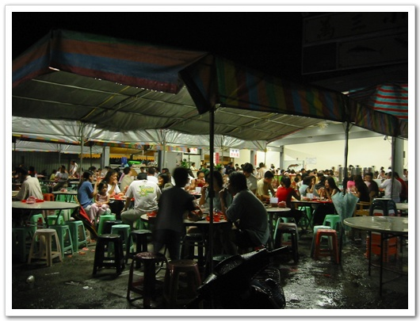

-꽤 많은 사람들이 있었다.

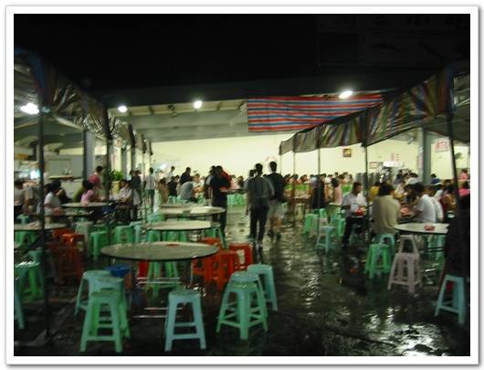

푸드코트처럼 미리 식권을 사서, 그 돈만큼 가져다 먹는 식이었다. 요리 하나 100원하였다. 요리 하나 하나씩 가져와 식탁에 가져다 놓기 시작했다.

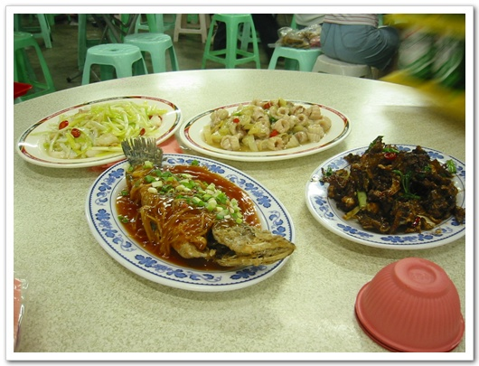

\- 맨 오른쪽에 있는 것이 개구리튀김, 가운데 뒤에 있는게 큰 물고기의 위라고 한다.

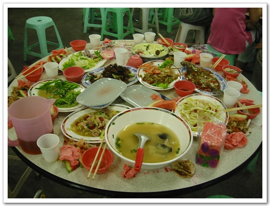

-다 먹고 난 후의 잔해들.. 배터지는 줄 알았다.

그후, 까우슝 시내를 한눈에 볼 수 있는 시내를 산에 가자고 하여, 그 산에 갔다. 남산과 비슷했지만, 산이라 하기엔 너무 낮아 그냥 언덕정도였다. 올라가니, 시내를 다 보이더군. 항구도시라 시내와 항구 모습과 옆의 섬이 다 보이니 야경이 괜찮았다.

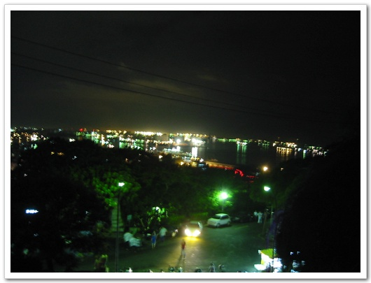

-항구

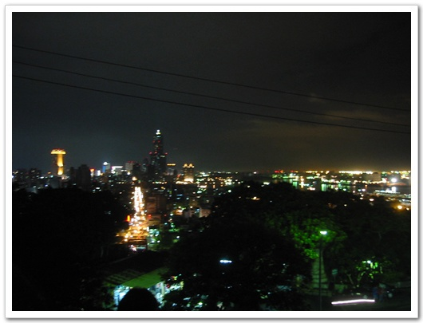

-시내

산의 이름은 만수산이다. 그 옛날 국어시간을 통해 들었던 "만수산 드렁칡이...." 이렇게 나오는 시조의 산이 바로 이 산인가 했는데, 나중에 찾아보니 만수산은 개성에 있는 산이라는군.. 이 산에는 충렬사라는 기념사가 있는데, 예전 일본군에 대항하여 싸운 열사들이 학살당한 것을 기념하는 사찰이라고 한다. 산 구경까지 하니, 시간은 10시 반. 호텔로 갈 줄 알았는데, 까우슝에서 제일 유명한 빙수집을 가야한다고 피터가 데려갔다. 93년된 빙수집이라고 하니, 꽤나 오래된 거다.

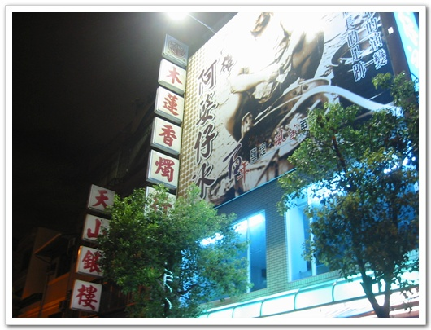

-이게 93년 원조 빙수집

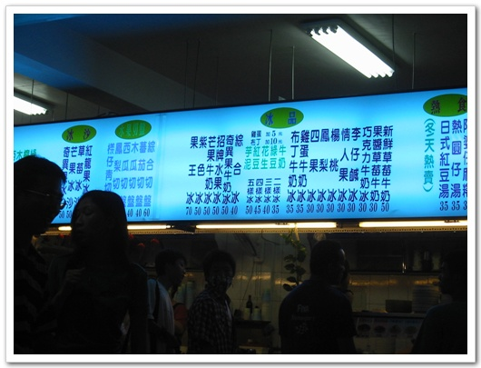

-메뉴판

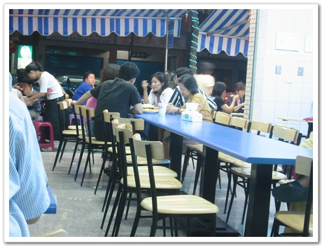

-그 안에서 먹는 사람들

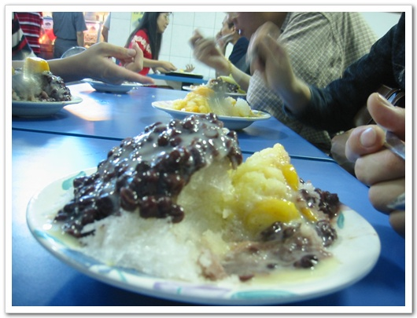

-팥빙수맛은 우리와 똑같았다.

