# 아무 대책 없던 암스테르담에서의 하루

카이로까지 가는데, 가능한 빨리 출발을 해야 했기에, 카이로까지 가는 직항이 있는 대한항공을 못타고, 암스테르담까지 가는 네덜란드 항공을 타게 됐다.

카이로에 갈 때는 암스테르담에 2시간만 있으면 되는데, 되돌아 올 때는 자기만치 10시간을 기다려야 하는 일정이다. 그래서 혹시 환승할 때 밖에 공항 밖으로 나갈 수 있지 않을까 엠파스 지식거래소와, 네이버 지식인을 다 검색해 봤는데, 된다는 말이 없었다.

그래서 암스테르담에 대한 준비를 안했다. 이게 크나큰 실수였다.

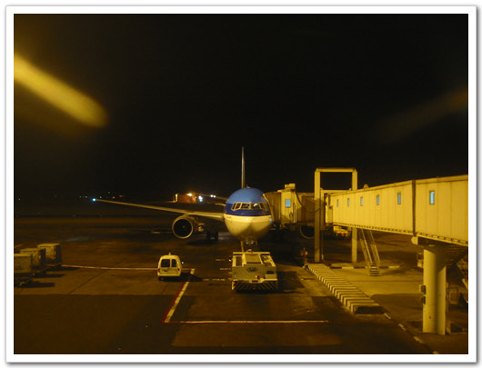

\- 카이로에서 암스테르담으로 가기 위해 대기중인 비행기. 만석이었다. 그래서 불편한 자세로 가야 했다.

KLM 비행기 안에서 환승안내 방송이 나오던데, 듣다 보니, 환승 승객을 위한 Transit Tour라는게 있다고 말하더군. 그래서 카이로갈 때 그 Transit tour에 대해 알아보았다. 처음에 안내 데스크에 물어보는데, 짧은 영어로 의미 전달이 안 돼, 내가 원하는 답이 안나오더군. 그래서 내 주특기인 샅샅이 뒤지기를 하여, 결국 찾아냈다. 그 때는 저녁이라 사람은 없고, 팸플릿만 있어 그것만 가지고 카이로 갔다.

돌아오는 비행기는 카이로에서 새벽 2시 55분 출발하여, 4시간 반이 걸려 암스테르담에 도착했다. 도착하니 아침 7시. 암스테르담 공항은 비행기에서 내리자 마다 여권검사를 한다. 아마 출발 객과 도착 객이 섞여서 그런가 보다. 검사하는 직원이 나에게 여권 검사를 다 하더니, 우리말로 "감사합니다"하더군. 친절한 직원일세.. 이런 게 선진국이 아닌가 싶은 생각이 들더군. Transit tour desk는 7시 45분에 문을 연다고 되어 있더군. 여자친구하고 회사에 메일 좀 쓸 겸해서, 그 동안 communication center로 가서, 인터넷을 했다. 무지 비싸더군. 30분에 7달러. 유로로는 6유로. 카드 결제를 하였다.

Transit tour를 위해 현금을 찾았다. ATM기에서 50유로를 찾았다. 그러고 나서 그 중 10유로를 동전으로 바꾸었다. 여기는 동전이 꽤 단위가 크군. 1유로는 천원이 넘는데, 2유로까지가 동전이니 말이다. Transit tour desk에서 물어보니, 종일코스는 없고, 두 시간 반과 세 시간 반짜리만 있다고 하더군. 두 시간 반이 35유로, 3시간 반이 45유로. 한 4만원, 5만원 하는 거더군. 그 정도 돈을 써서 그 정도밖에 구경을 못한다면 돈이 아까울 거란 생각에 transit tour를 포기하고, 그냥 나가보기로 했다.

안내데스크에 물어보니, 환승 승객은 네덜란드 입국이 된다고 하더군. 공항세도 물어보았는데, 암스테르담 공항은 공항세 없다더군. 그래서 우선 가방을 보관시켰다. 보관료는 4유로. 사용법을 처음에 몰라 보관하는데 거의 10분이 걸렸다. 먼저 가방을 넣고 잠근 다음, 신용카드를 넣어 확인하면 바코드가 출력되어 나오는 방식이었다. 나중에 찾을 때는 그 바코드만 들이밀면 문이 열리고.. 카메라만 들고서 나갔다.

암스테르담에 대해서 내가 아는 거라고는, 안내데스크에서 받은 팸플릿이 전부였다.

거기 있는 말이 암스테르담의 central station이 중심가이므로, 거기까지 기차를 타고 가면 된다고 나와 있더군. 그래서 네덜란드 입국하고서, 자판기에서 승차권을 구입하려고 하는데, 네덜란드 말로 적혀 있어 뭔 소리인지 모르겠더군. 그래서, 유인판매소로 갔다. 유인판매소도 처음엔 못 찾고, 기차 타는 곳까지 내려갔다가, 거기 쓰여져 있는 '승차권 소지지만 입장가능'이란 말에 다시 나와서 찾았다. 내가 어디서 주워들은 말은 있어서, 1 day ticket 달라고 했다. 그러니, 그것은 암스테르담 시내만 해당된다고 하면서, 오늘 다시 공항으로 돌아올거냐고 묻더군. 그렇다 그러니 returning ticket을 사면 된다고다고 하였다. 가격은 5.5 유로였다.

\- 입국심사를 하고 나온, 스키폴공항. 다른 공항에 비해 시설이 잘 되어 있어서 그런가, 처음엔 복잡하더군..

\- 밖에서 본 공항

기차타는 출구도 여러군데였다. central station이 어딘 줄 어떻게 아나, 그냥 사람들 많이 내려가는 쪽으로 내려가, 기다리는 사람에게 어디서 타야 central station으로 가느냐하니, 내가 서 있는 이 쪽에서 타면 된다고 하더군. 얼마 후 기차는 도착하였다. 기차는 2층으로 되어 있더군. 창가 석엔 탁자도 있더군. 2층에 탔다. 기차는 조용하더군. 공항인 스키폴 역에서 3번째 역이 central station이더군.

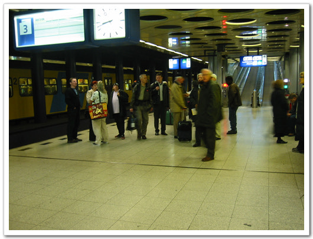

\- 스키폴 역에서 기차를 기다리고 있는 중..

\- 여기가 central station. 기차역이 멋있더군.

\- 예전 유럽의 기차역 사진 나오면서 보이는 거랑 비슷해 보인다.

드디어 암스테르담 시내에 입성했다. coffee 선전이나 무슨 유럽풍 패션, 뭐 이런 것 나올 때 많이 봤던 풍경이더군. 쉬가 마려워, 화장실을 찾았는데, 유료더군. 0.5유로. 거의 700원정도 되는 거니. 우선 참기로 했다.

\- 청사를 나와서.. 역 청사가 꽤 멋있게 생겼군..

지형숙지를 위한 첫걸음은 도보답사. 큰 길을 따라, 쭉 걸었다.

차도 별 없었고, 모노레일이 주 교통수단인 것 같았다. 사람들도 여유가 있어 보이더군.

전체적인 도시 모양도 괜찮았다.

미관을 해치거나, 어울리지 않는 건물은 없었다.

시내에 있는 이 물들이 운하인지는 모르겠지만, 중국 소주처럼 물길이 있었고, 배도 다니더군.

배낭 여행 중인 한국인 어디 없나 살펴보는데, 안보이더군.

보이면 암스테르담 오면 뭘 구경하면 되나요라고 물어보려고 그랬었는데..

오래된 건물들이 많은데, 그 건물들이 어떤 역사를 가지고 있고 어떤 의미가 있는지를 모르니, 그냥 멋있게 생긴 건물이구나 밖에는 별도로 느낄 수 없더군.

가다보니 차이나타운도 있더군. 세계 어딜 가나 차이나타운은 항상 있더군. 위치는 그리 좋은 곳은 아닌지, 그 쪽 도로에서 마약을 했는지 해롱해롱 대는 사람들이 많이 보이더군. 그리고 차이나타운옆쪽 골목으로 커튼들이 쳐져 있는 가게들이 있는데, 창문에 씌어져 있는 글자가 No Photo 라고 써져 있고 그 거리에 성인용품 점들이 많은 걸 보니, 매춘거리인가 보다 생각했다. 네덜란드가 법적으로 매춘으로 허용되어 있다고 들은 적이 있다.

\- 기차역 앞으로 나와 있는 메인 도를 따라 쭉 걷고 있는 중

\- 걷다 보니, 이런 성당도 나온다. 크기나 생김새나 위치로 보아 뭔가 역사가 있는 것 같은데,..

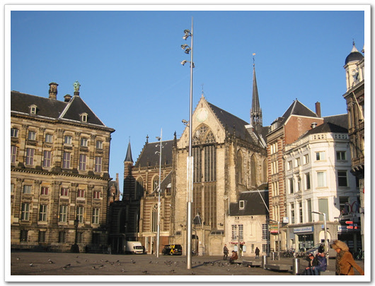

\- 옆으로도 무슨 건물이 있는데, 같은 종교시설 인가?

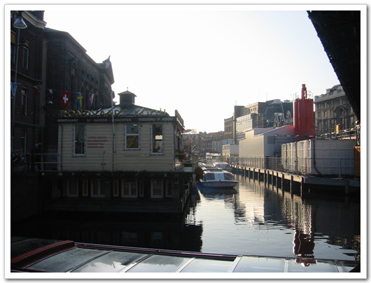

\- 운하로 암스테르담을 둘러볼 수 있는 배도 여기서 출발은 하더군. 타 보진 못했다.

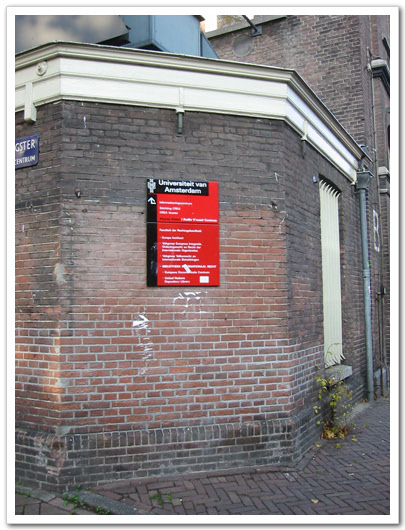

\- 암스테르담 대학 건물. 젊은 학생들이 있다는 것 빼고는 그리 대학처럼 보이지는 않더군.

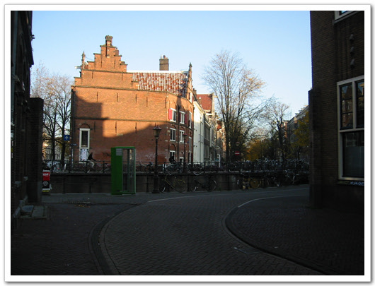

\- 차가 없어서 더욱 한적하고 분위기 있어 보이는 도로들..

\- 큰 도로처럼 여러갈래 물이 흐른다.

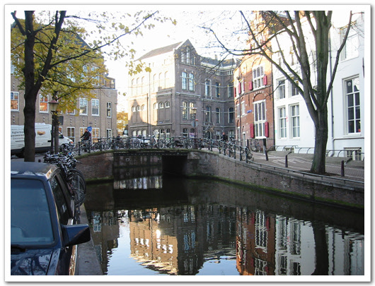

\- 물의 수질도 꽤 깨끗해 보인다.

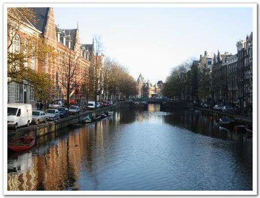

\- 다른 골목으로들어섰는데도, 역시 다른 운하

\- 역시 무슨 건물인지 모르지난 암튼 멋있게 생긴 건물

\- 차이나타운 골목이다. 가장 어두침침하고,거리의 사람들도 이상했던 골목이다.

\- 보수중인 운하. 다 벽돌로 이어져 있다.

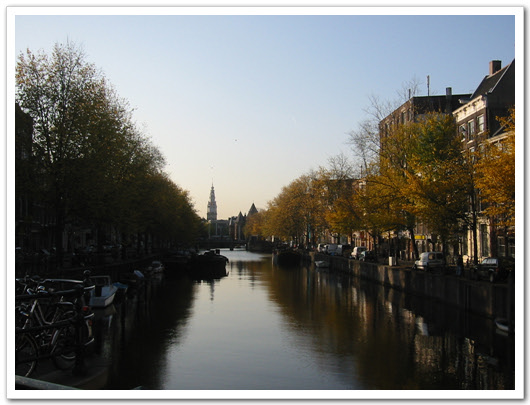

\- 깨끗한 공기와 맑은 하늘에 더더욱 아름다워 보이는 도시

이렇게 도보답사를 하고 나서, 다시 central station으로 돌아왔다.

더 이상 쉬를 참기는 힘들 것 같아, 거금 50센트를 내고 화장실에 들어가 쉬를 했다. 화장실 입구가 우리나라 지하철 개찰구처럼 되어 있더군.

그리고 이제 좀 더 크게 봐 보기 위해 모노레일을 타 보기로 마음을 먹고, ticket 파는 곳을 물어가서 물었다.

1 day ticket이란 게 있던데, 이게 얼마냐 그러니 15유로라고 하더군. 그럼 그냥 one way ticket은 얼마냐 했더니, 1.6 유로란다.

그럼 그 돈은 직접 운전사에게 내면 되냐고 하니, 그렇다고 하더군.

그래서 그냥 동전내고 타기로 했다.

내가 여기 모노레일 노선은 알지도 모르므로, 모노레일은 제일 새것이면서, 사람이 적게 탄 걸로 탔다.

운전사에게 2유로를 내니 20센트 두개를 거슬러 주고, 표를 찍어주더군.

속도는 한 시속 20 km로 천천히 가더군. 놀이공원에서 타던 모노레일 그 느낌이더군.

그 모노레일을 타고 암스테르담 시내를 구경했다. 한참을 남쪽으로 내려가니, 타고 있는 승객은 나 밖에 없었다.

운전사가 어디까지 가냐고 묻더군. 그래서 "목적지 없다. 그냥 한바퀴 둘러보려고 한다"고 말하니, "special guest..." 이렇게 뭐라고 하던데, 잘은 모르겠지만, 그럼 잘 구경하라는 의미인 것 같았다.

종점까지 갔다고 다시 돌아오는데, 1시간 반 정도 소요되더군.

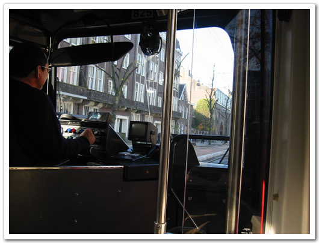

\- 내가 타고 간 모노레일. 그리고 운전사 아저씨.

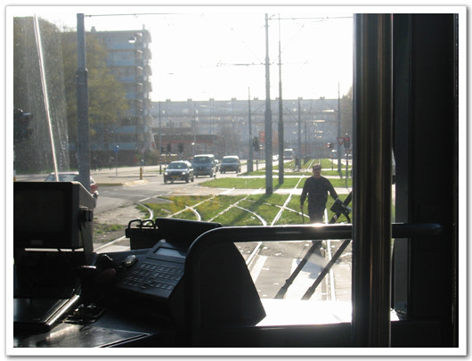

\- 한가지 특이했던 점은, 저 철도 노선들을 운전사가 직접 바꾸는 것 같았다.

문 옆에서 선로바꾸는 긴 쇠 막대기가 있는데, 가끔 저걸 들고 내려 선로를 바꾸고 들어와 가고는 하더군.

선로를 바꾸고 돌아오는 운전사.

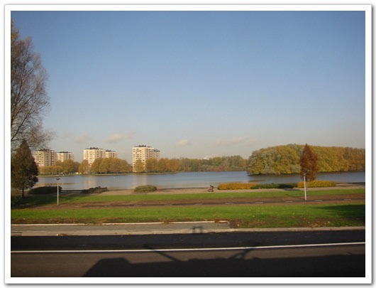

\- 다운타운에서 조금 벗어나니, 큰 호수도 나오더군.

\- 거리는 단풍이 곱게 물들었고..

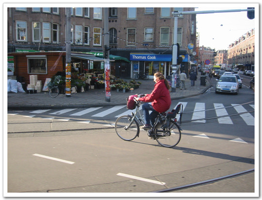

\- 자전거를 타고 가는 사람들도 많이 보인다..

\- 차 안에는 승객이 나 혼자다. 나 혼자 전세내서 타고 다닌 셈이다.

\- 모로레일에서 내리고.. 저게 내가 타고 다녔던 모노레일이다.

기차역으로 돌아올 때, 그 노선 중에서 제일 번화가였던 곳으로 보인 곳에 내렸다. 위치는 기차역 전방 2km정도 지점이다. 골목으로 들어가니, 내가 원하던 장면이 있었다. 명동거리처럼 사람들로 북적대는 곳이 나왔다. 돌아다니는 사람들은 젊은 사람들로, 유럽의 패션 동향을 여기서 직접 다 볼 수 있었다. 기념품 가게도 있기에 들어가 봤다. 역시 그곳에도 made in china가 압도적으로 많더군.

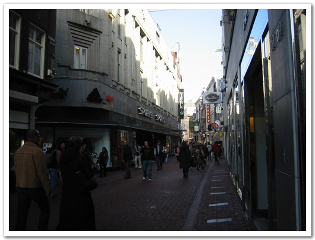

\- 젊은 사람들로 북적대는 거리.

\- 크리스마스가 가까워져서 인가, 골목 위에 늘어져 있는 장식물.

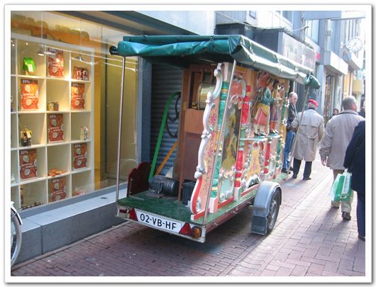

\- 이 수레에서 인형극을 하더군.

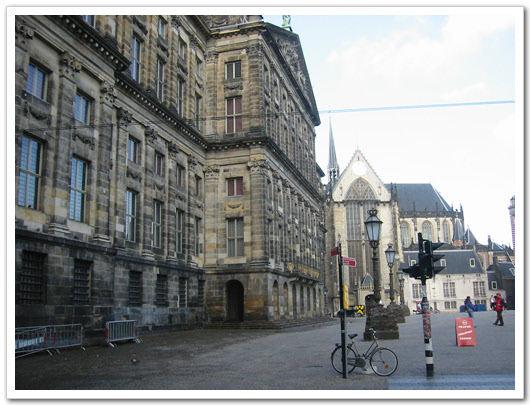

\- 아까 걸어서 봤던 성당이 계속 걸으니 나온다.

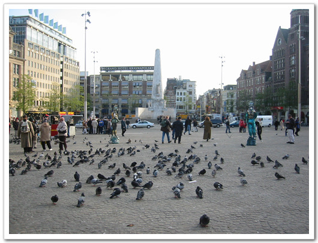

\- 토실토실 살찐 비둘기들. 그리고 그 앞에서 기사복장을 하고 뭔가를 하는 두 사람

개방된 사회라 그런가, 그 거리에도 성인용품점이 많이 있더군.

성인용품을 창에 진열해 놓고, 노골적인 비디오 포스터도 붙여져 있더군.

그리고 그 가게 앞에서 연인으로 보이는 두 남녀가 쇼윈도우에 진열된 물품 구경하는 것도 이색적이었다.

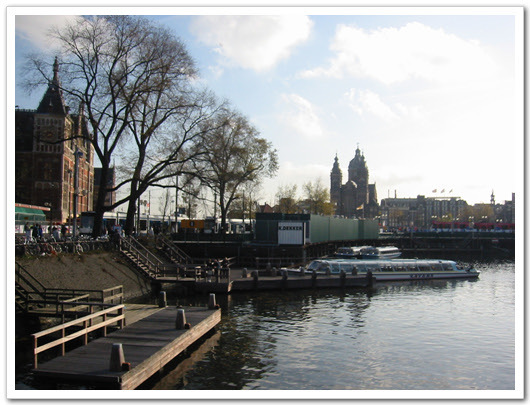

\- 다시 돌아온 기차역

비행기에서 자질 못해서 그런가, 한 5시간밖에 안 걸어 다녔는데, 벌써 피곤하더군.

다시 스키폴공항 역으로 가는 기차를 타고 스키폴 공항으로 갔다.

기차 타는 역에서는 역시 영화에서 많이 봤던, 작별의 키스, 포옹하는 연인들이 많아, 눈이 심심하지 않았다.

올 때는 도중 두 번 정차하는 역이 있었는데, 갈 때는 곧장 스키폴 역으로 가더군.

\- 내가 타고 간 기차. 그림이 멋있군.

\- 기차표를 꺼내 들고..

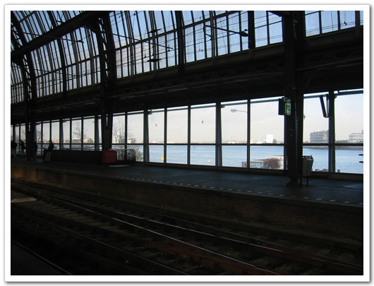

\- 기차역이 강가에 있어, 기차역 밖으로 보이는 풍경이 멋있다.

\- 잘 생긴 애들이 하니까, 보기에도 좋군.

\- 이번엔 1층에 앉아 공항으로 향했다.

이렇게 하여, 나의 첫 유럽 땅 밟아온 이야기는 끝이다.

처음이라 이런 짓을 했지, 다음에 이렇게 하루 반이나 걸리는 비행은 못하겠더군.. 엉덩이도 짓무르고, 피곤한 게 몸이 많이 축난다.

