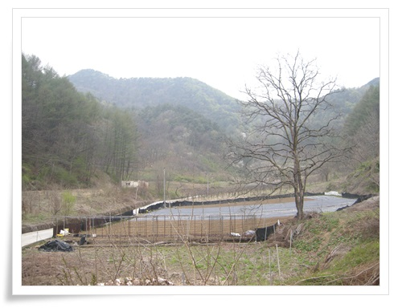
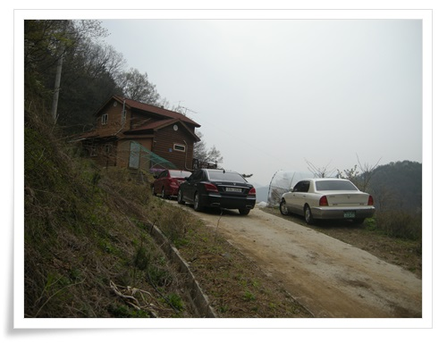
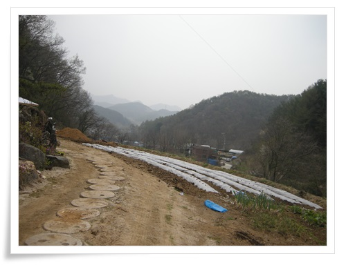
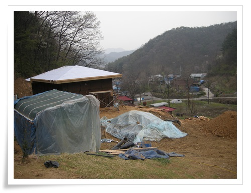
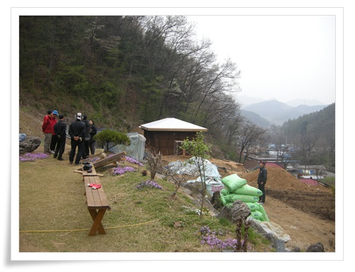
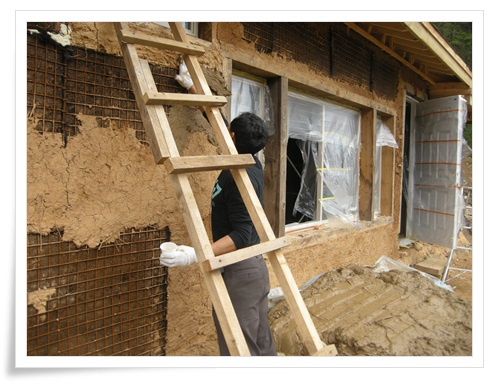
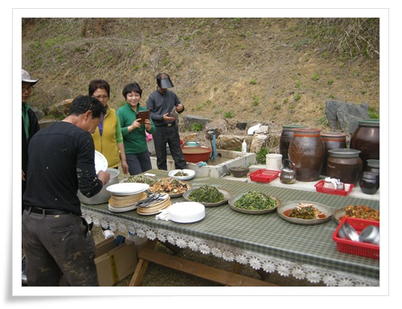
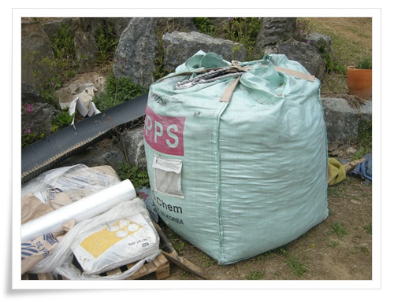
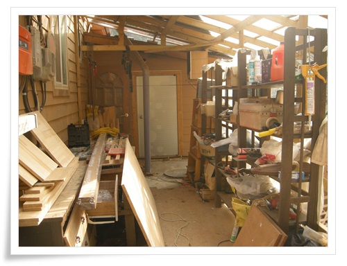

# 보은군 회인면 눌곡리에서 흙집 짓기 참가

집짓는 것을 한번 맛보기로 배워 보고자 저 멀리 충북 보은군으로 갔다.

보은군 회이면 눌곡리에서 흙집짓기 워크샵이 있어 참가 신청을 하고 갔다.

\- 눌곡리에서 산쪽 제일 깊숙이 있는 집이다.

아주 위치가 좋다.

이런 곳에서 살고 싶더군.

\- 산이 있고,

\- 언덕에 집이 있다.

\- 마을에서 제일 높은 위치에 집이 있어 경관도 좋다.

\- 이번에 짓고 있는 황토흙집.

미리 포크레인으로 황토와 석회 반죽은 준비되어 있는 상태.

\- 간단한 작업 설명 이후 현장으로 이동.

\- 매시공업으로 벽면이 되어 있는 상태에서 흙으로 미장하는게 이번 워크샵 작업.

노가다를 해 본 경험이 없어서 그런가 제법 힘이 들더군.

\- 점심은 집주인이 준비한 음식으로 야외에서 식사.

맛있었다.

\- 바닥에 깔 숯인데, 저 큰 걸 3만원인가 주고 샀다는군.

건축용이라서 그런가 싸군.

\- 집 옆 비닐하우스로 되어 있는 작업실.  내가 꿈꾸는 그런 시설이다.

