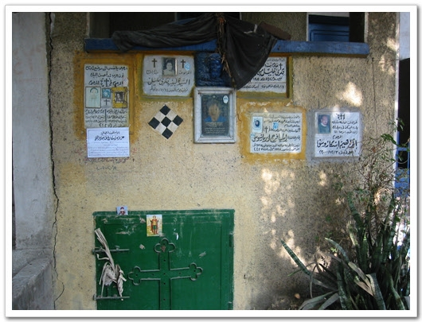
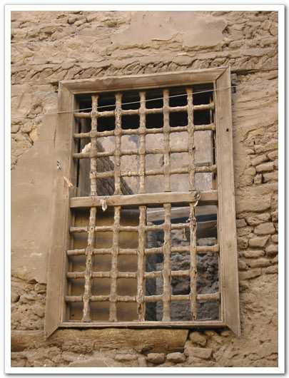
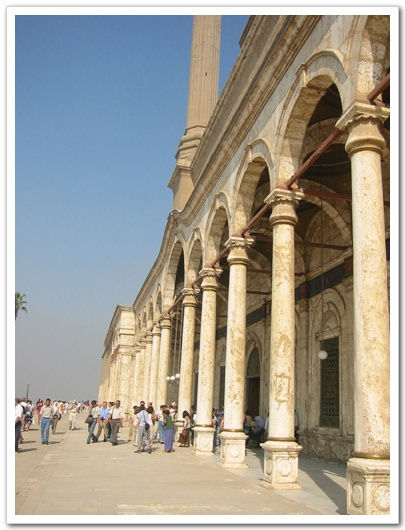
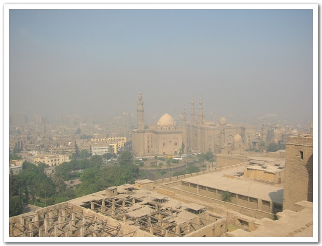

# 콥틱카이로와 시타델, 그리고 박물관

여해콥틱카이로와 시타델, 그리고 이집트 박물관

콥트는 이집트의 기독교라고 한다. 로마 카톨릭과는 다르고, 터키의 그리스정교와는 다르다고 한다. 하지만 역사는 제일 오래된 거라 한다. 이집트가 기독교를 제일 먼저 받아 예수 나면서부터 생겨난 콥트가 지금까지 계속 이어여 오는 것이라 한다. 그리고 이집트의 국교는 이슬람교이지만, 인구의 10%는 콥트파라고 한다. 그래서 그 유구한 역사만큼 카이로에도 콥틱카이로라는 지역이 있다. 위치는 카이로 남쪽에 있다. 여기를 갈려고 한다.

호텔앞에서 택시를 잡았다. 콥틱카이로로 하니까, 왕복 30파운드를 부른다. 왕복 필요없다 편도로 15파운드에 가자니까, 편도는 20파운드를 내란다. 꽤 오래 흥정을 했다. 이렇게 택시비 흥정하기가 힘들어서야... 결국 15파운드로 낙찰했다. 가다보니 콥틱카이로가 그리 가까운 곳은 아니더군. 원래 계획이 콥틱카이로 갔다가 시타델 갔다가, 박물관 갈려는 계획이었는데, 그렇게 따로 따로 가도 꽤 돈이 들것 같았다. 그래서 다시 마음을 고쳐먹고, 콥틱갔다가 시타델 갔다가 박물관 가려고 하는데, 40파운드에 어떠냐 그랬더니, 냉큼 OK를 하더군. 그러면서 시타델은 주차비를 받기 때문에 주차비 2파운드로 내달라고 한다. 그런다고 했다. 그후, 당신은 나의 친구다. 뭐 이렇게 하면서, 친하게 굴더군.

-내가 타고 다닌 택시

콥틱카이로가 유명한 이유중 하나가, 초기 기독교 지역이고, 옛날 헤롯왕의 추격에서 마리아가 아기 예수를 데리고 피신했던 성조지 교회가 있는 곳이기도 하다.

콥틱카이로와 다 왔다. 택시운전사를 입구에 기다리게 하고, 들어갔다. 예전 박해를 피해 피선했던 지역이서그런가 입구가 지하로 되어 있었다. 거리는 예전 종교영화나 고대로마영화에서 보았던, 그런 골목이었다. 이 골목의 구조가 예루살렘과 같은 구조라고 한다. 이 콥틱카이로 지역은 죽어 있는 거리는 아니었다. 살아있는 거리였다. 아직도 그 거리에 사람들이 살고 있었으며, 2천년이 된, 건물들과 현재 계속 보수되고 지어지고 있는 건물이 있는 살아있는 곳이란 생각이 들었다. 이곳은 예배당도 지하에 있었다. 특이했다. 내가 있던 그 시간이 예배 시간이었던지, 경건하게 예배를 하고 있었다. 한 곳은 들어갈 수 없었고, 다른 한 곳은 입장이 허가되었다. 우리나라 교회와 같이 시끄러운 마이크소리가 아닌, 깊이가 느껴지는 소리들이었다.

-콥틱카이로 입구

-예전 기독교가 포교되지 못했을 당시 박해를 피해, 통하는 입구가 지하로 지어졌다고 한다.

-지하 입구를 통해 들어가니, 밖과는 전혀 다른 세계가 펼쳐졌다.

-거리의 모습이 예수 시절을 다룬 영화에서나 보았던 그런 도로들이다.

-이집트는 발에 치이는 게 유적이고 유물이라, 이렇게 쓰러져 가는 것이 한두개가 아니다.

-저기 보이는 게 성 조지 교회라고 한다.

계속 이어지는 골목 끝자락엔 기독교인의 묘지 같은 느낌이 나는 건물들이 모여있었다. 꽤나 묘한 느낌이었다. 밖의 그 시끄러운 차 소리가 하나도 안들리면서, 지나가는 사람도 하나 없는, 적막한 곳이었다.

-기독교인들의 묘로 보이는 시설들..

-이 지역 전체가 이런 것으로 가득차 있었다.

-묘는 과거가 아닌 현재진행형이었다.

-묘만을 위한 시설로는 인상적인 거리이다.

-묘지 관리인인 듯한 사람. 지나가니 반갑게 인사를 해 준다.

-저 앞의 벽도 꽤나 오래된 거라 한다.

-지하 성당에서는 예배 중이었다.

-이곳은 유적지라서 그렇고,. 이집트는 어딜가나 무장한 경찰들이 많다. 그래서 치안 상태가 좋다고 한다. 그런데 이렇게 총기를 몸에서 이격해 놓고 있다니,. 우리 나라 같으면 당장 군기교육대감인데..

-이 콥틱카이로는 단순한 옛날 유적지가 아닌 아직 사람이 살고 있는 거리였다.

-창문 안쪽으로 빨래 걸려있는 것도 보이는군.

-거주민들의 방문

-신축 교회로 가는 길

-이 창문 문양도 영화에서 많이 보았던 것 같다.

-이 창문도 좀 특이해 보이고..

-역시 영화에서 본 듯한 문

-새로 지은 교회안에서는 두 신자가 있었다.

성조지교회는 크기와 건물의 모양에서 나를 압도했다. 예배당은 꼭대기에 있었다. 한 20명정도가 예배를 하고 있었다. 관광객이 들어가는 것을 제지하지는 않았다.

-성 조지 성당

-성당 위로 올라가 밑을 보니, 이 옆으로 전철도 다니고 있더군.

-때 마침 미사중인 것 같았다.

-성가대라고 해야 하나? 할머니 할아버지였는데, 목소리가 꽤나 고왔다.

-미사중인 사람들

-창 밖에서 퍼져 오는 햇살

-이 성당도 역시 부분 보수 공사중이더군.

-근무중에도 항상 코란을 읽는 모습이 아름다운 경찰들

콥틱카이로의 깊은 인상을 뒤로 하고, 이번엔 시타델로 갔다. 시타델은 1183에 지어진 지어진 중세와 왕궁으로 언덕위에 자리하고 있어, 시타델에서 시내가 다 보인다. 시타델을 모를때는 그냥 왕궁인가 보지 했다. 시타델을 향해 가는데, 운전사가 저게 시타델이라고 가르켜주는데, 입이 딱 벌어지더군. 언덕위에 웅장한 모습으로 내려다 보는 모습이 인상적이었다. 세상 가는 길이 설레더군. 입장료는 20파운드였다. 그리고 입장할때 보안검사를 하더군. 안에는 많은 외국인들이 있었다. 안에 들어서니 더욱 웅장했다. 이걸 보니 새삼 권력에 대한 욕구가 생기더군. 나도 절대 권력을 가져 이런 왕궁에서 살면 얼마나 재밌을까 하고.. 그래서 다들 남을 정복하려 하고, 그 위에 서려고 하는 것 같다. 건물 안에도 들어갈 수 있는데, 들어갈 때는 신발을 벗고 들어가야 했다. 그리고 노출심한 옷은 별도의 판초우의를 주더군. 그래서 여기 저기 판초우의를 걸친 아줌마들이 많았다.

-저 멀리 시타델 왕궁이 보이기 시작한다. 절로 가슴이 뛰더군.

-왕궁 주위의 성벽

-시타델. 오스만투르크 시대의 왕궁이라 한다. 이슬람에서 가장 큰 왕궁이라 한다.

-사진으로 보는 것 보다 훨씬 웅장하고 멋있다.

-저 큰 기둥을 어떻게 깍았을까?

-이곳의 왕족의 정원이었겠지..

-궁 안에 들어가서 본 탑. 제대로 찍지 못하는 내 실력이 안타깝더군.

-궁 안은 신발을 벗고 들어가야 한다.

-두 줄기 빛이 들어오는 궁 내부

-또 다른 탑 내부

 -이곳 시타델에서 시내를 보니, 전에 갔던 알아자르 모스크도 한 눈에 보이는군..

-시타델을 뒤로 하고,.. 역시 멋있는 궁이다.

마지막으로 간 곳이 이집트 박물관. 세계 3대 박물관중의 하나라고 한다. 들어가는 것 자체가 힘들더군. 얼마나 사람이 많은지, 박물관에 입장하는데만 20여분 걸렸다. 밖에서 줄 서느라.. 입장료는 역시 20파운드. 박물관 안으로 들어서자마자 보이는 거대한 파라오상이 여기가 바로 문명의 발상 이집트라구나라는 것을 새삼 느꼈다.

-박물관에 들어서자 날 반기는 파라오부부

-안에는 정말 사람이 많았다.

-이름은 잘 모르겠지만, 무덤을 지키는 수호신

-그리고 역시 왕의 무덤을 지키는 스핑크스

