# 여름 전국 일주

2003 여름 전국 일주 - 1

올 여름 휴가를 뉴질랜드 스노보드로 할까 하다가, 여러 사정상 안하고, 국내 여행을 하기로 했다. 8월 4일부터 8일까지 일주일을 냈다. 회사의 공식적 휴가는 3일이지만, 여러 사람들이 5일을 쓰고, 나도 휴가일자까지 눈치보고 싶지 않아, 일주일 그대로 냈다. 이 때가 휴가의 피크기여서 사람 또한 엄청 많아, 사람만은 걸 별로 좋아하지 않은 나에게 그리고 좋은 시기는 아니지만, 지금은 제일 한가한 시기이고, 언제 또 한가한 때가 있을지 몰라, 감행하기로 했다.

차도 이 때 고치기로 했다. 뒷문이 안잠기고, 운전석 자리가 열쇠로 잠글 수 없는 문제가 있어, 부품은 미리 사두어서 키박스 들고, 충주의 록스타 명장에게로 갔다. 이번 여행은 동생과 같이 간다. 월요일 아침 모든 짐을 챙기고, 6시에 출발을 했다. 상당히 막히는 휴가철의 도로를 생각하여 덜 막히는 시간대를 택해 갔다.

태릉에서 구리-남양주간 고속도로를 타다가, 서울외곽고속도로, 중부고속도로, 영동고속도로, 중부내륙을 타고 충주로 갔다. 영동고속도로는 그 시간에도 이미 정체는 시작되어 있었다. 8시 반쯤 충주에 도착했다. 국민카센터로 갔는데, 간판이 바뀌어 있었고, 셔터는 아직 안 열려 있었다. 8시면은 문을 여는 곳이라 좀 이상하긴 했지만, 오늘은 9시에 여나 보다하고, 시장에서 좀 시간을 보내다 9시에 다시 돌아왔지만, 아직 문이 안 열려 있어, 전화를 걸려고 하는 찰나에 앞에 있던 차의 운전자가 국민카 이전했다고 알려주는 것이었다. 괜히 30분이나 딴 데서 시간을 보냈었다. 전화를 해 보니, 시청 뒤편으로 옮겼다는 것이다. 그래서 갔다. 키박스 갈고, 엔진오일 갈고, 머플러 헐렁한 것 개스킷 갈고 하는데, 5만5천원 들었다.

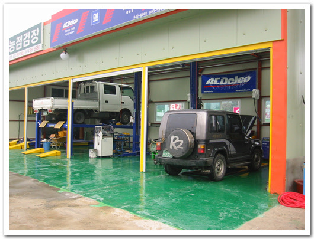

정비를 끝내고 충주호 근처의 계곡으로 가기로 하고, 움직였다. 그 근처의 제일 유명한 곳이 송계계곡인데, 전에 한번 지나쳐 봤을 때, 별로였고, 사람만 많은 곳이었다. 가다가 무슨구곡인가 하는 곳 가는 길목에서 차를 세우고, 냇가에서 김밥을 먹었다. 별로 좋지 않은 환경이었다. 행락객들이 많이 지나가는 마을이어서인가 마을 곳곳에서 경고푯말도 붙어있는 곳이었다.

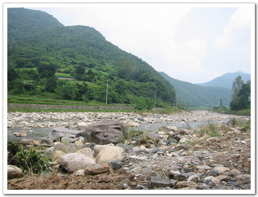

-별 볼 것 없는개울가.. 여기서 김밥을 먹었다.

단양쪽으로 향했다. 단양팔경을 보기위해,.

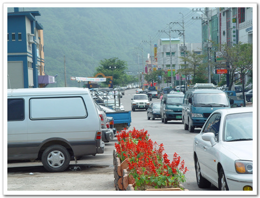

\- 단양 시내의 모습. 날이 워낙에 더워서 그런가 지나다니는 사람들은 없었다.

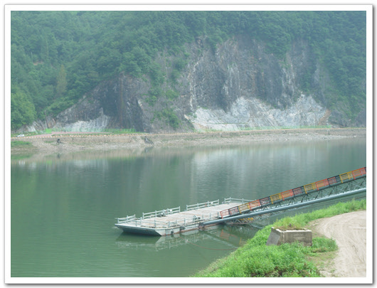

-단양 시내에서 보이는 강. 한적하니 좋아보였다.

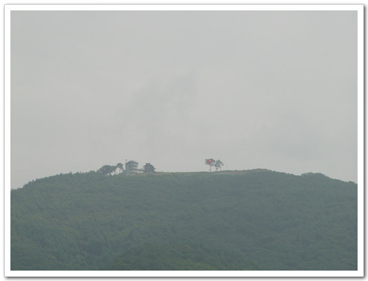

\- 강 너무 보이는 소백산 정상에는 패러글라이딩하는 모습도 보이고..

가다보니 새밭계곡이란 푯말이 보였다. 그 쪽으로 들어가는 차도 없어 보여, 그쪽으로 갔다. 괜찮았다. 사람도 그리 많지 않았고, 계곡물도 깨끗했다. 2천원 내고 차를 가지고 들어가 주차를 하고 그물막텐트와 돗자리를 깐 다음, 계곡물로 들어갔다. 꽤나 시원했다.

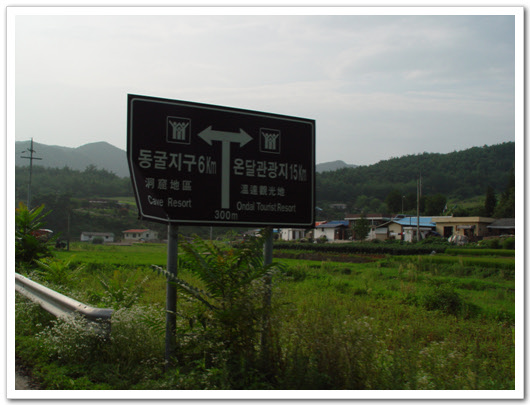

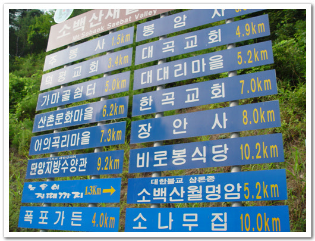

\- 새밭계곡으로 가는 표지판.

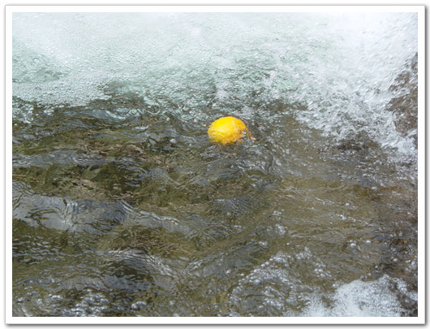

\- 새밭계곡에 돗자리 깔고서, 계속에 오렌지와 몸을 담그고, 시원함을 즐겼다

좀 있다 보니 더위는 싹 가시고 춥기까지 했다. 돗자리에서 1시간가량 잤는데, 추워서 잠을 제대로 잘 수는 없었다. 5시에 철수하고, 단양에 있는 유명한 절인 구인사로 향했다. 구인사를 거친 후, 동해바다로 갈 생각이었다.

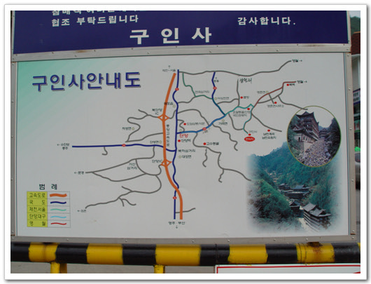

\- 구인사 안내판. 다음에 꼭 다시 오고싶은 절이었다.

구인사 앞에 주차를 하고, 한참을 걸어 올라갔다. 구인사는 지금까지 내가 보아왔던 절과는 매우 달랐다. 살아있는 절이라는 느낌이 들었다. 절에 활기가 있었고, 생기가 있었다. 건물 모양도 다른 절과는 다르게 절들이 큼직큼직했다. 절에 시외버스 정류장도 있었고, 우체국도 있고, 은행도 있었다. 꼭 중국의 큰 절에 온 듯한 느낌이었다.

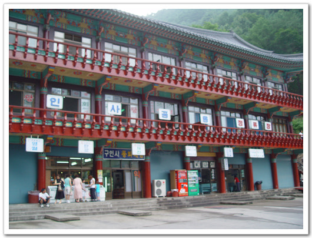

\- 이곳에 바로 구인사 입구에 있는 시외버스 정류장. 난 처음에 이게 본당인 줄 알았다.

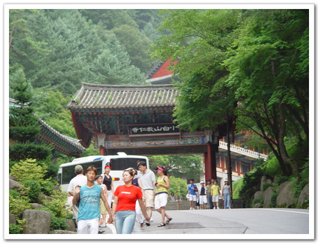

\- 한참을 걸어올라가니 이제 뭔가 본격적인 건물이 보이기 시작한다.

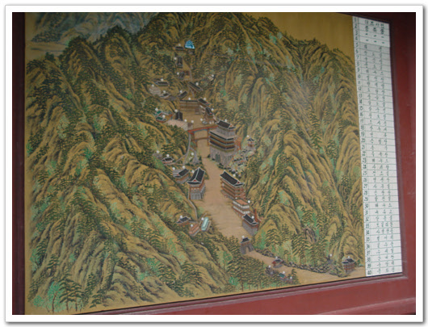

\- 구인사 시설안내도

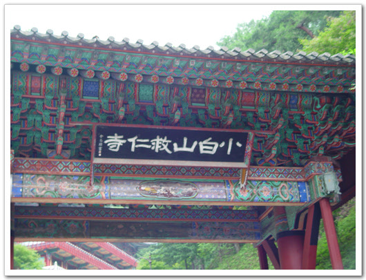

\- 이게 정문. 소백산구인사

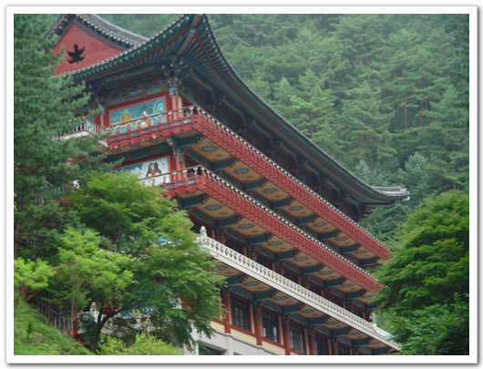

\- 절의 모습이 참 크고, 특이하다.

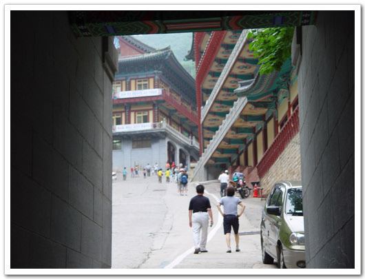

\- 정문에서부터 안참을 걸어올라가도, 계속 불당이 이어졌다. 엄청 많다.

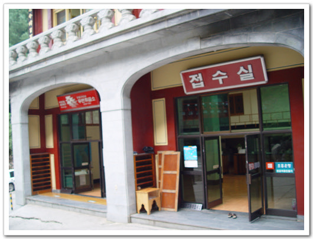

-구인사안에는 우체국도 별도로 있다.

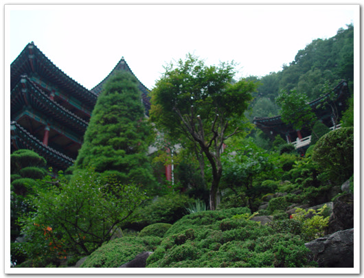

-계속 걸어 올라가도 계속 불당.

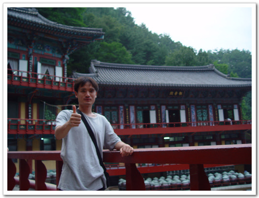

\- 방문객이 올라갈 수 있는 최고 지점. 이 건물이 식당이다.

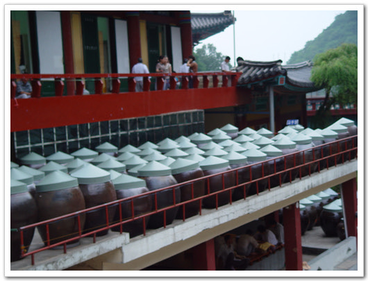

\- 항아리에는 많은 수행자들이 먹을 간장, 된장등이 들어있겠지..

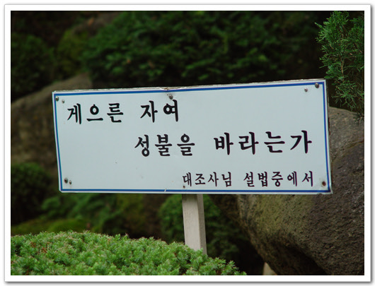

\- 구인사에서 본 것중 가장 인상깊은 어록

구인사에 깊은 인상을 받은 후 태백을 거쳐 동해바다로 가기로 했다. 한번도 가보지 않은 도시고, 태백시란 자체에 풍기에 삭막함을 한번 느껴보려고.. 역시나 꽤나 삭막한 도시였다. 죽은 도시 같았다. 기름값도 엄청 비쌌다. 경유가 1리터가 807원이나 했다. 기름이 떨어져 어쩔 수 없이 2만원어치 넣었다. 태백역 앞에 있는 기사식당에서 해장국을 먹었다. 세상에 기사식당이라는 곳이 이렇게 맛이 없을 수도 있구나라는 생각이 들더군. 10분간 휴식을 취한 후 태백산맥을 건넜다. 원래는 38번 국도를 타고 울진으로 갈 생각이었다. 지도를 잘못보고 35번 국도를 타는 바람에 삼척으로 가게 됐다. 국도를 타고 태백산맥을 넘는 길은 꽤나 음산했다. 지나가는 차들도 없고, 인가도 별로 보이지 않고 깜깜한 밤에 풀벌레 소리만이 들리는 것이 귀신 나올 것 같아, 백미러를 못 보겠더군.

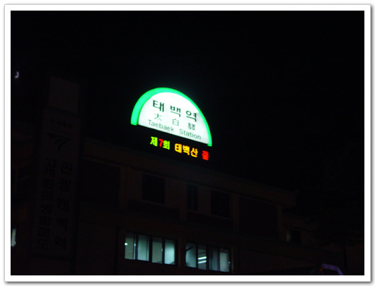

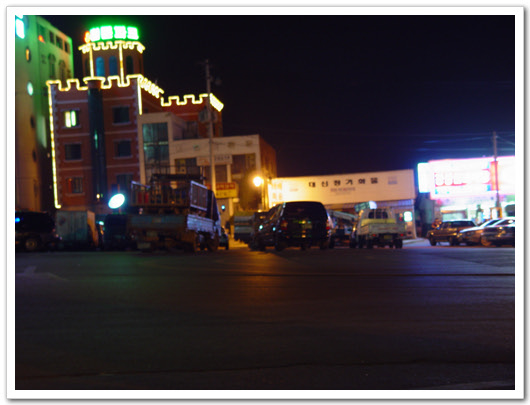

\- 태백역. 태백의 중심이다. 너무 우중충하다.

밤 11시쯤 삼척 맹방 해수욕장에 도착했다. 해수욕장은 강릉만이 북적이나 보다. 조용했다. 다들 텐트치고 잠만 자느라, 조용했다. 모래사장에 돗자리 펴고 2시간쯤 잠을 자고 출발하기로 했는데, 1시간 만에 모기가 물어 대서 일어나서, 차로 들어갔다. 자세가 영 안나와 뒤척이기를 20여분. 그러다 잤다. 도중에 알람 맞춰놓은 게 울어댔지만, 피곤하고 그냥 끄고 자 아침 5시 날이 밝기 시작할 때쯤에야 일어났다.

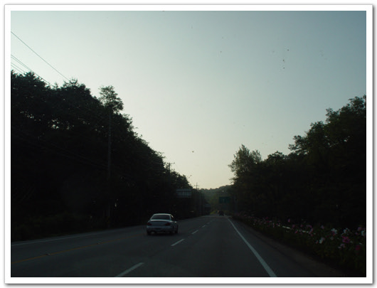

-이렇게 해가 뜰때까지 쭉 내려갔다.

7번 국도를 타고 쭉 내려갔다. 경주에 들러 구경 좀 한 후, 88고속도로를 타고 전라도로 넘어갈 생각이다.

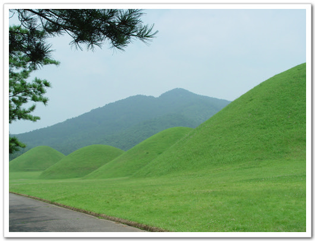

\- 태종무열왕릉. 무덤외에 전시물같은 없어 조금 아쉬었다.

