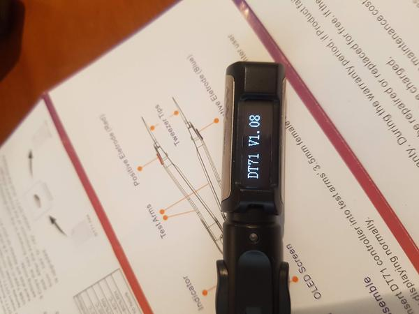
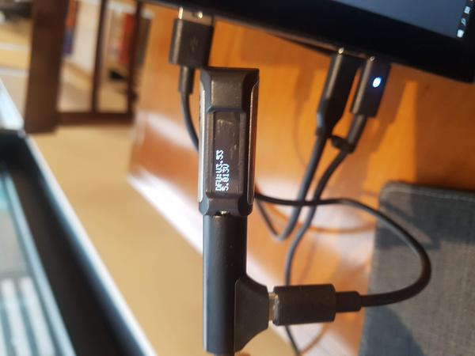
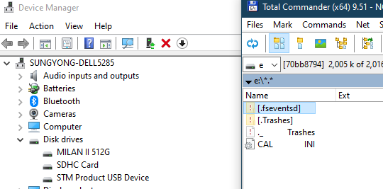

# DT71 디지털 멀티미더 트위저 사용기

DIY하는데 가장 많이 쓰는 기기가 멀티미터인데, 사용하다보면 불편한 점이 많다.

단자 두개를 찍고, 눈은 화면을 봐야하는데, 손 2개를 모두 사용하기 힘들 때가 있다.

그래서 집게 형태로 개조해서 사용도 해 보는데, 그래도 조그만 부분 체크할 때는 또 이대로 불편하다.

알리익스프레스를 서핑하다가, 트위저 형태로 된 멀티미터를 봤다.

꽤나 편해 보였다.

편한 만큼 가격이 제법 나갔다.

알리는 싼 맛에 사는 것인데, 이런 비싼 것은 선뜻 사기는 좀 그렇다.

그래서 장바구니에만 담아놓고 있었다.

그라다, 대원씨 만나 요즘 관심있는 기기 이야기하다가 이 트위저이야기를 했다.

그리고, 며칠 전 선물로 받은 디지털 트위저.

같이 시작한 일에 대한 뒷감당을 다 떠넘기고 내 할 할도 안 한 상태에서 선물을 받을 터라, 적잖이 미안하면서도 고마웠다.

암튼, 언박싱.

단촐한 구성이다.  요즘 설명서는 온라인으로 하는 추세라 해도 설명이 너무 빈약하다.

제조사 사이트 가서 설명서 다운받아서 읽어서 읽혀야 했다.

트위저부분에 충전지가 있어, 처음 저렇게 3.5파이 단자와 usb-c 단자로 해서 충전부터 시켰다.

펌웨어 버전을 보니, 1.08.  최신버전은 1.13.

무조건 최신 버전이기에 펌웨어 업그레이드부터 시작했다.

설명서대로 PC에 연결했다.

설명서대로라면 이동식 디스크로 인식해야 하는데, 반응이 없었다.

왜 일까 한참을 매뉴얼 정독을 했다.

원인은 3.5파이 단자를 끝까지 채결을 안해서였다.

이렇게 STM Product USB Device로 인식한다.

firmware는 1.13버전 .hex 파일을 root 에 복사했다.

그리고 재부팅.

그리고 버전 체크.  여전히 1.08

뭐가 문제일까 다시 매뉴얼 정독.

매뉴얼에 .hex파일을 복사후 확장자를 .rdy로 바꾸라고 되어 있더군.

그래서 확장자 .rdy로 바꾼 후 다시 복사.

그리고 재부팅

이제야 1.13으로 펌웨어 업그레드됐다.

트위저에 연결할 때도 끝까지 밀어넣어야 한다.

안그러면 트위저 단락시킬 때만 켜지고, open하면 다시 꺼져 버린다.

외부 충전기 전압을 측정해 본다.  5.10V 로 잘 측정된다.  저렇게 닿기 어려운 부분을 이렇게 쉽게 측정할 수 있구나.

조그만 크기에 비해, 기능은 왠만큼 다 된다.  AC전압과 전류 측정 모드만 없긴 한데, 그건 잘 안 쓰니까..

