# 맹골마을에서 두부만들기와 치즈만들기 체험

경기도 농업기술원의 교육 첫 체험교육으로 3월, 양주군에 있는 맹골마을을 찾았다.

버스를 타고 이동했다.

봄이고, 첫 외부 교육이고 하여, 마치 봄 소풍 가는 기분이었다.

버스는 경부고속도로, 올림픽대로를 거쳐 3번 국도를 타고 의정부를 지났다.

예전 복무했던 26사단 사령부 근처를 지나갔다.

제대한 이후로 이 근처로 올 일이 없어서 동네가 15년전에 비해 많이 바뀌었더군.

양주에서 파주쪽으로 한참을 가서, 25사단 사령부 바로 앞이 맹골마을이었다.

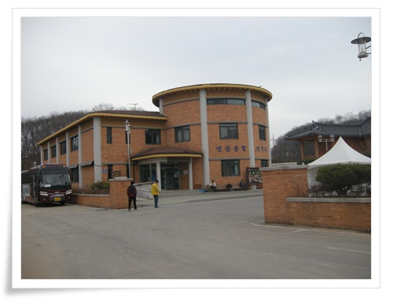

\- 맹골마을 마을회관. 지어진 지 얼마 안되어 보인다.

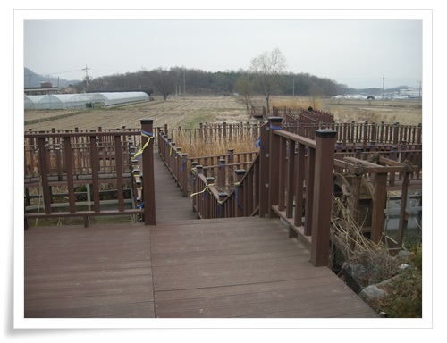

\- 마을회관앞 습지에 데크로 자연탐방로가 만들어져 있다.

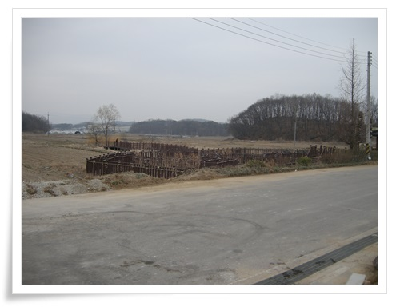

\- 마을회관에서 바로 본 풍경.

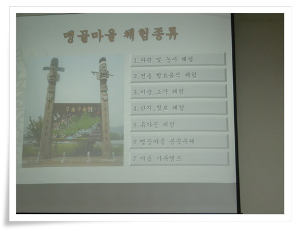

\- 정보화마을로 여러 체험행사를 하는데 그에 대한 소개를 들었다.

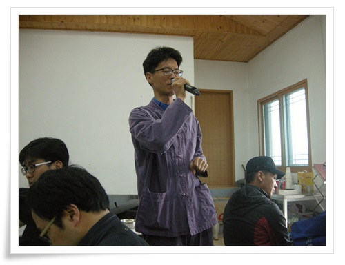

\- 소개와 오전 두부만들기 체험을 진행하신 분으로 원래 건축설계쪽 하시다 귀농하셨다고 한다.

많이 알려주시려 하는 열정이 가득했다.

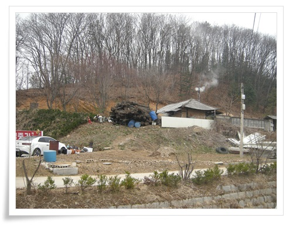

\- 맹골마을 통네 풍경

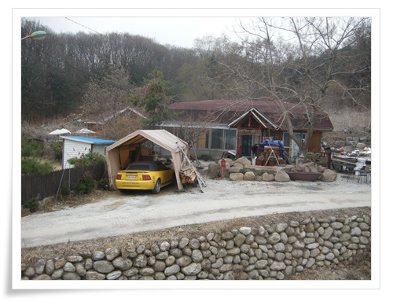

\- 좀 부유하 동네인지, 컨버터블카도 보이는군.

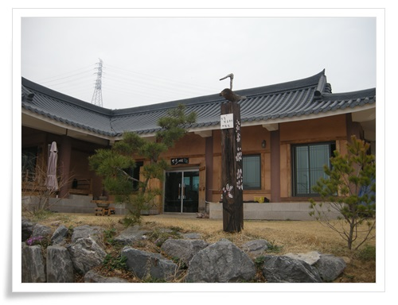

\- 여기가 두부 체험장

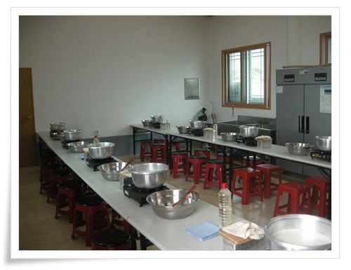

\- 두부 체험시설

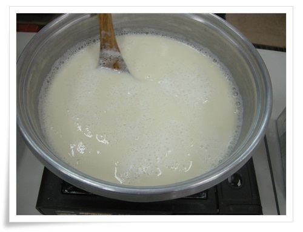

\- 두부 만들기 첫 시작으로 콩물을 끓이기 시작.

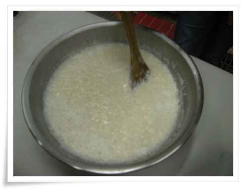

\- 간수를 부으니 덩어지리가 지기 시작한다.

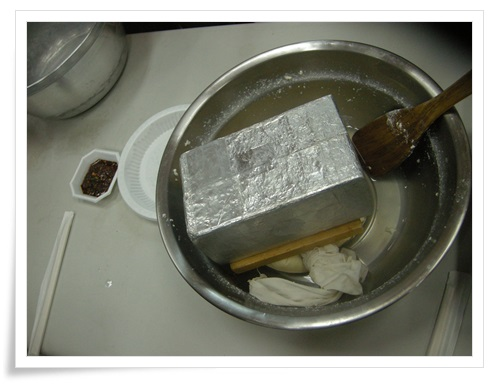

\- 덩어리가 어느 정도 될 때까지 저은 후 돌을 올려 물기 빼기.

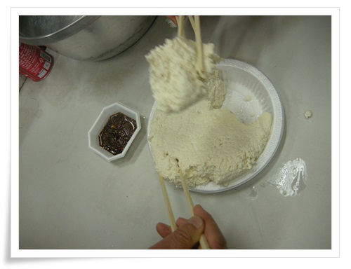

\- 완성된 두부 시식.

직접 만들어서 더욱 맛있었다.

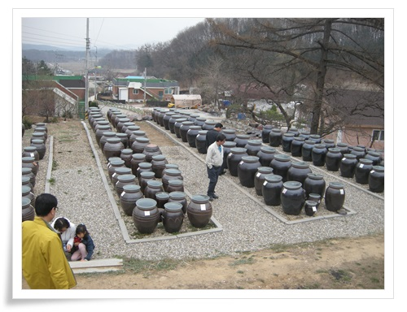

\- 두부 체험장 앞에 있는 장독으로 각각 장독의 주인이름이 붙어 있다.

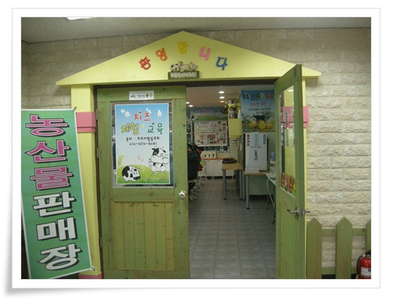

\- 점심 식사 후 치즈 체험장으로 이동.  여기가 치즈체험장.

마을회관 1층에 있다.

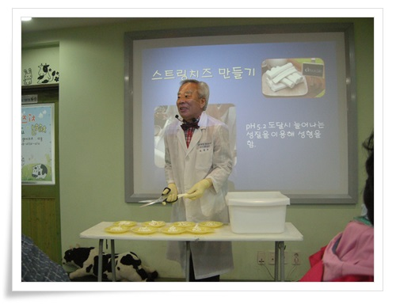

\- 치즈체험 진행하시는 분으로 연세가 되시는데 놀라울 정도로 열정과 활기가 있으시다.

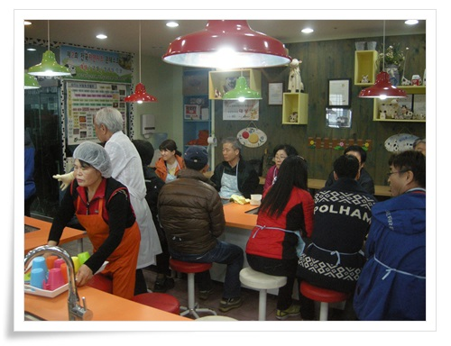

\- 이렇게 치즈 만들기 체험.

맹골마을.

그냥 놀러가 보기에도 괜찮아 보인다.

