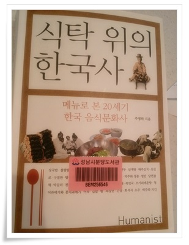
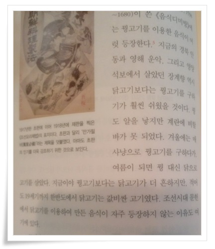

# 여태 거꾸로 알고 있었던 꿩대신 닭의 유래

즐겨듣는 팟캐스트중 하나가 MBC 라디오 '남경태의 타박타박세계사'.

그 코너중 좋아하는 것 중 하나가 역사학자 '주영하의 맛있는 역사'.

그 주영하교수가 쓴 '식탁 위의 한국사'라는 책을 봤다.

책 본문중 닭고기에 대한 편이 나왔다.

'꿩대신 닭'이라는 표현을 이제껏 꿩이 좋은데 할 수 없이 귀한 꿩 대신 값싼 닭고기를 쓴 것으로 잘못 알고 있었다.

그런데 반대더군.  값싼 꿩대신 비싼 닭고기를 쓴 것이었다.

조선시대는 닭고기는 값비싼 고기였다고 한다.

꿩은 겨울에 사냥으로 쉽게 잡을 수 있었지만, 여름이 되면 꿩을 사냥하기 힘드니까 돈은 좀 더 들지만 어쩔 수 없이 비싼 닭고기를 대신 썼다는 것이다.

