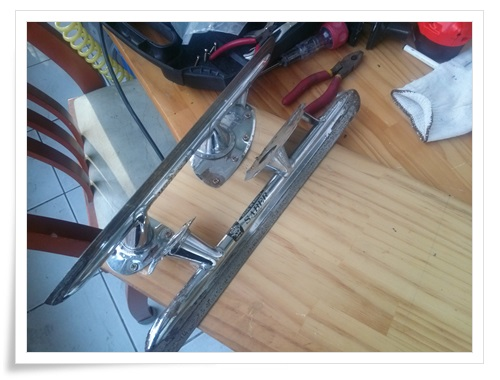
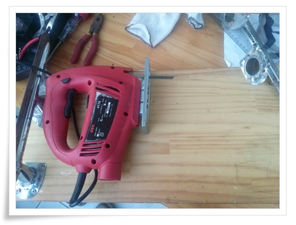
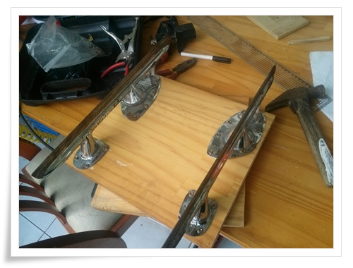
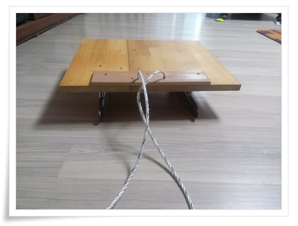

# 스케이트날 가지고 썰매 만들기

1997년 부대앞 논바닥에서 탔었던 스케이트화가 이제는 헤지고 찢어서 더이상 탈 수 없게 되었다.

이 스케이트날로 썰매를 만들어 보기로 했다.

어렸을 때 썰매를 탔던 기억을 더듬어보면, 내가 타던 썰매는 나무판자에 철사를 박아서 탔었다.

그리고 있는 집 자식들만이 스케이트날로 된 썰매를 탔었다.

그 럭셔리한 썰매를 30여년이 지난 지금에서야 만들어보려 한다.

\- 먼저 스케이트날 하나를 판자에 결합했다.

\- 나머지 한쪽을 부착전 직소로 판자를 자르고..

\- 부착 완료.

그런데 스케이트날에 맞추어 만들다 보니 막상 앉을 공간이 좁았다.

\- 위에 판자하나 덧대고, 앞에서 끌 수 있게 줄까지 달았다.

다음 달 얼음낚시 갈 때 들고 가서 시운전을 해 봐야겠다.

[이글루스 가든 \- DIY 나에게 필요한것들을 자작해...](http://garden.egloos.com/10004538)

