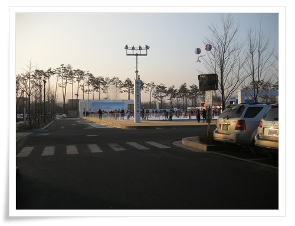
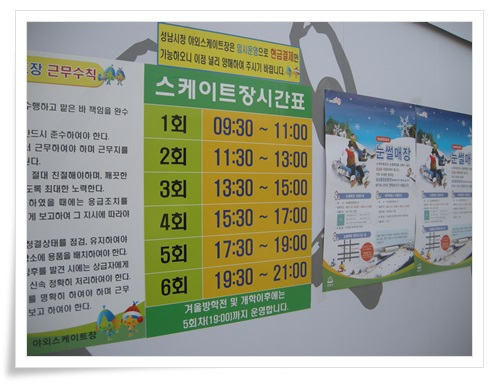
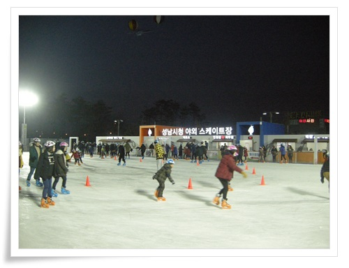
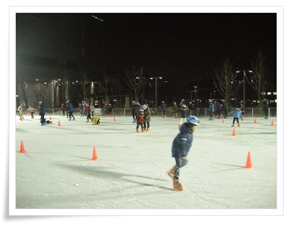
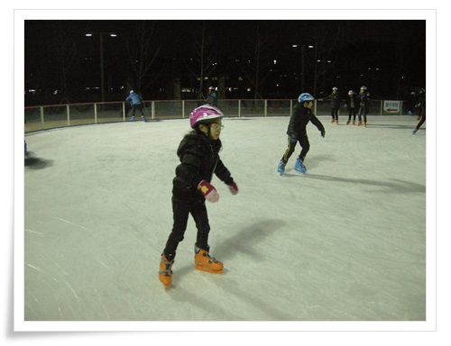
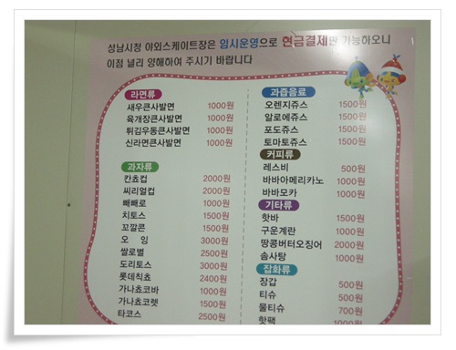

# 2013년 12월 성남시청 스케이트장

성남시청 스케이트장이 개장했다.

딸내미를 데리고 스케이트장으로 향했다.

\- 스케이트장으로 변신한 시청 주차장.

작년과 달라진 점은 외부 벽이 없어 한결 시원해보인다.

\- 스케이트장 시간표.

이 날 도착한 시각이 16시라, 4회 끊으려 했는데 매진했다.

그래서 시청에 있는 하늘북카페에서 책을 보다 5회를 끊었다.

1인당 천원.

이번에 장비도 싹 교체했는지 스케이트화도 헬멧도 모두 새거였다.

\- 스케이트장 입장.

\- 날이 어두워져 사람이 많이 줄었다.

\- 스케이트타는 딸내미.

탄지 1년됐다고 그 새 타는 법 다 까먹은 모양이다.

\- 타기 시작한지 30분만에 배고프다고 뭐 사달라고 하여 들어간 매점.

메뉴는 사발면으로 골랐다.

