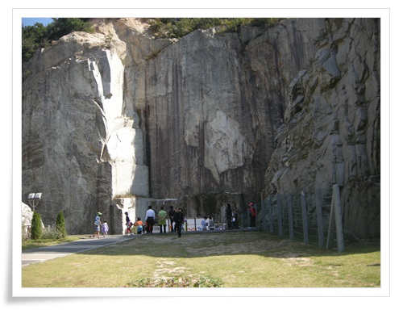

# 포천아트밸리로 가을 나들이

유난히 날이 좋은 2013년 가을.

식구들과 성묘갔다가 포천아트밸리에 들렀다.

원래 채석장이었던 곳을 멋진 장소를 탈바꿈 시킨 곳이라고 한다.

\- 먼저 입장료를 끊고,..  대인 3,000원 소인 1,000원.

모노레일이 있는데 한대로 운영하는 거라 대기시간이 엄청 길다.

그래서 그냥 걸어 올라간다.

걸어올라가도 얼마 안 걸린다.

5분이면 다 올라간다.

\- 걸어 올라가기 시작한다.

\- 아기자기하게 잘 만들어놨다.

\- 모노레일 옆으로 죽 걸어 올라간다.

\- 냇가에 핀 쑥부쟁이(?)이 가을을 느끼게 한다.

\- 5분 정도 올라온 꼭대기.  여기서 부터 슬슬 구경해 본다.

\- 조각공원처럼 조각들이 있다.

\- 야외 무대가 있어, 공연도 하고 그러나 보다.

\- 산의 8부 능선쯤 되는 곳이라 다른 산 봉우리들도 잘 보인다.

\- 천지호.  꼭 중국에 온 기분이다.

\- 천지호 주변으로 가꿔놓은 공원.

\- 수직으로 되어 있는 절벽이 채석장이었음을 알 수 있게 해준다.

\- 막걸리병으로 만든 하우스.  근데 별로 잘 어울리지는 않는 듯 하다.

[이글루스 가든 \- 여행다니기](http://garden.egloos.com/10001194)

