# 영월, 제천 일대 구경

원주에 놀러간 김에 인접해 있는 영월, 제천으로 구경갔다.

영월에 있는 요선정부터 갔다.

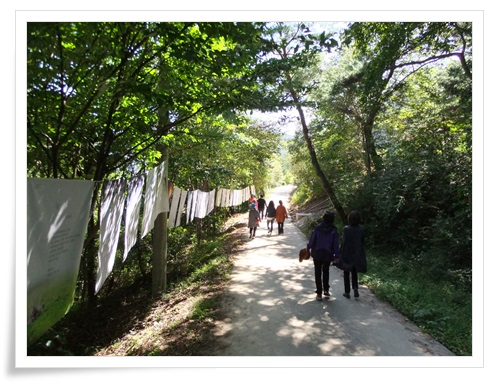

\- 요선정과 그 일대를 주제로 시 전시회가 있었다.

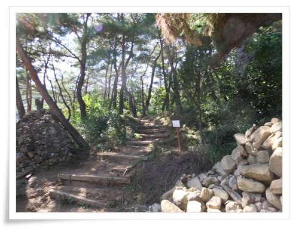

\- 요선정으로 올라가는 길

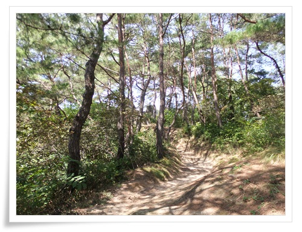

\- 소나무 숲길

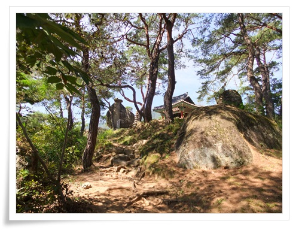

\- 요선정과 마애불이 보인다.

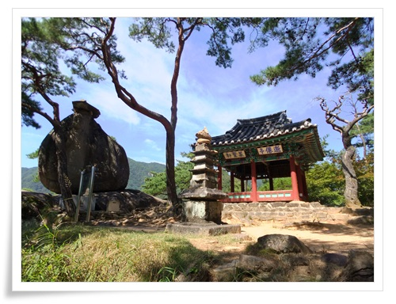

\- 단출하지만 멋진 풍경이다.

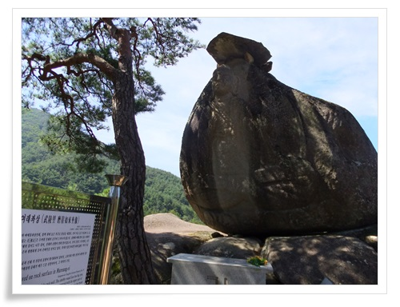

\- 무릉리 마애여래좌상.  고려시대 만들어진 불상이라 하는군.

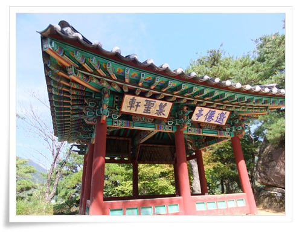

\- 요선정

조선시대 서예가였던 봉래 양사언이 평창군수 시절에 이곳에서 놀다가 신선을 맞이한다는 뜻으로 요선암으로 새겨놓아 여기를 요선암이라 부른다고 하는군.

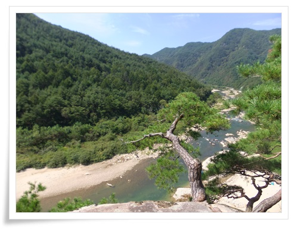

\- 마애여래상 뒤로 절벽에서 바라본 풍경이 멋지다.

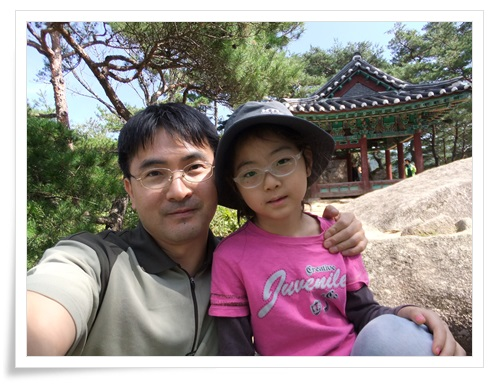

\- 딸내미와 한 컷

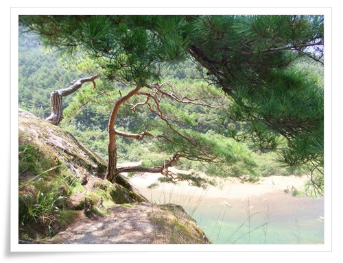

\- 절벽에 자라고 있는 소나무가 신기하군.

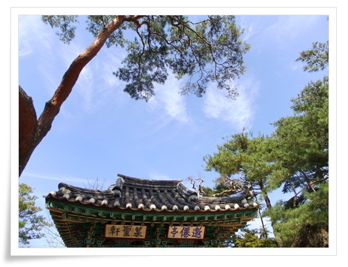

\- 정말 깨끗한 가을 하늘이다.

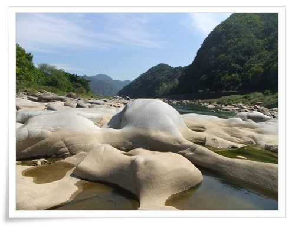

\- 요선정쪽 강에 있는 바위들이 멋지다.

물에 쓸려온 돌이 깎여 저리 둥글둥글해진 것 같다.

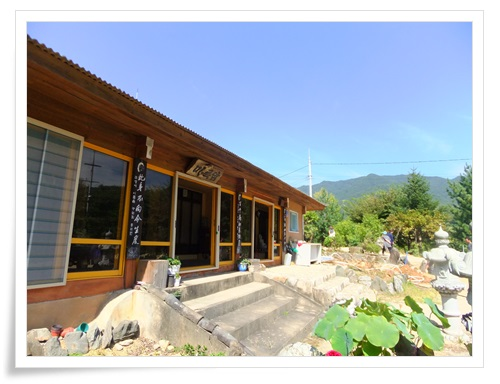

\- 요선정 아래에 있는 미륵암.

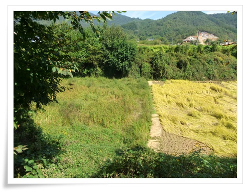

\- 요선암 밑으로 논이 있는데, 오른쪽만 벼가 자라고 오른쪽는 그냥 습지 상태인 듯 하다.

요선암에서 나와 근처 다른 곳으로 구경갔다.

먼저 간 곳 신림역.

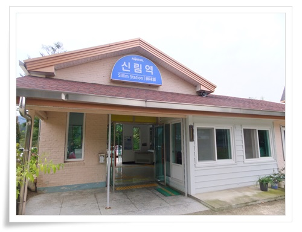

\- 신림역.  중앙선의 간이역이라 단촐하다.

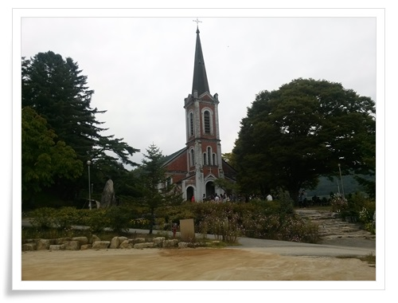

\- 그리고 신림역 근처에 있는 용소막 성당.

강원도에서 세번째로 건립된 성당으로, 조선말기 지어졌다.

그 다음은 탁사정으로..

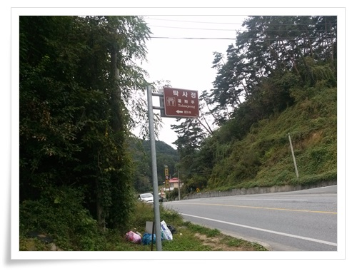

\- 탁사정으로 올라가는 길.

저 표지판을 잘못 이해해 더 갔다가 돌아왔다.

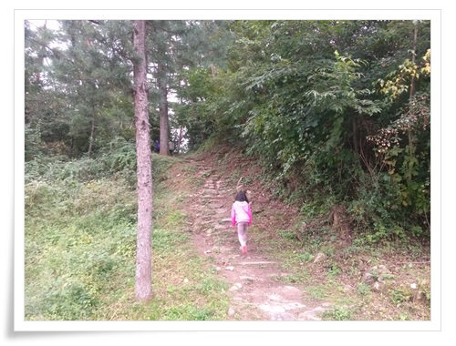

\- 탁사정으로 올라가는 길

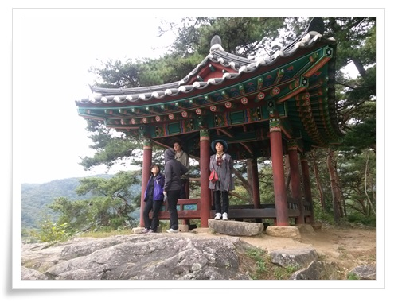

\- 이게 탁사정 정상.

탁사정이 이 정사를 말하는 것이 아니라 정자 주위의 절경을 말하는 것이라 하더군.

조선 선조때 해송 8그루를 심어 팔송정으로 했던 것이 시초라 한다.

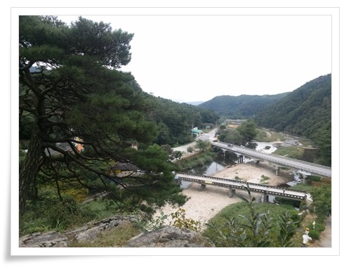

\- 탁사정에서 바라본 풍경.

다리가 없이 강만 흐르고 있었을 조선시대에는 선비들 놀기 좋은 장소였으리라.

다음은 배론 성지.

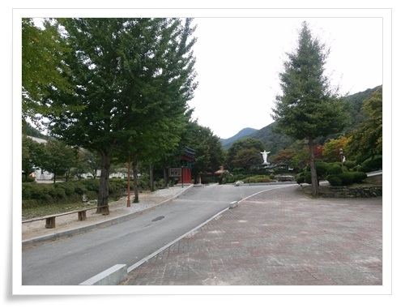

\- 배론성지 안.

배론이라는 명칭이 생소하여 이 성지를 만든 외국 신부 이름이 배론인가 했는데, 원래부터 있던 舟論(배론)이라는 지명이었다.

배론은 산골 마을로 배 밑바닥처럼 생겼다하여 붙여진 지명이다.

이곳이 성지가 된 까닭은 조선시대 천주교 박해를 피해 사람들이 살았고, 특히 황사영 백서가 씌여진 곳이어서다.

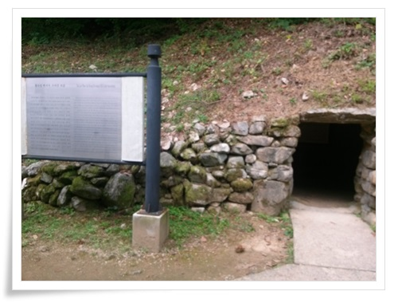

\- 황사영백서가 씌여진 토굴을 재현한 곳

황사영 백서가 뭔지 검색해 봤다.

나쁜 놈이더군.  종교를 위해 나라를 팔아먹으려 한 놈인데, 이 자를 기리기 위해 성지로 만들다니 천주교에 실망이 들더군.

황사영 백서 원문은 http://theologia.kr/zeroboard/zboard.php?id=koreatheo&page=1&sn1=&divpage=1&category=50&sn=off&ss=on&sc=on&select\_arrange=headnum&desc=asc&no=748&PHPSESSID=a38e068fd3ab66ef0eac6385f55575d3 에 다 나와 있어 봤다.

내용은 눈에 거슬리는 부분은 아래 내용..

**청의 속국이 될 것을 명하여 그 옷을 같이 입게 하고...**

**중국 종실의 한 여자를 시집보내서 왕부하게 되게면 지금의 왕은 부매가 될 것이고, 그 다음 왕은 외손이되므로 마땅이 황조에 충성을 다할 것이고...**

**이 나라(조선)의 병력은 본래 가냘프고 약해서 모든 나라 가운데 제일 끝인데다가 이제 태평한 세월을 2백년간이나 계속해 왔으므로 백성들은 군대가 무엇인지 모릅니다. ... 자칫 불행한 일이 있기만 하면 흙더미처럼 와르르 무너져 버리고 기왓장처럼 부서질 것이 틀림없습니다.**

**배 수십척에 5,6천명만 되어도 쓸 수 있을 것입니다.**

**예수의 거룩하신 가르치심에 의거하여 전교를 용납하지 않는 죄는 소돔과 고모라보다도 무겁다고 하였으니 비록 이 나라를 멸망시킨다 하더라도 성교의 표양에 해로울 것이 없을 것인데...**

암튼, 이 황사영백서 내용을 알고 배론성지라는 이 곳에 대한 감정은 안 좋아졌다.

점심은 배론성지 앞 삼거리에 있는 사또가든이라는 식당으로 갔다.

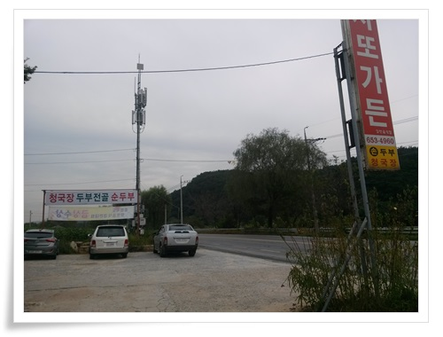

\- 사또가든

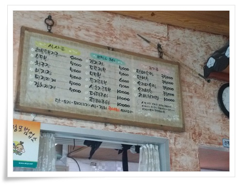

\- 사또가든 메뉴판.  싸다.

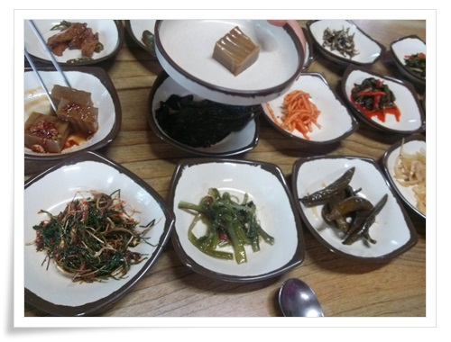

\- 먼저 나온 밑반찬.  맛있었다.  순위권 음식점이다.

다음에도 이 근처로 놀러올 일이 있으면 이 식당은 꼭 다시 들러야겠다.

[이글루스 가든 \- 여행다니기](http://garden.egloos.com/10001194)

