# 원주 황둔리의 산속너와집과 창촌마을

아내의 무슨 모임에서 놀러가는데 따라갔다.

장소는 원주 황둔리에 있는 창촌마을.

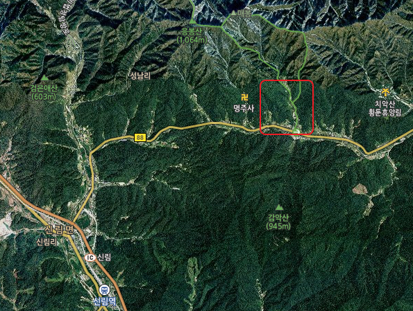

\- 저 곳이 황둔리 창촌마을이고, 숙소인 산속너와집이 있는 곳

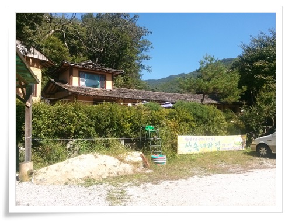

\- 내가 가 본 펜션중에서는 가장 좋은 풍경이다.

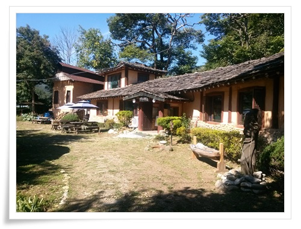

\- 이 건물이 본 건물이고, 식당과 찻집으로 사용중이다.

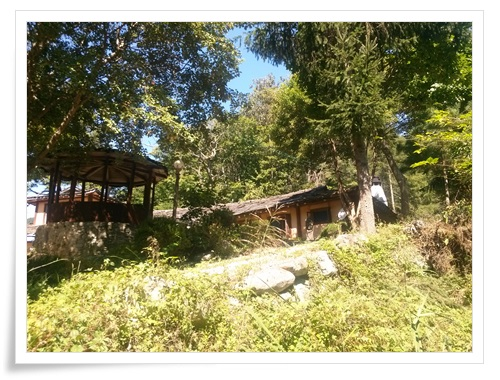

\- 바로 뒤가 산이고,

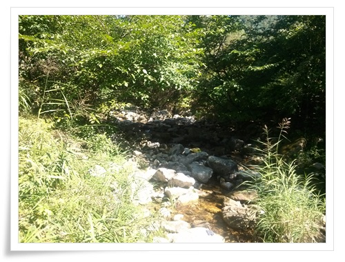

\- 바로 옆에는 개울가도 있고,

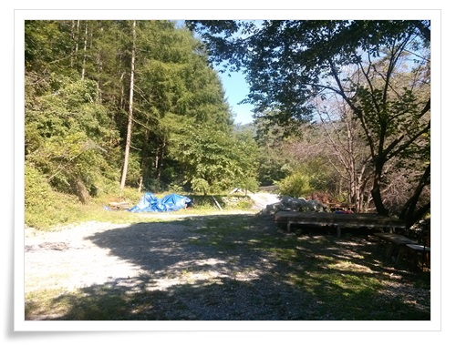

\- 건물뒤로도 공터가 넓다.

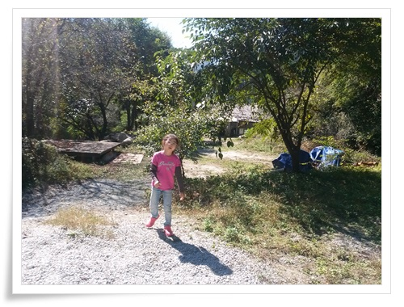

\- 딸내미와 집터 탐험중.

저 공터에 비닐하우스로 차고를 지어 작업장으로 쓰면 정말 좋겠다.

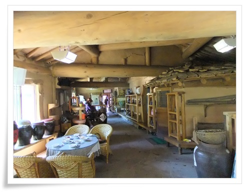

\- 식당 내부.

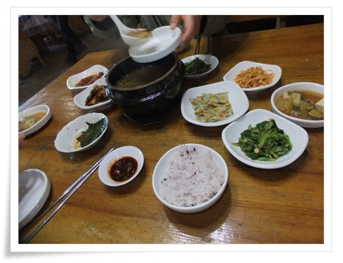

\- 점심 식사.  김치가 특히 맛있었다.

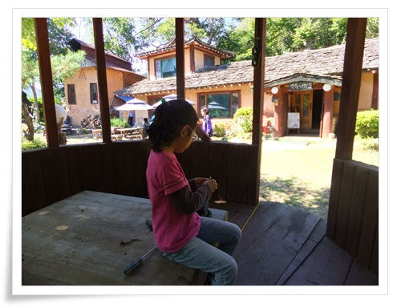

\- 정자같은 것이 있는데, 바닥 밑으로 물탱크가 있더군.

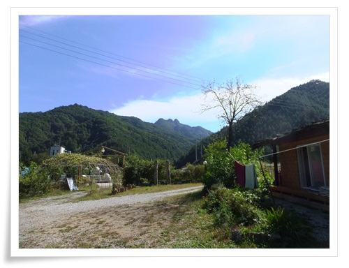

\- 앞으로도 시원한 풍경과 감악산이 보인다.

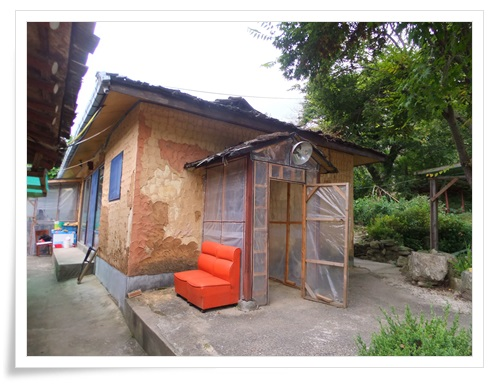

\- 내가 묵은 방.

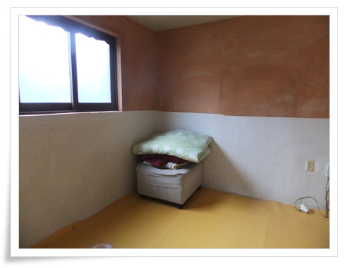

\- 방 내부.  휑하다.

썩 좋다고는 할 수 없지만, 그래도 1박에 5만원이니..

예전 아는 분의 충북 진천에 있는 집에 놀러갔을 때 부러웠던 생각이 다시 난다.

다음 날 아침 일어나 홀로 동네 구경을 나섰다.

치악산 자락의 응봉산, 매봉으로 가는 등산로가 있더군.

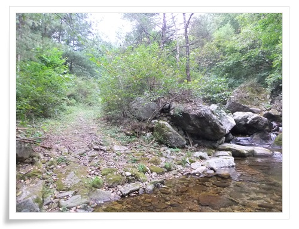

\- 본격적인 등산로까지 올랐다.

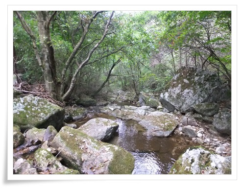

\- 골짜기가 좋군.

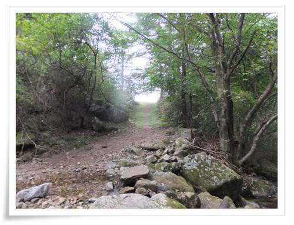

\- 임도도 있고..

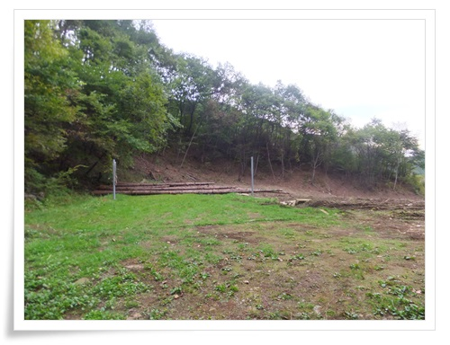

\- 여긴 뭔가 새로 개발하는 곳인가 보다.

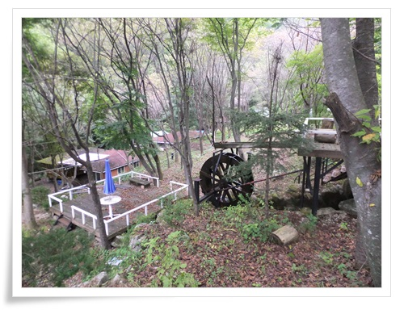

\- 산 밑에는 산장이 바로 있군.

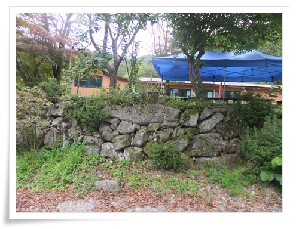

\- 매봉공원이라 써 있다.

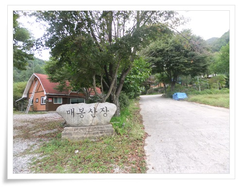

\- 정식 명칭이 매봉산장이군.  꽤 넓다.

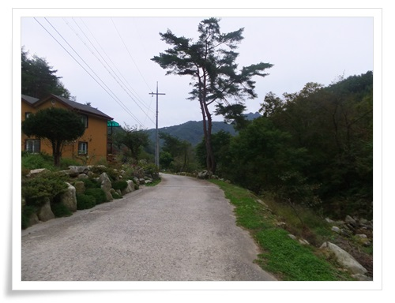

\- 산장 밑으로는 고급 전원주택들이 여러채 있었다.

하긴 이리 풍광이 좋으니, 많이 올 만 하겠다.

