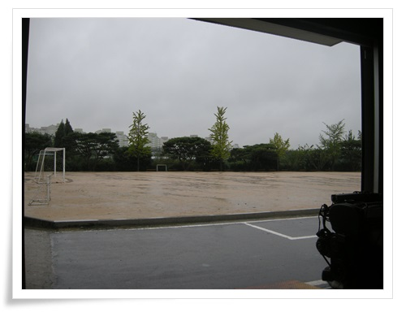
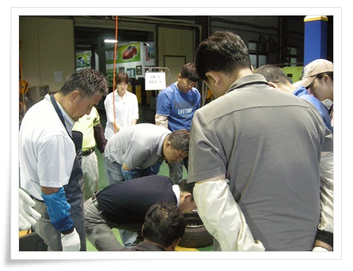
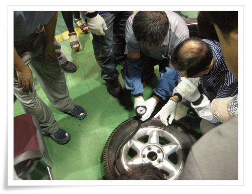
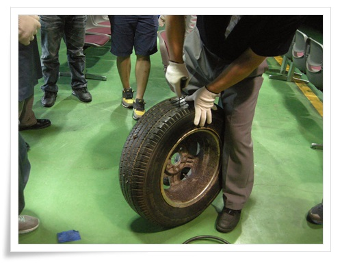
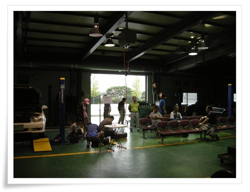
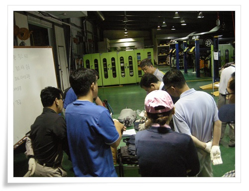
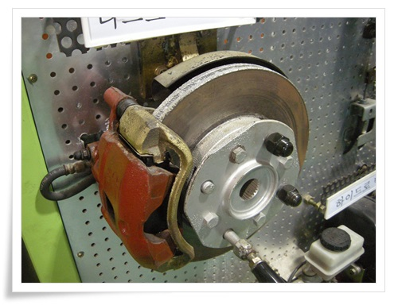
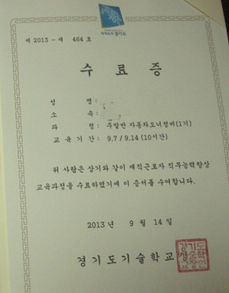

# 경기도기술학교에서 자동차오너정비교육 2일차

토요일 2주에 걸쳐 받은 자동차오너정비교육 2일차이자 마지막 날 경기도기술학교로 갔다.

이번 주요 교육 내용은 OVM공구로 타이어교체와 펑크 떼우기, 브레이크패드교체.

\- 실습장 한쪽 문을 개방하니 비내리는 운동장 모습이 보인다.

\- 이번 교육에 참여한 사람들.  첫날은 20명정도 됐었으나 이날은 15명 정도 된 것 같다.

\- 타이어에 공기 집어넣고,

\- 지렁이로 타이어 펑크 떼우는 것 실습

\- 10분간 휴식 시간.

\- 디스크브레이크와 브레이크패드 교체 시범

\- 디스크브레이크 모양.

실제 교체를 하려면 차 바퀴를 빼서 하는 거라 제법 힘좀 들여야 할 것 같다.

\- 교육 마치고 받은 수료증

경기도기술학교에 재직자가 들을 수 있는 과정으로 야간과정도 있더군.

강사가 3개월 과정의 용접과 생활전기을 추천했다.

제법 경쟁률도 세다고 하더군.

관심있어 찾아보니 교육시간이 저녁 6시반부터 9시반까지더군.

칼퇴근해도 시작시간에 맞출 수 없어 신청해봤자 난 소용없겠군.

