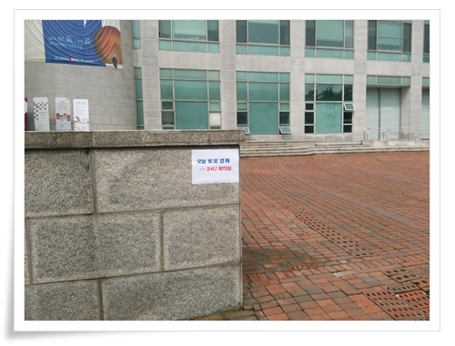
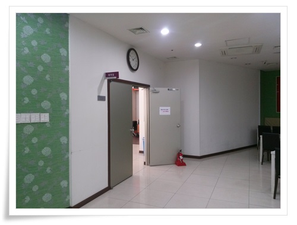
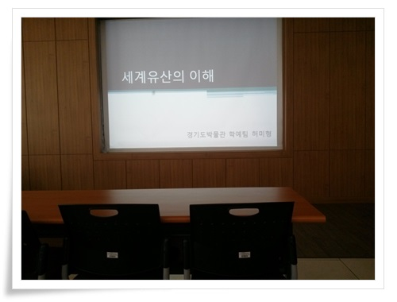
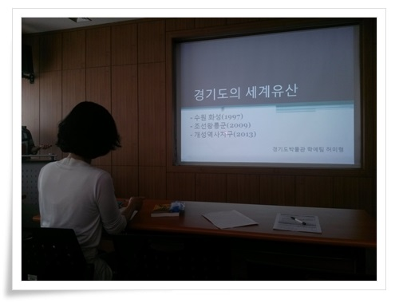
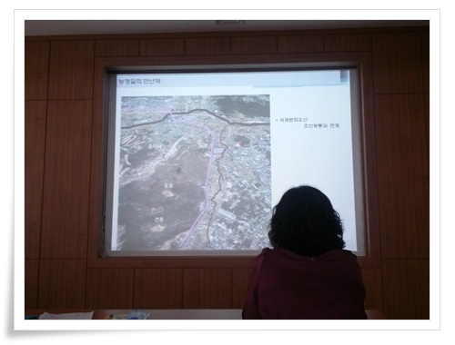
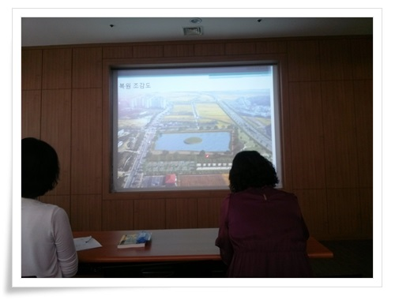
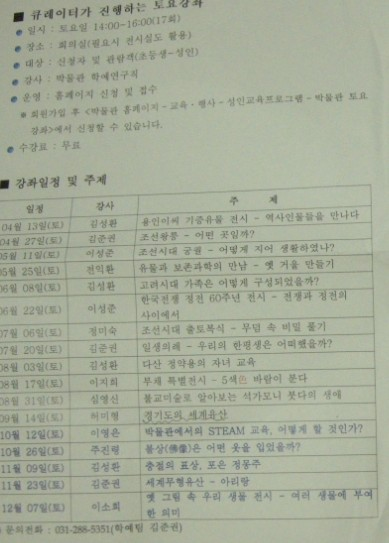

# 경기도박물관 토요강좌 \"경기도의 세계유산\"

딸내미 데리고 [어린이발굴체험](../11050427.html) 하러 갔다가, 박물관에 성인대상 강좌도 있다는 것을 알게 되었다.

격주 토요일마다 하는데, 제법 재밌어 보였다.

9월 14일 토요일의 강좌 주제는 "경기도의 세계유산"

경기도에 어디 놀러 갈 데 없나 궁금하던 차에 재밌겠다 싶어 신청했다.

2시부터 하는 거라, 일찌감치 주차를 하고 회의실을 찾아 갔다.

\- 토요강좌가 있는 곳을 알리는 표지

\- 구내 식당이 있는 안쪽이 토요강좌를 하는 회의실이었다.

\- 첫시간은 세계유산의 이해.

그다지 쉬운 내용은 아니었다.

유네스코 조직과 그 산하 분과들에 대한 시간이었다.

\- 두번째가 경기도의 세계유산

세계유산으로 등록된 것 중 경기에 있는 것이 수원화성, 북한의 개성, 화성의 융건릉 이고, 남한산성 등록예정이라고 한다.

\- 정조와 사도세자의 묘 근처에 있는 만년제 발굴에 대한 이야기 진행중.

\- 만년제 복원도.

만년제는 정조때 용 모양 지형에 맞게 여의주 모양을 만들기 위해 만든 저수라고 한다.

\- 올해 토요강좌 일정.  10월 26일에 하는 "불상은 어떤 옷을 입었을까?" 이거 재밌어 보인다.

