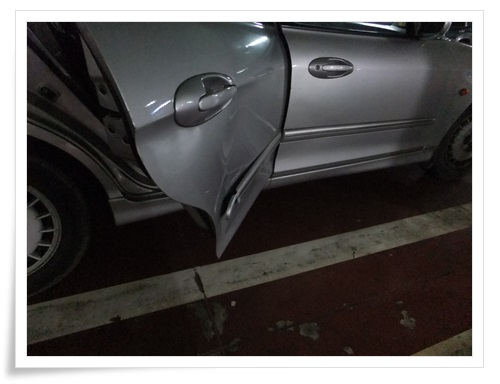
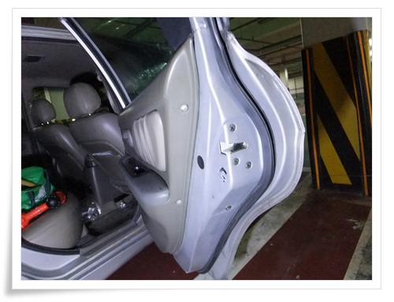
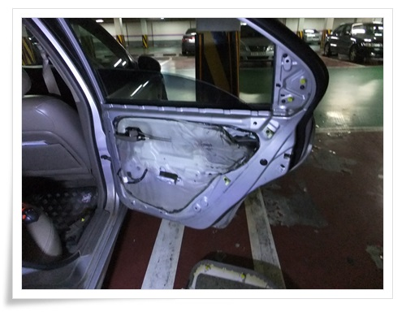
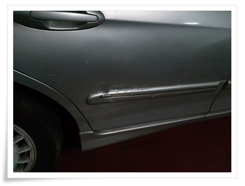

# EF소나타 셀프 야매 덴트

후진하다 뒷 문을 찌그러뜨렸다.

바퀴 높이의 주차방해물을 못 보고 후진하다 일을 낸 거다.

\- 도어가니쉬 한쪽어 떨어지고, 움푹 패인 문짝.

새차였다면 엄청 가슴 쓰렸겠지만, 1~2년 정도만 탈 차기에 그냥 저 덜렁거리는 것을 어떻게 하나라는 생각만 들었다.

철판이 오그라들었기에 가니쉬를 그냥 붙일 수는 상황.

셀프 야매 덴트를 해 보기로 했다.

도어트림을 뜯어 도어 안쪽에서 철판이 망치질하면 대충 펴질 것 같은 생각이 들었다.

실행에 옮겼다.

\- 먼저 도어트림 분해 시작.  옆에 있는 플라스틱 뚜껑을 먼저 열어야 나사가 나타나더군.

\- 안쪽 철판의 홈을 통해 기다린 뭉둥이를 집어넣고, 망치로 두들겨 대충 폈다.

\- 대충 펴고 난 후, 글루건을 바르고 마무리.

[이글루스 가든 \- DIY 나에게 필요한것들을 자작해...](http://garden.egloos.com/10004538)

