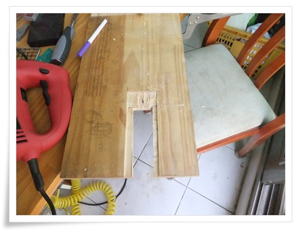

# 허접하게나마 테이블쏘를 흉내내 만든 직소 지그

테이블쏘를 갖고 싶었다.

하지 그 비싼 가격은 도저히 가질 수 없는 욕망이었다.

게다가 아파트 베란다에 설치하기도 힘들고..

대부분 원형톱으로 테이블쏘를 자작을 많이들 했다.

내겐 원형톱도 부담되고 하여 내가 가진 직소로 만들어 보려 했다.

검색해보니, 직소를 가지고 테이블쏘로 만든 사람들도 있긴 했다.

주로 프로파일을 가지고 만들던데, 제법 난이도 있어보이고, 재료비도 좀 들어 보였다.

나의 헝그리 스타일과 맞지 않았다.

최소비용으로 나만의 직소 지그를 만들어 보았다.

재료는 버려진 원목 가구에서 떼낸 나무판.

\- 이 직소가 거꾸로 매달려 있는 게 나의 컨셉

\- 직소가 들어갈 부분을 그리고,

\- 끌로 파기 시작.

\- 열심히 판다.

\- 어느 정도 모양이 나왔다.

\- 1차로 직소 넣어봤다.  조금만 손 보면 될 것 같다.

\- 본격적인 마감작업

\- 완성된 모습.

최소의 노력으로 비교적 잘 된 듯 하다.

\- 이렇게 직소가 거꾸로 매달린다.

\- 필드 테스트.

1차 성능 테스트 통과.

[이글루스 가든 \- DIY 나에게 필요한것들을 자작해...](http://garden.egloos.com/10004538)

