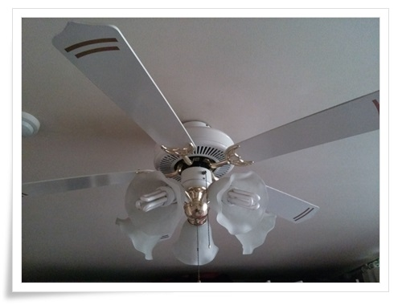

# 이번 여름 열대야를 버티게 한 실링팬

2007년 6월에 샀으니, 실링팬 사용한지 어언 6년이 되었군.

핸드폰 개발하면서 한창 더운 지역을 출장다닐 때 실링팬을 능력을 몸소 체험해 본 후, 아내의 반대를 꺾고 그 당시  7만원정도를 주고 샀었다.

잠 잘 때 에어콘 켜고 자기엔 전기세의 압박을 도저히 감담할 수 없고, 일반 선풍기로는 한계가 있었다.

실링팬을 켜고 자면, 바람이 솔솔 부는 자연속에 자는 듯한 느낌이 들어 열대야 속에서도 비교적 잘 잘 수 있었다.

이제 여름이 끝났으니, 실링팬도 쉬고 내년 여름까지 조명으로만 사용하겠군.

