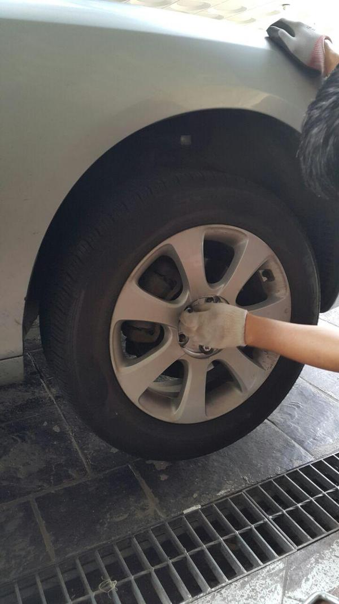

# 그랜저TG 와셔액 안나오는 것 수리 DIY

갑자기 워셔액이 안 나왔다.

워셔액이 벌써 떨어졌나 하며, 집에 도착하여 워셔액 한통을 다 집어넣다.

다음날 창문의 먼지도 닦을 겸 워셔액발사를 시도했지만 안 나왔다.

그리고 계기판에는 워셔액 없음 경고등이 들어와 있었다.

워셔탱크가 조수석 범퍼 속에 위치에서 뜯어 보기 전에는 정확한 원인을 알 수 없다.

일단 부품부터 주문했다.  현대가 부품하나는 싸니까, 워셔탱크와 워셔모터까지 15,000원, 배송비 4,000원에 주문했다.

부품번호는

- 91-981 98620 리저버 어셈블리－윈드 쉴드 와셔 986203L000
- 91-981 98510A 모터 & 펌프 어셈블리-윈드실드 와셔 985103L000

주문은 tuning09.co.kr 에다 했다.

이틀만에 배달되었다.

작업방법은 구독하고 있는 유투버 "고릴라diy car"( [https://www.youtube.com/channel/UCDhXFM19N0dhAfUhopxYrVQ](https://www.youtube.com/channel/UCDhXFM19N0dhAfUhopxYrVQ))에 물어봤다.

친절한 답변을 들었다.

더 다행인 것은 범퍼를 뜯지 않고 휠 인하우스쪽만 뜯어도 된다는 거였다.

작업을 시작했다.

OVM 공구로 들어있는 잭으로 차를 들어 올리고, 조수석쪽 앞 바퀴를 탈거했다.

그리고, 휠 인하우스 커버를 탈거했다.  바닥쪽으로 피스가 2개 있고, 나머지도 그리 자세가 잘 안나오는 위치라 좀 시간이 걸렸다.

뜯고 보니, 기름때 범벅인 워셔탱크와 워셔모터가 보였다.

동생보고 사진을 찍으라고 했는데 이 중요한 사진을 안 찍었더군.

워셔액모터 밑으로 호스가 빠져 있는 게 발견되었는데, 그게 원인이었다.

그걸 끼워 넣으니, 워셔액 잘 나온다.

사 놓은 부품은 다음번에 또 안 나오면 그 때 교체하기로 하고, 이번 수리 완료.

