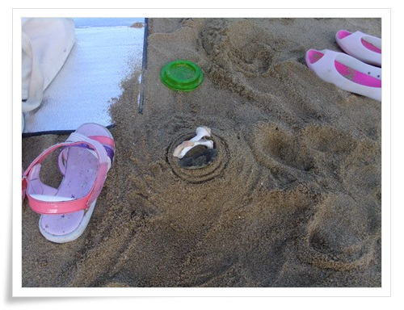

# 왜목마을 해수욕장

현대아산공장을 구경하러 멀리 아산까지 온 김에, 당진까지 더 들어갔다.

-왜목마을 해수욕장.

많이 알려져 있지 않아서인지, 사람으로 북적대지 않았다.

화장실도 깨끗하고, 무엇보다 샤워시설이 무료라서 좋았다.

\- 건물이 만들어놓은 그늘에 자리를 펴고,

\- 아내는 의자에서 구경, 나와 딸내미는 물속으로..

\- 서해안이라 완전 모래는 아니 모래80%, 갯펄20% 정도 되는 것 같다.

해수욕장에서 바닷물에 몸 좀 담그고, 딸내미와 모래놀이하며 논다.

이렇게 딸내미와 해수욕장에서 놀 날도 몇년 안 남은 것 같다.

2시간정도 물놀이하고, 저녁을 먹으로 근처 해물칼국수집으로..

\- 7천원짜리 해물칼국수

