# 죽전야외음악당 용인거리아티스트 공연 관람

성남시에 살지만, 길만 건너면 죽전인 성남시 끄트머리에 살기에 용인 시설을 더 많이 이용한다.

용인시 공식 블로그에서, 죽전야외음악당에서 하는 공연 소식을 보고 딸내미를 데리고 야외음악당으로 갔다.

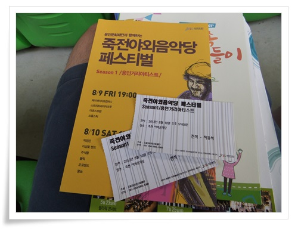

\- 입구에서 받은 입장권과 팜플렛.

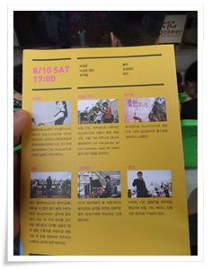

\- 이날의 순서는 박정은, 이성호밴드, 주석렬, 몰릭, 꿍쇼.

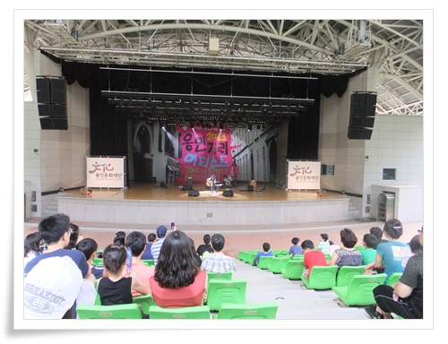

-관객은 한 150여명 정도.

무더위와 오전에 퍼부어댄 비로 별로 많지 않다.

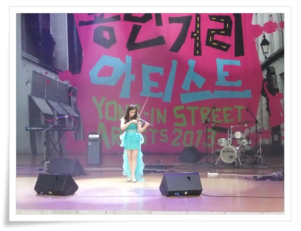

\- 첫 순서 전기바이올린 연주 박정은, 내가 좋아하는 피이졸라의 리베르탱고가 연주되었다.

\- 두번째 이성호밴드의 재즈공연.

재즈를 잘 모르는 나이지만, 묘한 끌림을 주었다.

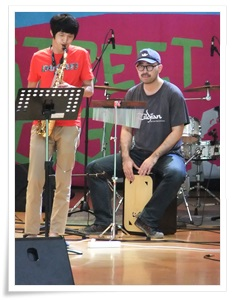

\- 저 타악기 소리가 좋았는데, 저거 이름을 모르겠다.

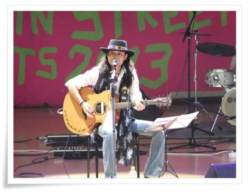

\- 세번째, 포크송 싱어 주석렬.

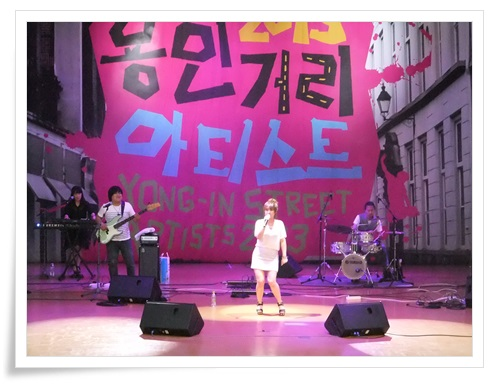

-네번째, 밴드 몰릭.

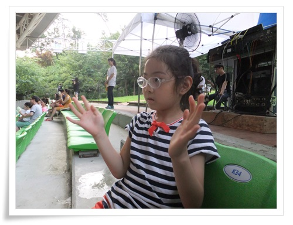

\- 옆자리에 앉은 딸내미.

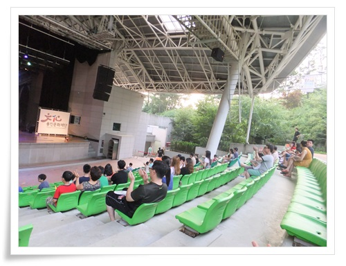

\- 공연이 진행될 수록 관객의 수는 줄어들었다.

처음 150여명에서 시작되 관객은 마지막 30여명으로 줄었다.

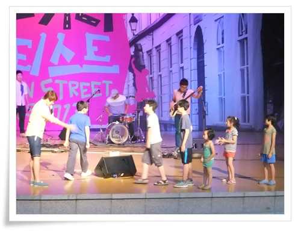

\- 중간에 진행된 게임.

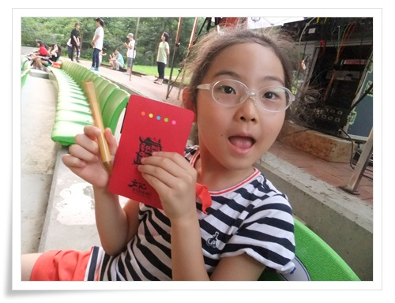

-게임에 참여하여 수첩과 볼펜을 받아 좋아하는 딸내미.

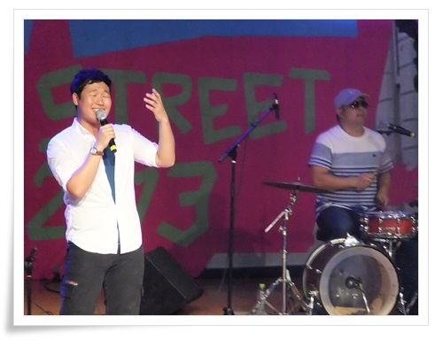

\- 마지막공연은 쿵쇼.

관객이 별로 없는데로 공연 자체를 즐기며 노래하는 모습이 좋았다.

