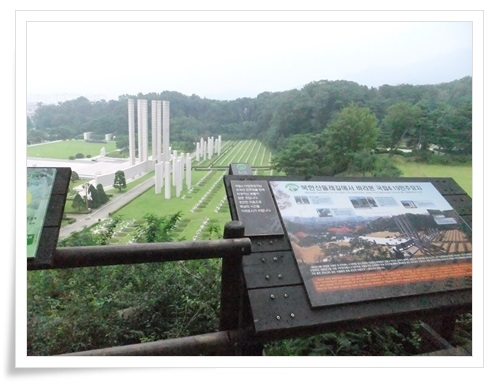
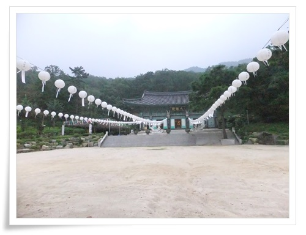

# 북한산 둘레길 - 소나무숲길 가 보기

무료한 토요일, 성호씨를 따라 북한산 둘레길 가기로 했다.

집에서 9401번 광역버스를 타고 순천향대병원에서 다시 142번 간선버스로 갈아타고, 쌍문역에서 130번 버스를 타서,  시작지점인 우이동에 도착했다.

\- 시작지점

\- 뭔가 리조트같은 것을 짓고 있다.

다 지어지면 더더욱 계곡은 왜소해보이겠군.

\- 우이동 계곡.  비온 후라 제법 수량이 많다.

\- 계곡 너머 무질서하게 펼치진 음식점도 보이는군.

\- 입구를 걷기 시작한 지 얼마 안되어 다시 도로가 나왔다.

둘레길 표지를 따라 걷는다.

\- 여기서부터 1구간 소나무숲길 시작이군.

\- 이제 산길을 걷는 느낌이 난다.

\- 현 위치 우이-01

\- 둘레길이라 주택가를 따라 걷는 길이 많다.

\- 사유지인 밭 옆으로 난 길도 걷고,

\- 약수터에서 잠깐 약수 마신다.

\- 예전 약수터로 씌인 것 같은 시설물이 보인다.

\- 넓찍히 쉴 수 있는 공간도 나오고,

\- 야생꽃을 심어놓은 구간도 있고,

\- 다시 주택가로 나와서 걷는다.

\- 다시 산 길 진입구.

\- 이제 완연한 능선길.

\- 4.19 국립묘지가 보이는 전망대.

예전 대학 3,4학년 북한산 오를 때 이 4.19 기념탑에서 묵념을 시작으로 북한산 올라갔던 기억이 난다.

비가 쏟아질 것 처럼 천둥소리가 울려댔다.

덥고, 습한 날씨에 바람도 안 불어 무지 더웠다.

대광사에서 비가 지나가기를 기다렸다.

\- 천둥소리에 비가 어서 지나가기를 기다리는데, 올 듯한 비는 안와 다시 걸었다.

막상 걷기 시작하니, 비가 오기 시작했다.

제법 왔다.

우의를 입기도 애매한 양의 비라, 우산을 쓰고 화계사까지 걸었다.

화계사에 도착한 시각이 13시 30분쯤.

혹시 점심 공양시간 아닌가 봤는데, 11시부터 11시반까지가 일반인 대상 점심 공양시간이더군.

\- 이날의 이동 괘적.

정작 둘레길을 걸은 시간보다 이동하는 시간이 더 길게 걸리긴 했다.

간만에 땀을 많이 흘리면서 걸으니 찌뿌둥한 몸이 풀렸다.

