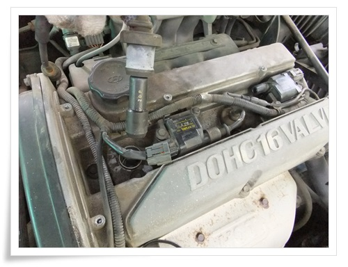

# EF 소나타 점화플러그와 배선 교체

중고차는 어떤 고장이 기다리고 있을까라는 묘한 스릴이 있다.

그 고장을 통해 뭔가 해 보는 소소한 재미가 있다.

이번 차, 가속할 때 뭔가 울컥하는 증상이 있었다.

주로 발생하는 시점은, 정지에서 출발할 때 rpm 1500~1800사이 1단->2단 변속 중 뭔가 기어가 안 물린 듯한 느낌이 들 때가 있었고, 4단에서 가속하려고 할 때 rpm 2000에서 울컥울컥 대는 증상이 있었다.

자동변속기가 처음이다 보니, 이게 변속기 문제인가 싶기도 했고,

그리고 가솔린차도 처음이다 보니, 휘발류차라서 그런가 하고 감이 잘 안 왔다.

정비소를 가면 되기야 하겠지만, 오래된 차다 보니, 엄청난 견적으로 겁을 줄 것 같은 상황이 싫어 가급적 혼자 해결해 보려 했다.

정비책과 검색을 통해 이 현상을 일으킬 수 있는 원인으로 크게 아래 4가지로 좁혀졌다.

1\. 미션오일 교환시기 넘김

2\. 점화플러그와 배선 수명 다 함

3\. 점화코일 고장

4\. 미션입출력센서, 산소센서, 맵센서 등 각종 센서 고장

이중 가장 돈이 적게 드는 것부터 해 보기로 했다.

어차피 점화플러그는 교환시기도 넘긴 것 같으니 말이다.

부품 검색을 모비스 사이트에 가서 품번을 조회했다.

그리고 옥션에서 주문했다.

순정품보다 조금 싼 호환품으로 주문했다.

점화플러그4개 + 배선 2개 + 배송료 = 18,000원에 주문했다.

\- 배송된 점화플러그와 배선2개

\- 본넷을 열고, 작업 시작.

먼저 헤드 커버부터 열였다.

\- 헤드커버를 여니 등장한 점화코일2개와 배선.

\- 점화플러그에 연결된 배선을 뺐다.

\- 21mm 점화플러그용 소켓렌치 준비.

\- 1번 플러그부터 빼기 시작.

\- 역시나 제법 낡은 플러그다.

\- 인터넷 검색하다 보니, 플러그 자가 교체하다가 부러져서 견인차로 끌고 간 경우가 제법 많다고 했다.

원인이 플러그가 고착되어 잘 안 풀어져서 그런다가 하여, 방청제를 뿌려 나사가 잘 풀리도록 해야 한다고 하더군.

그래서, 다이소에서 2,000원 주고 산 방청제를 뿌렸다.

\- 2번, 4번 플러그는 점화코일 밑으로 연결되어 있어 점화코일을 제거했다.

\- 마지막 플러그까지 완료.

시동 걸리는 것 확인하여 플러그 교체 작업 완료.

여기까지 총 40분 소요.

\- 제거한 플러그와 배선.

간만에 DIY하는 김에 타이밍벨트도 점검해보기로 했다.

현 주행거리 149,330km.

이전 정비내역은 모르는 상태.

보통 8만km에 교체를 하니, 그 때 교체했다고 가정하면 교체후 7만 정도 된 셈이라 좀 불안하긴 했다.

\- 타이밍벨트 점검을 위해 타이밍커버를 분해하기로 했다.

\- 타이밍커서 분해하니 타이밍벨트가 보인다.

겉보기 상태로 7만정도 되어 보이긴 하다.

\- 자세한 상태 점검.

갈라진 곳이나, 실 풀린 곳, 이 빠진 곳은 없어 그래도 1~2만 km는 버틸 것 같다.

5,000km 주행 후 다시 한 번 점검해봐야겠다.

DIY를 마치고 시험 운행을 나섰다.

엔진부조 현상을 사라졌는지 확인을 위해 동네 한바퀴 돌았다.

현상 재현은 안 된다.

좀 더 운행을 해 봐야겠지만, 일단 작업 성과 만족이다.

