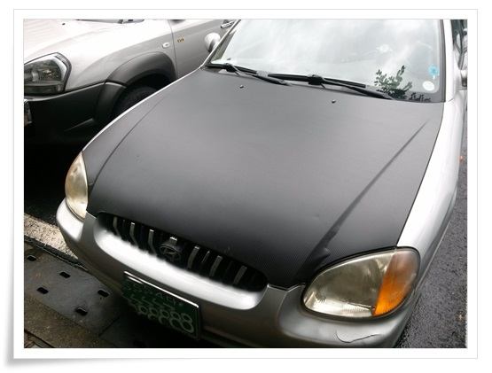

# 카본 시트지로 본넷 랩핑 실패기

99년식 EF 소나타.

많이 낡았고, 특히 본넷은 도장도 벗겨지고 모서리도 녹슬도 하고 한층 더 볼품없이 보이게 했다.

이걸 최소한의 비용으로 탈피하는 방법으로 내가 선택하는 것이 본넷 랩핑.

시트지 붙이는게 손기술을 꽤나 요구하는 것은 알고 있었지만, 그래도 오래된 차고 실수하더라도 큰 부담이 없는 차이기에 감행했다.

인터넷쇼핑몰에 제일 싼 걸로 주문했다.

135cm x 200cm 크기이고, 배송료 포함 3만원이었다.

색상은 검색에, 빗살무니.  가장 흔하게 사용하는 것으로 골랐다.

기본이 2명이 해야 하는 작업이라고 하여, 장안동 본가로 가서 동생과 같이 작업을 했다.

본넷을 깨끗히 닦고, 녹슨 부분을과 도장 벗겨져 울퉁불퉁한 부분은 그라인더에 융을 연결해서 갈아냈다.

그리고, 본넷에 연결되어 있는 워셔 노즐과 호스를 분리했다.

그다음 분무기에 주방세제와 물을 섞어 넣어 본넷에 골고루 뿌렸다.

카본시트지를 뒷면에 분리하면서도 퐁퐁물을 뿌려야 하는데, 별도의 사람이 필요했다.

엄마를 불러 분무기로 뿌리도록 했다.

\- 한시간의 작업 시간에 걸친 결과.  곡면에 들떻고, 곡면 처리가 부실하다.

실패 원인 분석에 들어갔다.

인터넷 검색을 하여 다른 사람들은 어떻게 했나 봤다.

가장 큰 원인은 히팅건으로 말리지 않았고, 특히 곡면에서는 히팅건으로 늘려서 붙여서 했는데 그냥 붙여서 이 고무재질이 오그라든 것 때문으로 생각된다.

양카스러워지긴 했지만, 그래도 이전의 추잡스런 모습에서는 벗어난 것에 일단 만족한다.

남은 분량으로 사이드미러나 해 볼까 했는데, 이 작업은 그야말로 DIE라고 말리는 작업이라 하여 후일을 도모한다.

