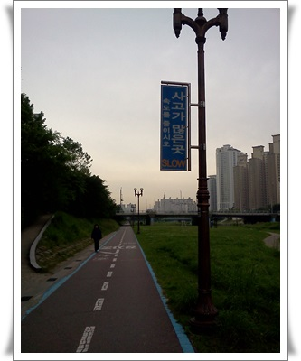

# 다이어트으로 운동 시작, 그리고 무례한 자전거

운동을 전혀 안 하면서, 먹기는 또 많이도 먹어 살이 디룩디룩 쪄간다.

요즘 의욕이 별로 없는 것도 아마 몸무게가 불면서 그런게 아닌가 싶다 싶은 김에 샤워하다가 거울에 비친 옆구리살이 한 주먹으로 잡히는 것에 이래선 안되겠다는 생각을 가지고 몸관리를 하기로 결심했다.

현재 무게 78kg, 목표 70kg.

실천방법은 운동과 저녁 7시 이후 금식.

그 첫 운동으로 인라인을 골랐다.

왕년에 주말마다 잠실에서 여의도까지 로드런했고, 회사가 반포에 있었을 때 매일 저녁시간 반포에서 여의도까지 왕복을 했었던 그 시절을 생각하면서..

인라인을 신고 탄천으로 나섰다.

분당 중앙공원까지 왕복 18km 주행했다.

역시나 저질 체력으로 왕복하는동안 5번정도 쉬었다.

첫 운동에 찬물을 끼얹은 것이 있었으니, 자전거였다.

왕복 2차선 자전거도로로 주행을 하고 있는데, 뒤에서 자전거 벨소리가 요란하게 울렸다.

난 우측 차선을 지키고 가고 있는 상태고, 추월하려면 좌측 차선을 통해 추월하려면 될 것을 매우 신경질적으로 소리내고 있었다.

그러다, "야! 비켜!" 하는 반말로 소리지르는 것이었다.

예의없는 것들에 잘 해 주고 싶은 생각이 없기에, 왜 반말지거리를 하냐고 하니까 잘 알아듣기 힘든 소리로 뭔가 욕지거리를 계속 쏘아대면 추월해갔다.

나도 추월해서 따라가고 싶었지만, 인라인의 속도가 자전거에 못 미치고, 게다가 저질 체력에 숨까지 차 온 상태라 그냥 멀어져 가는 모습을 지켜 볼수 밖에..

자전거를 탄 것은 50대후반으로 보이는 남자로 뭔가 제대로 돈을 쓴 듯한 복장과 자전거를 타고 있었다.

자전거 입장에서는 자기의 전속력에 방해되는 것에 신경이 거슬리는 모양인 듯 싶다.

그리고 자전거보행자겸용도로를 자전거전용으로 착각을 하고 있는지도..  명백히 탄천은 자전거보행자겸용 도로이건만..

자동차 운전할 때나 자전거 탈 때 보행자한테 절대 경적을 울리지 않는 나로서는 참으로 무례한 자였다.

아무래도 이놈의 "따르릉 따르릉 비켜나세요"라는 자전거 동요가 다 버려놓은 듯.

암튼 저런 자들때문에 비싼 자전거타는 사람들에게 안 좋은 편견만 자꾸 생기는 것 같다.

