# 양평물소리길 2코스 산책

부처님의 자비로 3일 연휴의 시작인 금요일, 양평물소리길 산책에 나섰다.

1코스에 먼저 다녀온 성호씨를 따라 가기로 했다.

12시에 국수역에서 만나기로 전날 약속을 했을 때 집에서 국수역까지 시간을 검색해보니 자동차로 1시간 10분.  대중교통으로 2시간 45분이 나왔다.

자동차로 가야겠다 생각하고, 출발 전 다시 교통검색을 했는데 자동차로 걸리는 시간이 1시간50분.

인터넷 게시판을 보니 고속도로이고 국도이건 간에 설,추석을 능가하는 정체라고 아우성이었다.

대중교통으로 가기로 마음을 바꾸고, 약속시간도 1시간 연기했다.

딸내미를 데리고 분당선을 타고 왕십리역에서 중앙선을 탔다.

왕십리에서 탈 때부터 지하철은 출퇴근길 수준의 빽빽함이었다.

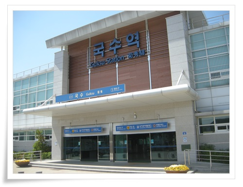

\- 드디어 도착한 국수역.

6번 국도타고 자동차로 많이 오고 가면서 국수역이라는 표지판은 많이 봤는데 직접 와 보기는 처음이다.

장시간 걸어야 할 것이기에 먼저 점심 식사부터 하러 식당 검색을 했다.

국수역은 블로거의 활동이 뜸한지 맛집 검색에 나타나는 음식점이 없었다.

기껏 뜬 것은 역전에 있는 식당이 맛도 없는데 양도 적도 비싸다라는 글, 그리고 6번 국도변에 있는 순대국밥이 그럭저럭 괜찮다는 것 정도.

일단 식당이 모여 있는 6번 국도쪽으로 걸어갔다.

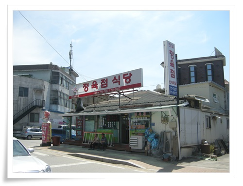

\- 뭔가 지역주민을 상대로 영업하는 느낌의 식당이 눈에 띄어 들어갔다.

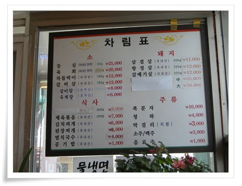

\- 메뉴판에서 제육볶음을 시켰다.

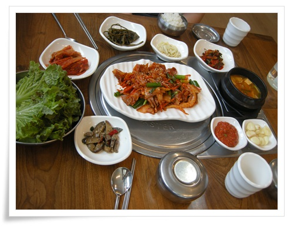

\- 크게 기대를 안해서인지 모르겠지만, 맛이 괜찮았다.

반찬도 깔끔하니 잘 나왔다.

계산은 성호씨가..

본격적인 산책은 국수역을 바라보고 오르편 굴다리로부터 시작했다.

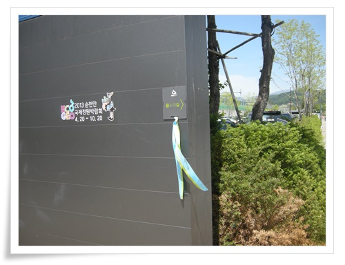

\- 물소리길은 사진과 같이 작은 표지와 리본으로 길을 안내하고 있었다.

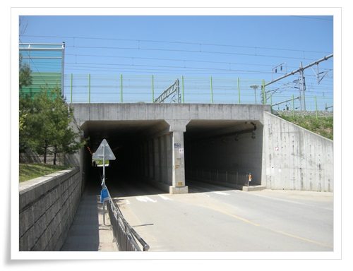

\- 시작은 굴다리 통과부터.

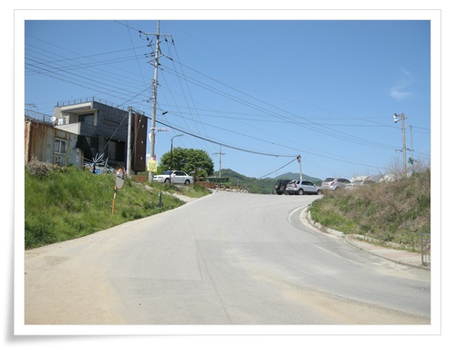

\- 굴다리 통과후 오른편 길로 갔다.

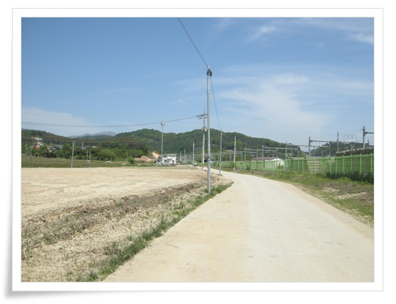

\- 오픈한지 얼마 안 된 길이라 그런가 사람이 없다.

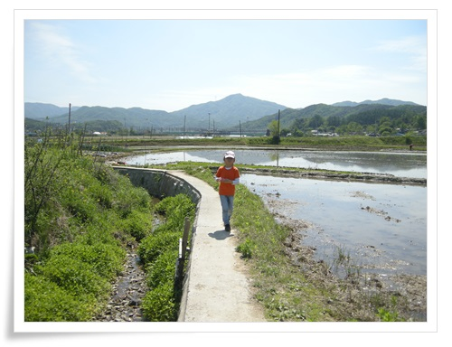

\- 이런 논두렁길도 가고 그래서 걷는 재미가 좋다.

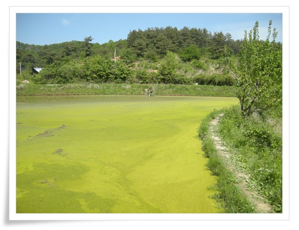

\- 이렇게 논 가 바로 옆 두렁을 통과한다.

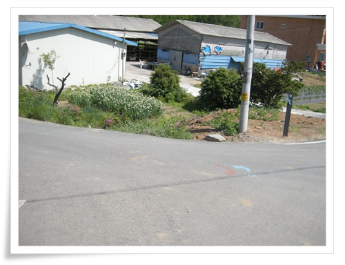

\- 갈림길에서는 저렇게 바닥에 표시를 해 놨다.

\- 날이 참 좋았다.  그리 덥지 않은 날씨에 바람도 살랑살랑 부는게..

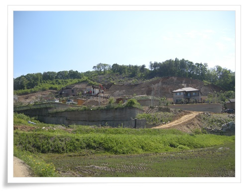

\- 펜션을 짓는지 전원주택을 짓는지 산을 깎고 있는 모습.

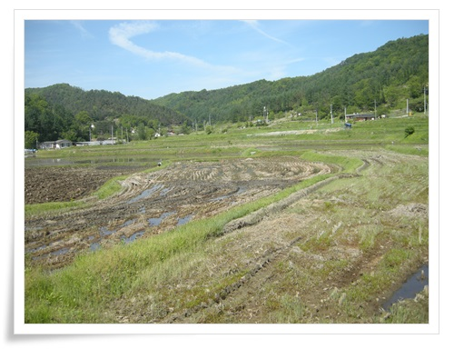

\- 정말 한적한 시골이란 이런 거다라는 느낌이다.

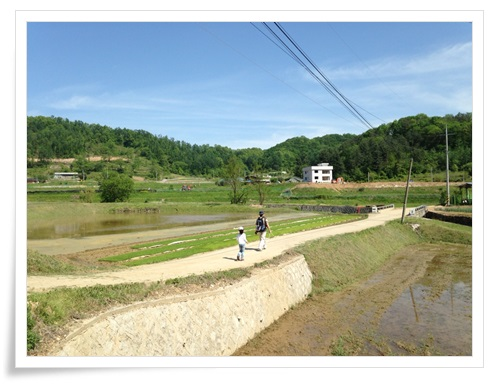

\- 나와 딸내미.

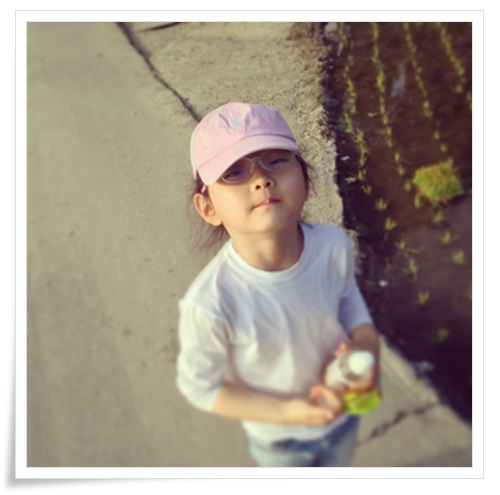

\- 아직 초반이라 쌩쌩한 딸내미.

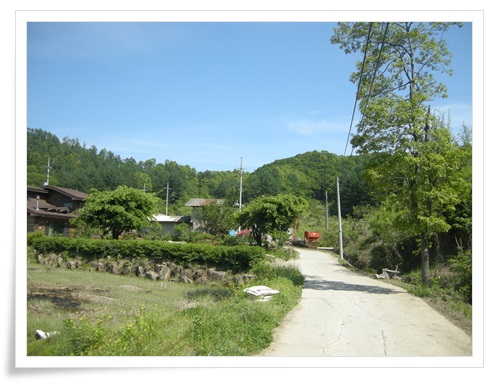

\- 산을 통과하는 언덕길을 올라,

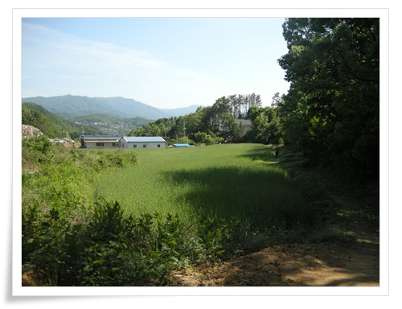

\- 다른 마을로 건너간다.

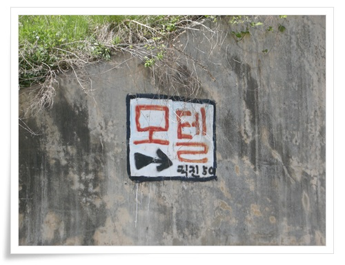

\- 한적한 동네인데도 모텔이 있다는 것이 신기하기도 하다.

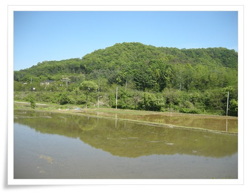

\- 모내기 전 물을 받아놓고 있는 논.

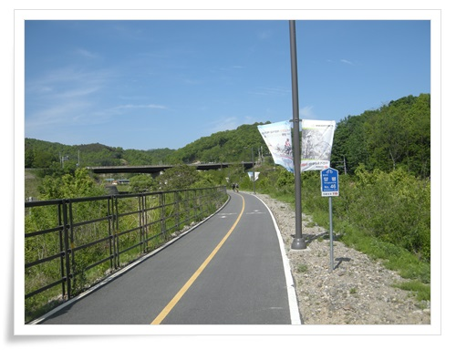

\- 두어번 자전거길과 같이 걸을 때가 있는데 이런 구간이 걷기 좀 위험한 구간이다.

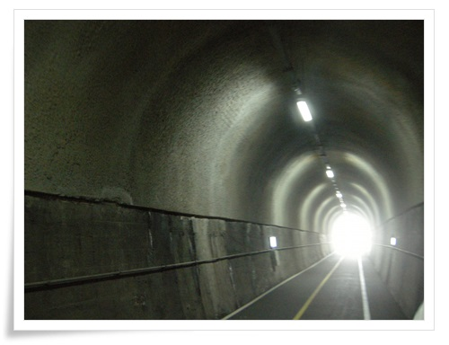

\- 터널통과할 때는 무척이나 시원하다.

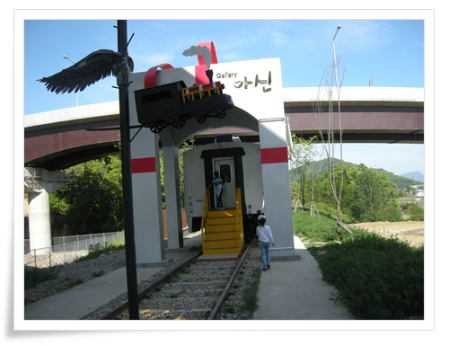

\- 아신역 근처에 철길 일부를 남겨놓고, 객차로 갤러리를 만들어 놨는데 문은 잠겨 있었다.

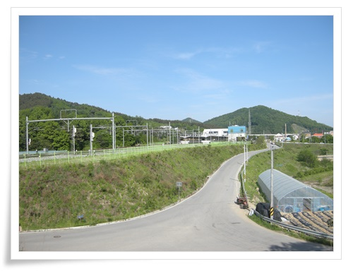

\- 중간에 포기할 수 있는 기차역이 딱 한 번 등장한다.

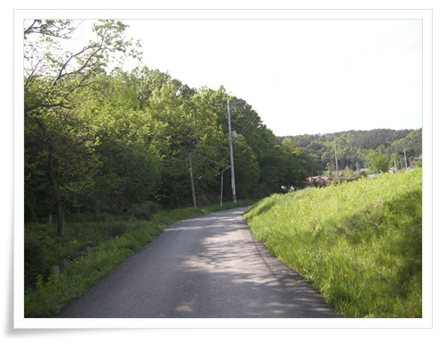

\- 또다시 시골길을 걷는다.

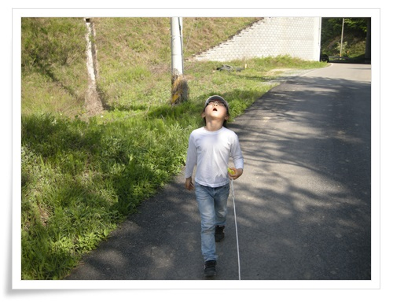

\- 7km를 땡볕에서 걸었더니 딸내미가 힘들다고 하여 심봉사마냥 줄을 잡고 따라오라 했다.

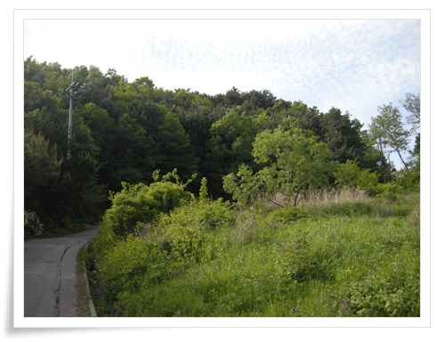

\- 이웃 마을로 넘어가는 언덕.

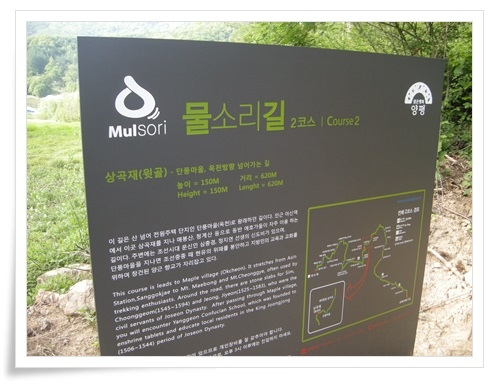

\- 이 언덕이 상곡재라고 하는군.

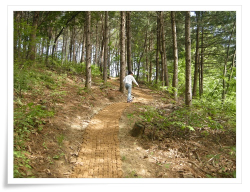

\- 이 상곡재는 넝마로 길을 깔아놨다.

자연친화적이니 꽤나 괜찮은 생각이다.

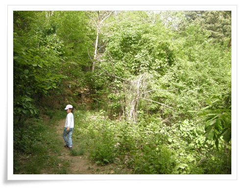

\- 이런 산길을 어떻게 찾아내서 발굴했는지 새삼 감탄스럽다.

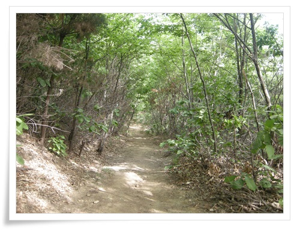

\- 걷기 좋은 상곡재길.

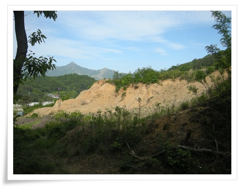

\- 상곡재를 넘어가니 또 산을 파헤진 곳이 나타난다.

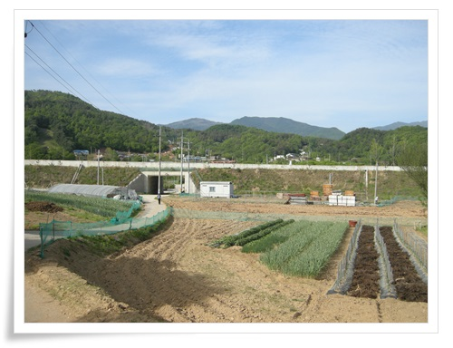

\- 30년전 양평에서 살긴 했는데 양평에 이런 곳이 있는지 이제야 알게 된다.

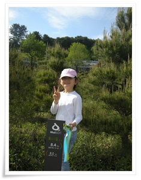

\- 에너자이저의 힘으로 잘 따라오고 있는 딸내미.

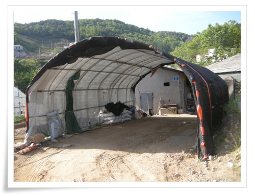

\- 내가 꿈에 그리는 차고가 보였다.

단독주택이면 나도 이런 비닐로 나만의 차고를 만들고 싶다.

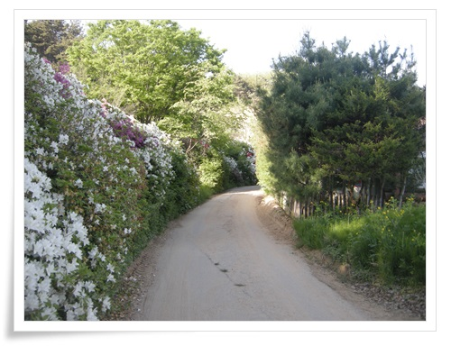

\- 여기는 향교마을.  뭔가 고급스런 동네다.

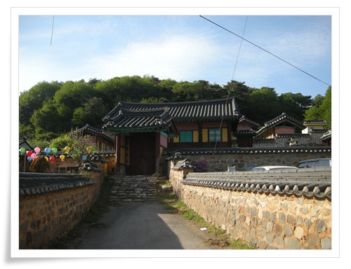

\- 향교가 있어 향교마을인가 보다.

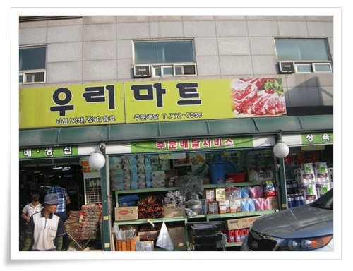

\- 산책을 시작한지 10km만에 처음 등장한 슈퍼.

물이 떨어진 터라 구멍가게라도 언제 나오나 했었는데 옥천면에 다다러서야 슈퍼에 들어갈 수 있었다.

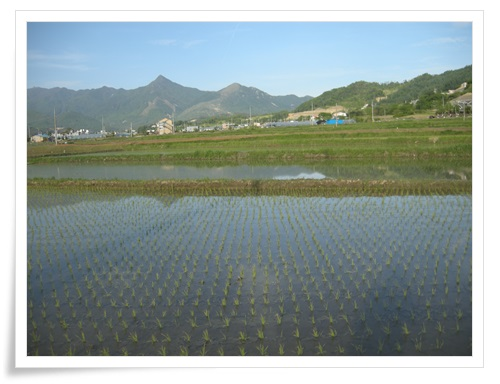

\- 옥천면은 볕이 잘 들어서 그런가 모내기를 했군.

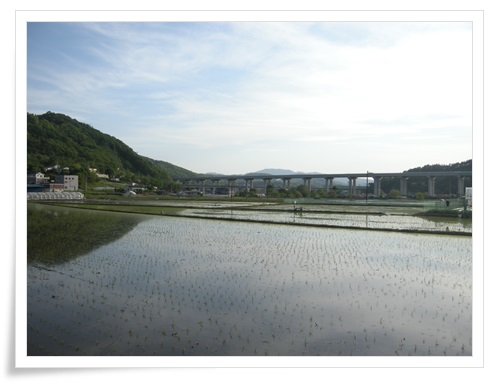

\- 뜨거운 해도 이제 뉘엿뉘엿해질려고 한다.

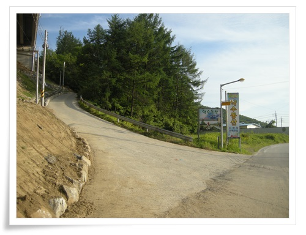

\- 물소리길을 안내하는 리본을 왼편으로 향하게 했다.

\- 언덕을 넘어가니 양평대교가 나왔다.

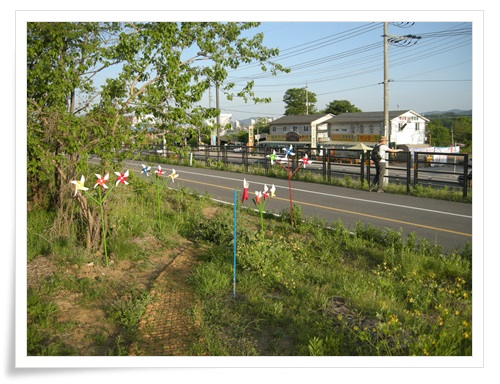

\- 바람개비로 장식한 길.  여기서 다시 잠깐 자전거길과 만난다.

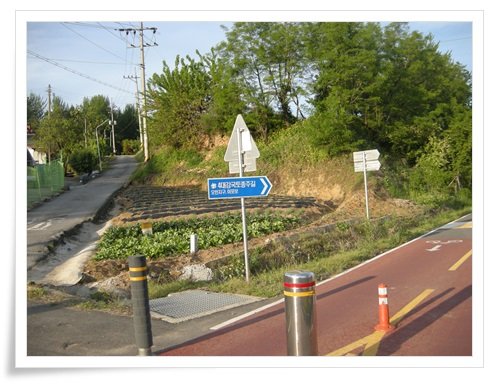

\- 강변길로 향하라고 한다.

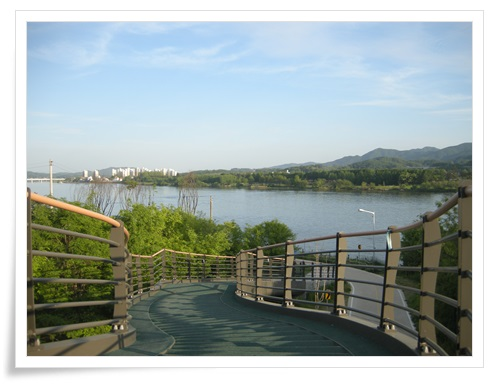

\- 남한강

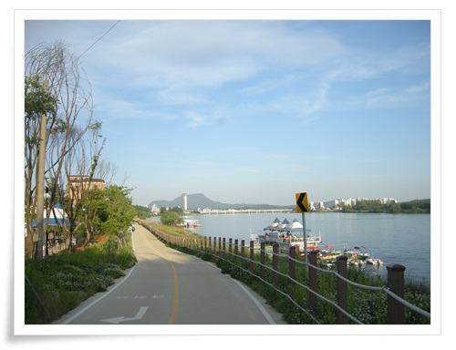

\- 여기부터 양평역까지 쭉 강변도로를 따라 걸어간다.

흙길을 걷다가 시멘트길을 걸으니 발바닥이 아파온다.

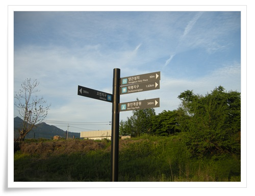

\- 천주교 양근성지를 지나간다.

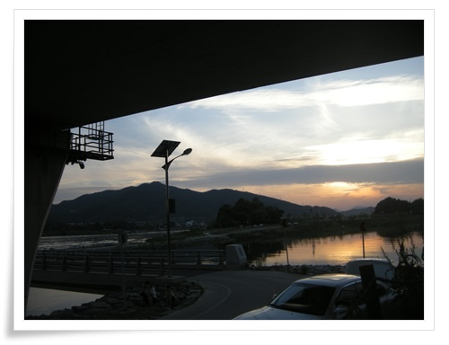

\- 양근대교밑으로 양근섬이 연결되어 있군.

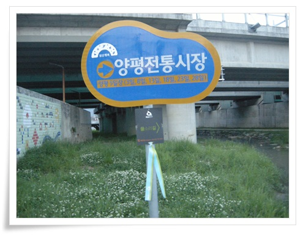

\- 이제 종착지 양평전통시장이 있다.

하지만 이 날은 5일장이 서는 날은 아니다.

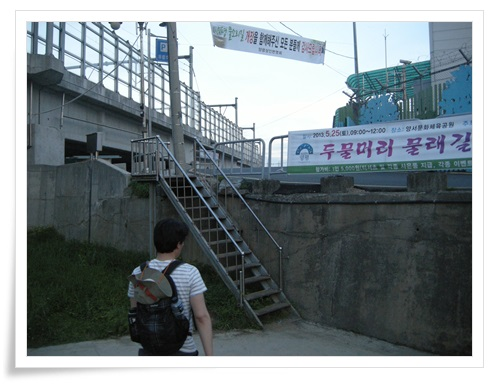

\- 이제 하천에서 올라간다.

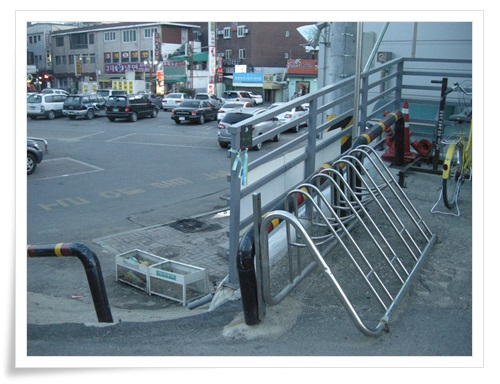

\- 물소리 2코스의 마지막 리본.

이제 저녁을 먹을 시간.

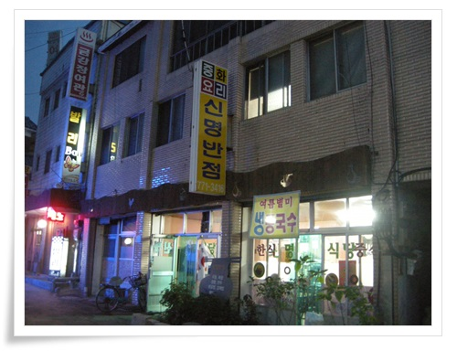

\- 뭘 먹을까 하다가 냉콩국수 현수막을 보고 들어간 신명반점.

\- 콩국수 1인분에 5천원.  맛있다.

주인아저씨,아줌마의 인심이 좋다.

간만에 느껴보는 인심이다.

딸내미와 콩국수를 나눠먹으려는데 애들은 콩국수 별로 안 좋아한다고 짜장면 한 젓가락 그냥 주겠다고 했다.

그 짜장면 한 젓가락이 온전한 1인분이더군.

반찬도 푸짐하니 주고, 주인아줌마가 산에 간 김에 따서 만들었다는 엄나무 나물이 맛있었다.

\- 집으로 가기 위해 양평역에서 전철을 탔다.

\- 1시 반부터 7시까지 5시간 반 동안 18km를 걸었다.

이걸 1학년짜리 딸내미가 잘 걷더군.

이 정도 체력이면 나중 군대가서도 행군 잘 하겠군.

