# 일본 아카사카 벚꽃 여행

1박2일 일정으로 도쿄로 갔다.

장소는 이전에 갔던 아카사카지역.

밤을 꼬박새고 먼동이 틀 무렵 퇴근하여, 집에 도착하자마자 짐 챙기고, 다시 집을 나섰다.

9시에 김포공항에서 출발하는 비행기를 타기 위해 오리역에서 공항버스 탑승.

회의는 무난히 끝나, 여유로운 식사를 했다.

점심을 못 먹었기에, 저녁이 첫 식사였다.

일본 음식을 그리 좋아하지 않기에 별 기대는 없었지만, 이번엔 제대로 내 입맛에 맞는 음식을 먹을 수 있게 되었다.

\- 큐슈장나라(kyusyujangara.co.jp) 아카사카점.

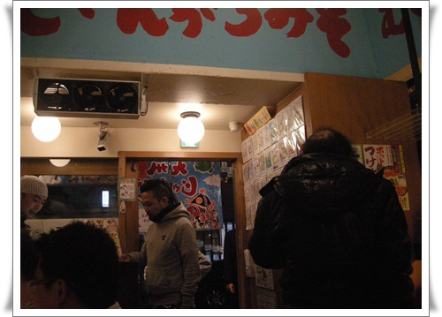

\- 내부는 좌석 10석정도로 작다.

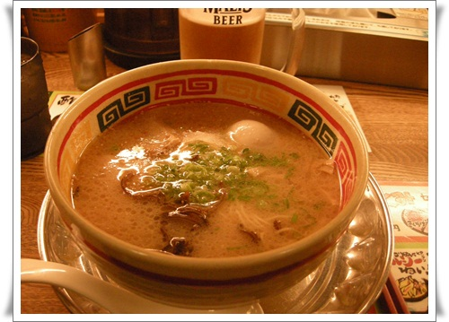

\- 주메뉴인 큐슈장가라에 달걀반숙 추가하고, 맥주와 같이 먹었다.

합 1,420엔(17,000원정도)

숙소는 전과 같이 빌라퐁테 롯본기점.

Ana 호텔 뒷편 길로 걸어갔다.

그 길이 동네에서 정해놓은 벚꽃 감상길인가 보다.

\- 벚꽃이 만개했다.

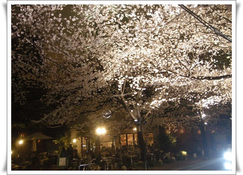

\- 벚꽃 축제기간이라 야외카페도 운영중이고..

호텔 들어와, 목욕하자마자 쓰러져 자고, 다음날 비행기 타기 전까지 본격적인 동네 탐험에 나섰다.

이번에는 아카사카 동네쪽을 돌아보기로 했다.

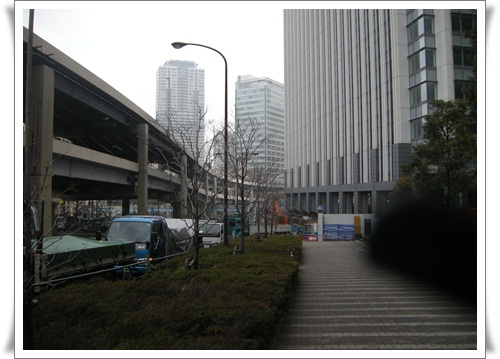

\- 호텔에 있는 롯본기잇초메역에서 아카사카쪽으로 걸어간다.

\- 골목길 사이에 왠 신사표시가 보였다.

\- 이름은 구국신사(久国神社)

1741년 저 자리에 세워진 신사로, 우카노미타마(宇迦之御魂神)라는 일본신을 모신 곳이라 한다.

\- 신사 안은 아담한 크기다.

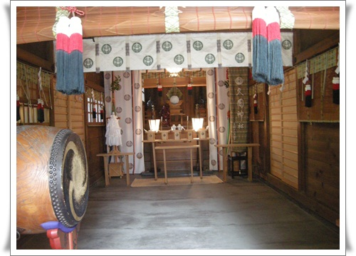

\- 신사 본당 내부에는 뭔가 참배하는 것이 만들어져 있군.

\- 뒤에는 무슨 신주 모신 듯한 것이 있고..

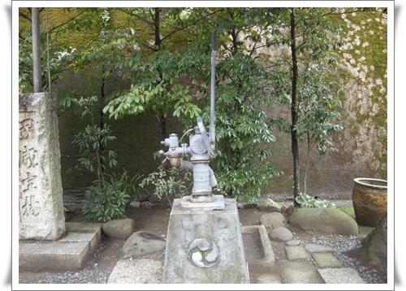

\- 수동 펌프도 있군.

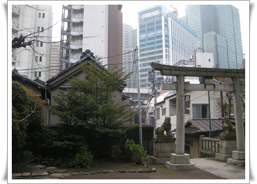

\- 도시 한 가운데 조그맣게 있는게, 의외로 잘 어울리는 듯 하군.

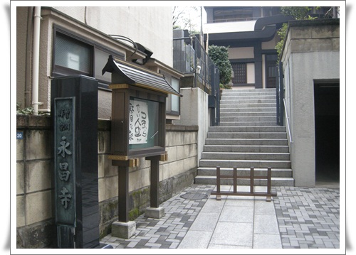

\- 이건 신사 옆에 있는 영창사.  한번 들어가 보고 싶었지만,

계단 앞의 저게 아직 개점시간 안되었다는 표시같아 그냥 지나쳤다.

\- 마음 내키는대로 걸어간다.

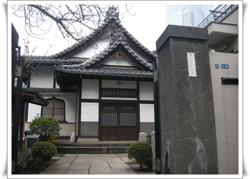

\- 문이 열려있는 집이 있길래 보니, 뭔가 분위기가 있다.

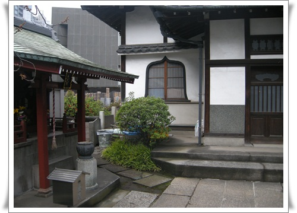

\- 들어가 봤다.

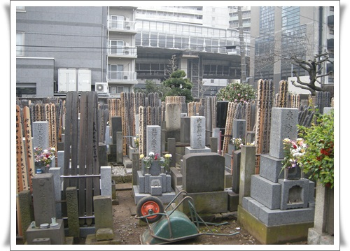

\- 도시내 공동묘지인가 보다.

\- 다시 또 걷는다.

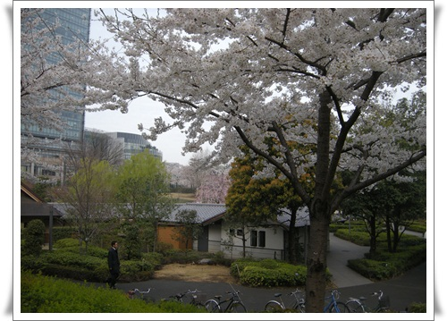

\- 공원이 나타났다.

\- 여기도 벚꽃이 흐드러지게 폈다.

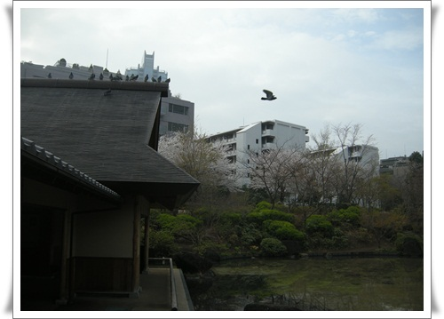

\- 일본식 정원이 이런거구나하는 느낌의 정원이 만들어져 있었다.

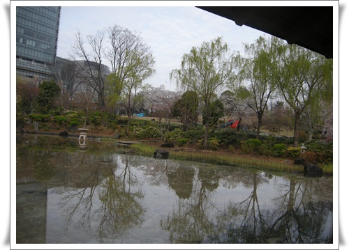

\- 이 공원이름이 구립히노키공원(区立檜町公園)

에도시절 모리가문의 정원이었던 것이 공원으로 된 것이라 한다.

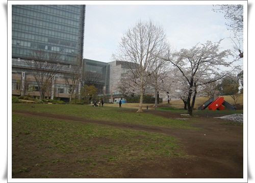

\- 옆으로 잔디광장이 이어져 있어, 산책 코스로 꽤 괜찮은 곳이다.

\- 오밀조밀한 도쿄에 이렇게 여유로운 잔디광장 있다는게 신기할 정도.

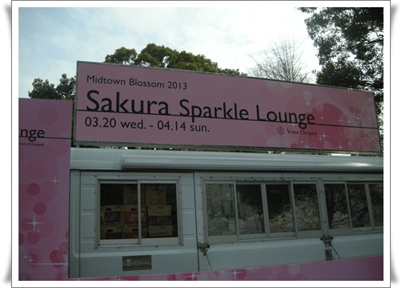

\- 역시 벚꽃 축제기간이라 야간에 카페 운영이 되나 보다.

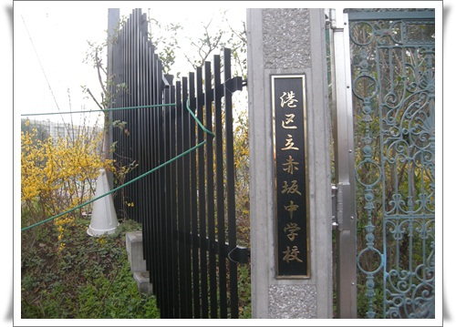

\- 아카사카 중학교 옆길로 내려갔다.

\- 학교 담벼락을 이렇게 화단으로 꾸며놓으니 멋있군.

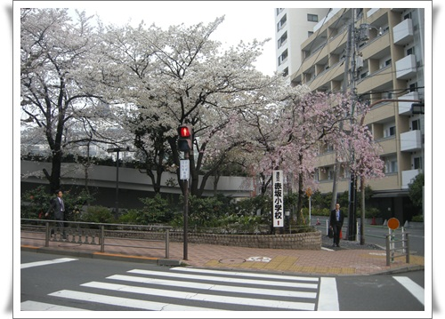

\- 중학교 길 건너편에는 아카사카 소학교도 있군.

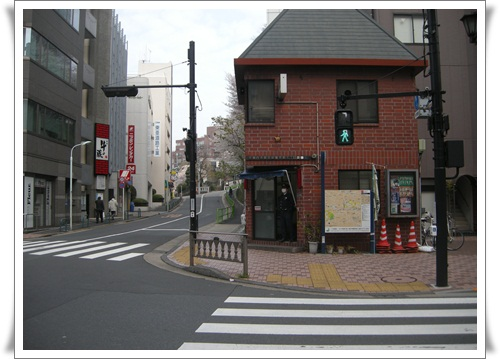

\- 경찰서가 있는 사거리에서 보행 신호등이 켜지길 기다는 중.

\- 경찰서 앞에 있는 지도에서 현 위치를 파악하고, 다시 이동

\- 앞에 조그만 절이 있는 것을 지나치고,

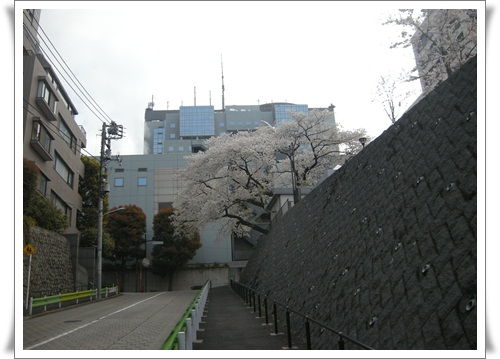

\- TBS 건물쪽으로 올라가는 중.

\- 히토츠기공원(一ツ木公園)이 있군.

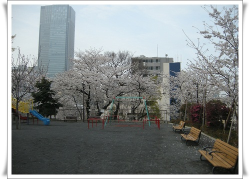

\- 조그만 동네 놀이터 수준이다.

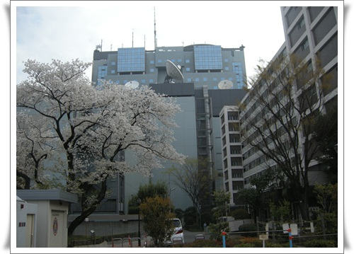

\- 놀이터 그네에 앉아 보니 TBS가 보인다.

\- 7시반부터 걸었으니, 동네 탐험 45분째.

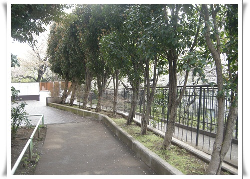

\- 골목길을 따라 내려간다.

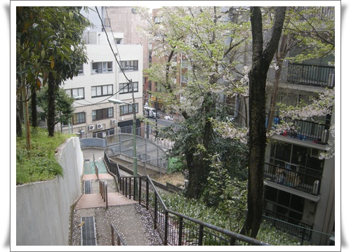

\- 언덕아래로 내려간다.

\- 이 골목도 뭔가 아기자기하게 꾸며놓은 느낌이 난다.

\- Suzy's Zoo?  TBS에서 방송한 캐릭터 이름인가 보다.

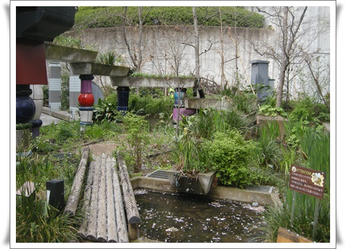

\- 이 정원도 아마 방송속 정원 재현해 놓은 것 같군.

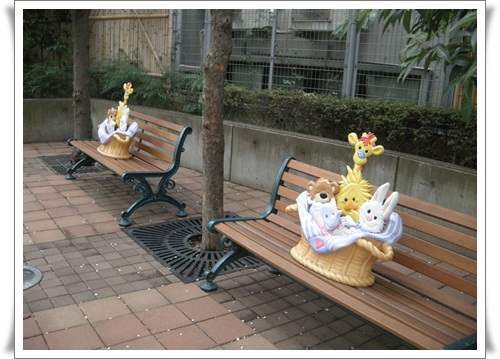

\- 벤치 중앙마다 캐릭터 배치놓고 있고..

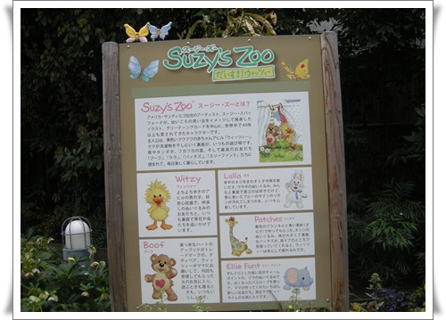

\- 여기 캐릭터 설명이 나오는군.

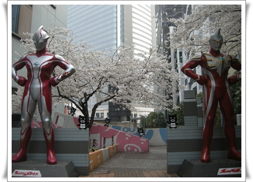

\- 울트라맨도 TBS 꺼였나 보군.

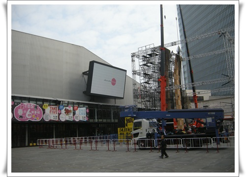

\- 아카사카사카스라는데 무슨 중앙광장인가 보다.

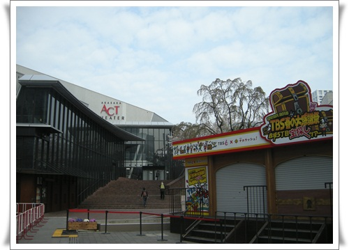

\- 극장도 있고..

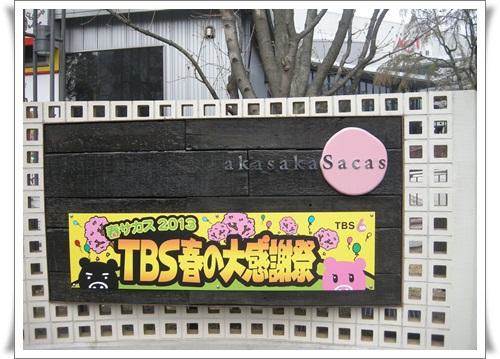

\- TBS 무슨 행사가 있나 보다.

\- 이게 TBS 본사 건물인가 보다.

\- 이제 아카사카중앙에 도착했다.

\- 지난번 점심특선으로 맛있게 먹었던 식당이 여기 있었다.

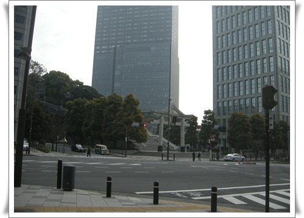

\- 쭉 걸어가니, 전에 봐 두었던 신사 입구가 나타났다.

\- 신사로 올라갔다.  신사이름이 히에신사(日枝神社).

에도성과 도쿠가와가문의 수호신을 모시는 신사라고 한다.

\- 에스컬레이터 덕에 힘들이지 않고 올라간다.

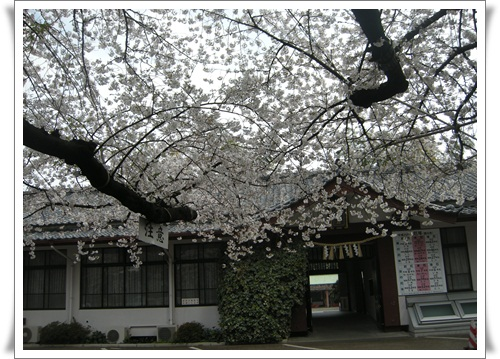

\- 사쿠라 나라답게 온통 벚꽃이군.

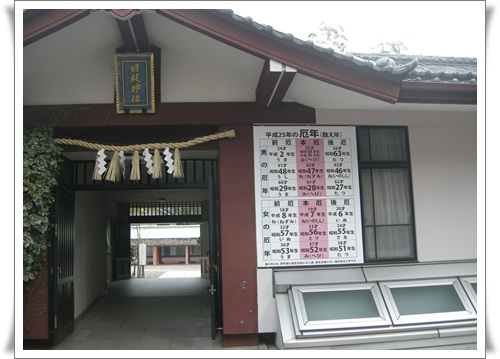

\- 신사 내부로 들어간다.

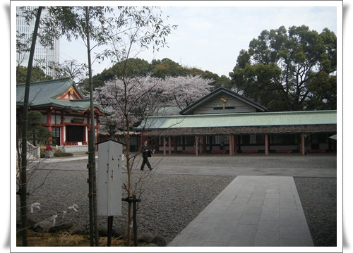

\- 꽤 넓다.

\- 신사 옆에 고층건물이 보이는게, 꼭 강남에 있는 봉은사에서 코엑스 바라보는 느낌이다.

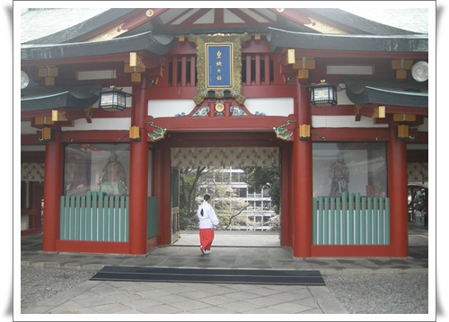

\- 규모가 있는 신사라, 유니폼을 입은 신녀들이 있군.

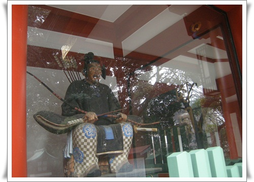

\- 불교 사원의 사천왕이 위치하는 자리에 애들이 앉아 있군.

이 애들이 수호신인가?

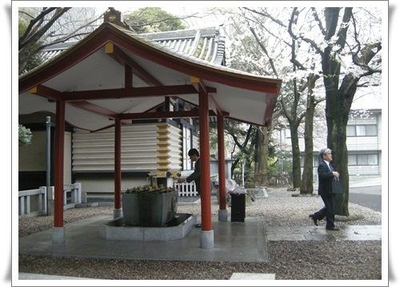

\- 약수터같은 것이 보일래 사람들이 어떻게 하나 관찰했다.

나무 주걱으로 물어 퍼서 손에 물을 뭍이고, 입술에도 물을 묻히더군.

뭔가 몸을 정결히하고 신사참배하겠다는 의미인가 보다.

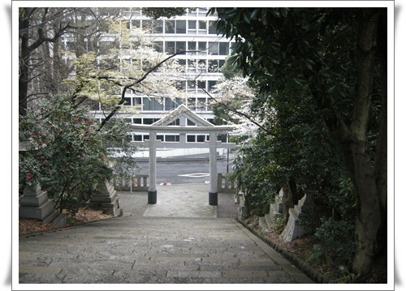

\- 신사에서 내려가 이제 호텔로 가려는 중.

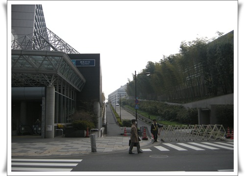

\- 가다보니, 뭔가 언덕이 보인다.

호기심이 발동하면 충족시켜야 하는법, 저 쪽으로 가 본다.

오른편의 건물이 총리공관이인 것 같았다.

\- 총리공관 사거리에는 아마 일본 우익으로 보이는 시위차량과 사람이 떠들어대고 있었다.

\- 이날의 이동 경로.  07:30 ~ 09:00까지 1시간 반 탐험.

