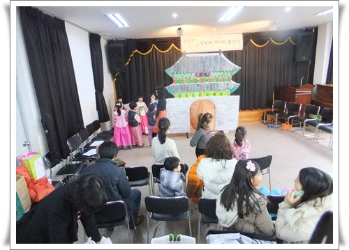
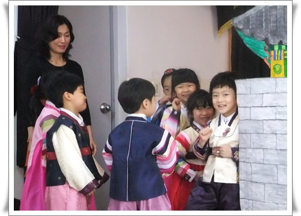
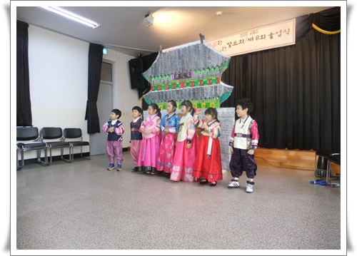
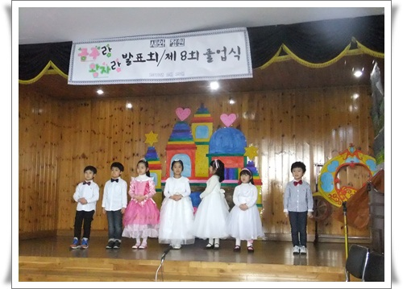

# 딸내미 새와정원유치원 졸업식

딸내미가 유치원을 졸업했다.

며칠후엔 초등학생이 된다는 것보다는, 내가 학부형이 된다는 것에 뭔가 모를 세월의 무게가 느껴진다.

그리고, 이제 딸내미도 본격적인 경쟁이 있는 사회로 진입했다는 사실에 안타까운 느낌도 있다.

1년반동안 유치원을 다녔다.

정규유치원이 아닌 아파트에 있는 어린이집처럼 아파트 가정집에서 하는 새와정원유치원.

꽤 괜찮은 유치원이다.

\- 졸업식은 기흥구 다용도문화센터에서 했다.

저 준비를 원장선생님 한분이 하셨다.

\- 졸업식에 앞서 발표회가 있었다.

'공주와 왕자' 주제로 몇달간 프로젝트 수업한 결과란다.

6세반 3명, 7세반 4명.

그래서 이번 졸업은 4명.

