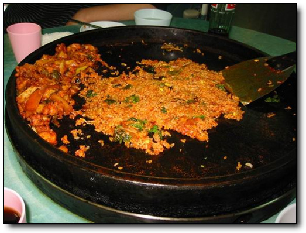

## [소양강 노동당사 그리고 백마고지](../6166981.html "소양강 노동당사 그리고 백마고지") [우리나라](../category/%EC%9A%B0%EB%A6%AC%EB%82%98%EB%9D%BC.html)

- 2003/04/12 19:38
- [badsaarow.egloos.com/6166981](../6166981.html)
- 덧글수 : 0

시절 좋았던, 지난 스노우보드 시즌이 끝나고, 한동안 밖으로 나갈 일이 없었다. 큰누나가 산 sony F707 풀셋을 빌려, 나도 출사란 것을 떠나게 되었다. 사진이라는 목적보다도 바깥 공기를 마시고 싶어서였다. 서울은 한창 절정인 벚꽃축제로 주말이면, 여의도로 사람들이 몰리는 때에, 우선 소양강으로 향했다. 그렇게 많이 들었던 소양강처녀가 살던 그 소양강이 어떤 곳인가 궁금한 점도 있었다.

토요일 아침 8시. 나가는 길은 꽤 막혔다. 마석을 지나서야 겨우 정체가 풀렸다.

정체된 길에서 한 시간 반 정도를 보내고 나니, 나타난 강. 이게 아마 소양강 같은데..

소양 댐에 도착하여, 주차료를 내고 들어가는 길이 벚꽃이 만발했다.

도착하여, 기념사진도 한번 찍어보고,.

댐에서 청평사로 향하는 배를 타고..

모처럼 사진발 잘 받은 동함.

배를 타고 간 시간은 한 20여분. 모처럼 타본 배에 마시는 공기는 시원하고, 가로지르는 물결을 보고만 있어도 좋더군. 그리 크지 않은 창문에 머리만 쑥 빼고 바라보는 사람을 뒤에 보는 것도 재미있었다. 인간 개벽을 보는 듯했다.

인간 개벽

어느덧 배는 청평사 있는 유원지에 도착을 하였고,

언제부터 세워있었는지 모르겠지만, 그리 낡아보이지는 **않은 배**

청평사 입장료를 내고, 올라가는 길.

가파르지 않은 완만한 언덕길이었다.

사진기를 들이 내밀어도 꿈쩍도 않은 겁을 상실한 다람쥐도 있었고,.

토실토실 맛있게 생긴 강아지도 있었다.

고려 광종때 만들어진 청평사, 아담한 사찰이었다.

사찰 옆에는 하나하나 돌을 쌓아 올린 돌탑이 있었다.

하산하는 길. 아마 댐으로 수몰되기 전에 쓰던 계단이었으니깐, 아마 학교 터나 되지 않았을 까 싶은 계단.

다시 배를 타고 오는 길. 내 록스타는 근엄한 자태를 내뿜고 있군.

명색에 춘천에 왔는데, 춘천 닭갈비는 먹어야겠기에, 춘천 시내로 들어갔다. 지도를 보니, 춘천에 명동이라는 거리가 있으며, 그 거리에 유명한 닭갈비 촌을 형성하고 있다고 나와있었다. 명동을 향해 갔다. 조금 헤메일줄 알았는데, 의외로 아주 얼떨결에 한방에 도착한 명동 닭갈비 거리.

어느 닭갈비 집에 맛있을까 유심히 살펴보다가, 고개를 돌려보니,.

쭉 널려있는 닭갈비 집들.

2인분을 시켰다. 꽤 많은 양이 나왔다. 원조라서 많나 보다.

이렇게 밥도 비벼먹고.

밥을 먹었으니, 다음 목적지인 노동당사로 가기로 했다. 철원에 위치해 있는데, 이곳은 예전 서태지 뮤직비디오에 나온 곳이다. 원래는 민통선 안쪽에 있었는데, 서태지꺼 이후로 찾는 사람이 많아서, 민통선은 노동당사 뒤로 옮겼다고 한다.

철원 가는 길. 왜 차가 밀리나 했더니, 선두에 군 차량이 행군하고 있었었다.

도착한 노동당사, 소련양식 건물이라 이국적인 풍채를 지녔다. 포탄의 흔적으로 곳곳이 파여 있어, 조금 안쓰러워 보일 지경이다.

벽 사이로 바라본, 민통선. 저 앞의 군 시설물이 민통선 초소이다.

내부는 깨진 벽과 전기 시설, 그리고 낙서들이 묘한 조화를 이루고 있었다.

노동당사 근처의 백마고지. 반공교육을 통해 무수히 들었던, 그 백마고지다. 그런데 조형물을 보니, 반지의 제왕에 나오는 사라곤이 떠오르는군.

별로 높이 않은 이 언덕을 두고, 엄청난 피가 뿌려졌다고 하니, 안타까운 마음이 든다. 촬영금지 너머가 민통선 안쪽이다.

[null](../6166981.html#6166981_1)

[신고](#신고)

[트랙백(0)](#trb) [덧글(0)](#cmt)

[수정](http://www.egloos.com/egloo/update.php?eid=a0109780&srl=6166981&rtnurl=http%3A%2F%2Fbadsaarow.egloos.com%2Fpage%2F598) [삭제](#del)

* * *

[이전](581.html)[591](591.html) [592](592.html) [593](593.html) [594](594.html) [595](595.html) [596](596.html) [597](597.html) **598** [599](599.html) [600](600.html)[다음](601.html)

* * *

* * *

* * *

### 프로필

;)

가만이 있으면 좀이 쑤셔by 언젠가는

### 태그

[구라제거기](../tag/%EA%B5%AC%EB%9D%BC%EC%A0%9C%EA%B1%B0%EA%B8%B0.html) [엔구](../tag/%EC%97%94%EA%B5%AC.html) [당근](../tag/%EB%8B%B9%EA%B7%BC.html) [가산디지털단지](../tag/%EA%B0%80%EC%82%B0%EB%94%94%EC%A7%80%ED%84%B8%EB%8B%A8%EC%A7%80.html) [워셔액](../tag/%EC%9B%8C%EC%85%94%EC%95%A1.html) [쪼쪼](../tag/%EC%AA%BC%EC%AA%BC.html) [다이어트](../tag/%EB%8B%A4%EC%9D%B4%EC%96%B4%ED%8A%B8.html) [독일](../tag/%EB%8F%85%EC%9D%BC.html) [융프라우](../tag/%EC%9C%B5%ED%94%84%EB%9D%BC%EC%9A%B0.html) [매립](../tag/%EB%A7%A4%EB%A6%BD.html) [설득](../tag/%EC%84%A4%EB%93%9D.html) [칼스루에](../tag/%EC%B9%BC%EC%8A%A4%EB%A3%A8%EC%97%90.html) [튜터링](../tag/%ED%8A%9C%ED%84%B0%EB%A7%81.html) [멀티미터](../tag/%EB%A9%80%ED%8B%B0%EB%AF%B8%ED%84%B0.html) [스위스](../tag/%EC%8A%A4%EC%9C%84%EC%8A%A4.html) [맛집](../tag/%EB%A7%9B%EC%A7%91.html) [모란시장](../tag/%EB%AA%A8%EB%9E%80%EC%8B%9C%EC%9E%A5.html) [자전거](../tag/%EC%9E%90%EC%A0%84%EA%B1%B0.html) [모두의프린터](../tag/%EB%AA%A8%EB%91%90%EC%9D%98%ED%94%84%EB%A6%B0%ED%84%B0.html) [전화영어](../tag/%EC%A0%84%ED%99%94%EC%98%81%EC%96%B4.html) [DIY](../tag/DIY.html) [그랜저](../tag/%EA%B7%B8%EB%9E%9C%EC%A0%80.html) [연천](../tag/%EC%97%B0%EC%B2%9C.html) [카라반](../tag/%EC%B9%B4%EB%9D%BC%EB%B0%98.html) [레이](../tag/%EB%A0%88%EC%9D%B4.html) [네비](../tag/%EB%84%A4%EB%B9%84.html) [영월별마로](../tag/%EC%98%81%EC%9B%94%EB%B3%84%EB%A7%88%EB%A1%9C.html) [트위저](../tag/%ED%8A%B8%EC%9C%84%EC%A0%80.html) [이발소](../tag/%EC%9D%B4%EB%B0%9C%EC%86%8C.html) [유성호](../tag/%EC%9C%A0%EC%84%B1%ED%98%B8.html)

[태그 전체보기](../tag.html)

### 카테고리

- [전체](../index.htm)(603)
- [이집트](../category/%EC%9D%B4%EC%A7%91%ED%8A%B8.html)(5)
- [우리나라](../category/%EC%9A%B0%EB%A6%AC%EB%82%98%EB%9D%BC.html)(141)
- [중국](../category/%EC%A4%91%EA%B5%AD.html)(30)
- [대만](../category/%EB%8C%80%EB%A7%8C.html)(5)
- [태국](../category/%ED%83%9C%EA%B5%AD.html)(28)
- [유럽](../category/%EC%9C%A0%EB%9F%BD.html)(16)
- [내 일상](../category/%EB%82%B4%20%EC%9D%BC%EC%83%81.html)(216)
- [베트남](../category/%EB%B2%A0%ED%8A%B8%EB%82%A8.html)(2)
- [조선민주주의인민공화국](../category/%EC%A1%B0%EC%84%A0%EB%AF%BC%EC%A3%BC%EC%A3%BC%EC%9D%98%EC%9D%B8%EB%AF%BC%EA%B3%B5%ED%99%94%EA%B5%AD.html)(5)
- [내가 아는 사람들](../category/%EB%82%B4%EA%B0%80%20%EC%95%84%EB%8A%94%20%EC%82%AC%EB%9E%8C%EB%93%A4.html)(15)
- [멕시코](../category/%EB%A9%95%EC%8B%9C%EC%BD%94.html)(2)
- [캄보디아](../category/%EC%BA%84%EB%B3%B4%EB%94%94%EC%95%84.html)(9)
- [북미](../category/%EB%B6%81%EB%AF%B8.html)(11)
- [장난감](../category/%EC%9E%A5%EB%82%9C%EA%B0%90.html)(36)
- [책 읽고 나서](../category/%EC%B1%85%20%EC%9D%BD%EA%B3%A0%20%EB%82%98%EC%84%9C.html)(27)
- [DIY](../category/DIY.html)(36)
- [아시아](../category/%EC%95%84%EC%8B%9C%EC%95%84.html)(13)
- [미분류](../category/%EB%AF%B8%EB%B6%84%EB%A5%98.html)(6)

### 이전글 목록

- [2023년 03월](../archives/2023/03.html)(2)
- [2021년 12월](../archives/2021/12.html)(1)
- [2021년 11월](../archives/2021/11.html)(3)
- [2021년 09월](../archives/2021/09.html)(1)
- [2020년 07월](../archives/2020/07.html)(2)

[more...](../archives.html)

### 구글검색

### 최근 덧글

- [94년도면 김일성사망으로 비상이었을 시기에 복..](../6166900.html#3699407.01) _by 언젠가는_ _3/5_
- [안녕하세요.. 반갑습니다.\
98년 12월이면 저와 같..](../11265096.html#3700881.01) _by 언젠가는_ _3/5_
- [네. 함 가보세요. 기억을 되살릴겸.](../11265096.html#3660436.01) _by 언젠가는_ _3/5_
- [안녕하세요^^ \
저두 222대대 브라보에 운전병으..](../11265096.html#3700881) _by 가니_ _3/2_
- [좋은 게시물, 더 기다리고 있습니다](../10526723.html#3699855) _by agencja copywritersk_ _9/16_
- [좋은 아이디어, 이런 글 더 많이](../10526723.html#3699665) _by manclinic_ _9/7_
- [94년에 알파포대에서 제대했습니다. 얼마전에 30..](../6166900.html#3699407) _by 대구너구리_ _8/3_
- [아뇨, 남은 경유 빼는 마개였던 것 같아요.](../10885971.html#3695367.01) _by 언젠가는_ _10/24_
- [그 마개는 물 빼는 마개죠?](../10885971.html#3695367) _by 지리산불곰써치_ _6/5_
- [공돌이 기질이 아직 남아있어서 그런가 봐요. ㅎㅎ](../11361859.html#3689412.01) _by 언젠가는_ _2/26_

### RSS

### 통계 위젯 (화이트)

**2** 2

40

886474

