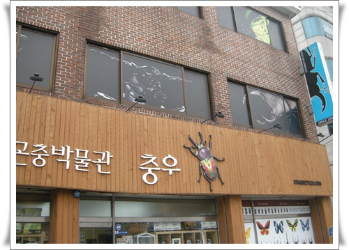
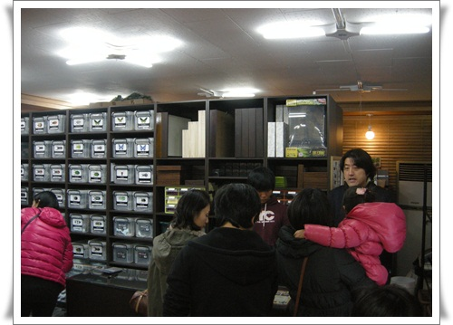
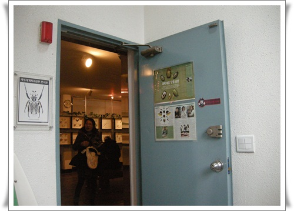
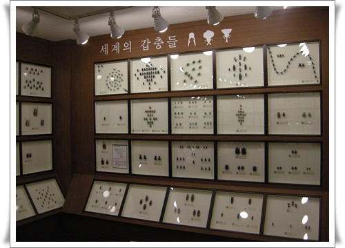
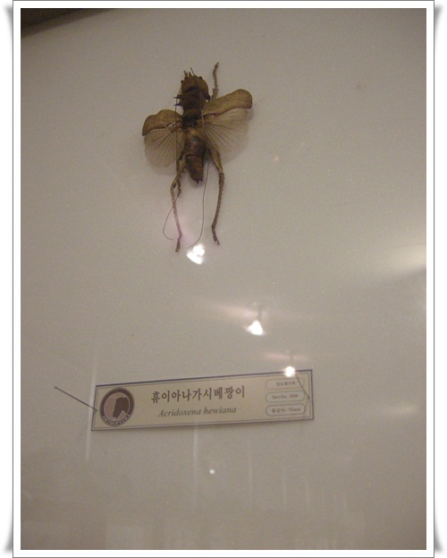
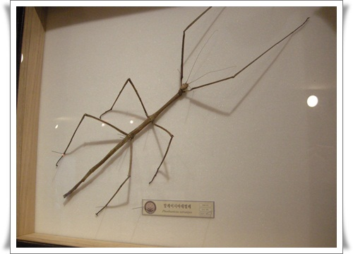
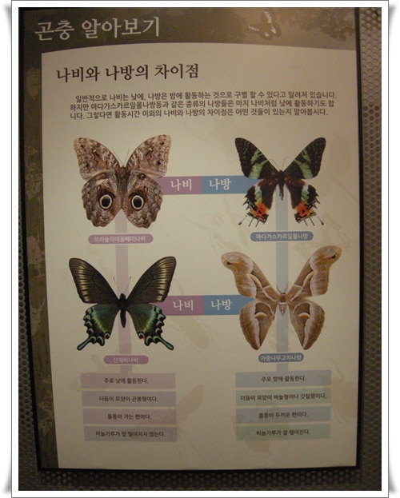
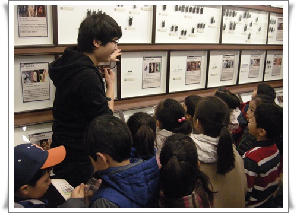
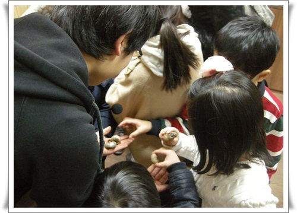

# 충우 곤충 박물관

딸내미 유치원에서 단체로 곤충박물관에 간다고 하여 가본 충우 곤충 박물관.

강서구 화곡동에 있어, 1시간을 운전하여 갔다.

\- 곤충박물관 건물.

따로 주차장이 없어, 일요일 아침 일찍 가지 않았더라면 주차하기 힘들 뻔 했다.

\- 1층에 곤충들 판매하고 있다.

\- 2층부터 4층까지가 박물관.

입장료는 3천원

\- 전시장 입구.

\- 곤충들 표본들이 전시되어 있다.

\- 개미와 베짱이의 그 베짱이다.

베짱이가 이렇게 큰 줄 몰랐다.

이제껏 한 여치정도의 크기로 생각했는데, 꽤 크군.

\- 대벌레.  60cm가 넘어 정말 엄청난 크기다.

\- 나비와 나방의 차이가 나와 있군.

중고등 생물시간에 종속과목강문계하면서 뭔가 배웠던 게 생각이 난다.

\- 단체로 간 거라, 박물관 직원이 애들에게 설명을 해주고 있다.

\- 사슴벌레 만져보기도 하고..

2년전 키우다 번데기에서 탈피하다 죽은 내 사슴벌레 유충이 생각난다.

