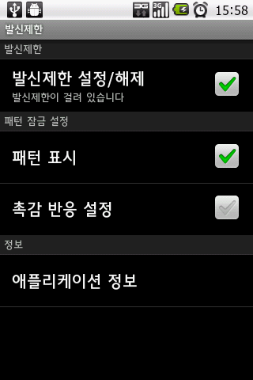
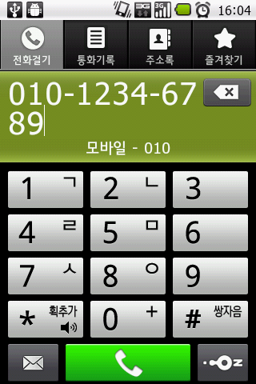
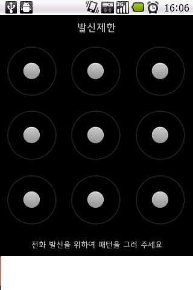

# 
- 2013/01/23 20:48

터치폰을 사용하면서 부터 나도 모르게 전화기 혼자 거는 전화가 많아졌다.

주머니에 전화기 넣고 다니다 보니, 실수로 통화버튼에 터치되거나 하면 전화기가 전화를 걸곤 했다.

통화해도 상관없는 사람에게 걸리는 전화면 괜찮은데, 주소록에는 저장되어 있지만, 통화하기엔 껄끄러운 상대에게 전화가 걸리기라도 할 때면 좀 난감했다.

실수 통화가 그래도 내가 잘못 건거면 그나마 다행이지만, 애가 어릴 때 전화기 가지고 놀다가 잘 못 걸 때도 많았는데, 이 때 딸내미가 혼자 통화하는 모습이 목격되곤 했다.

안드로이드에는 실수로 잘못 터치하여 통화되는 것을 방지하는 앱이 있다.

바로 "발신제한"앱( [https://play.google.com/store/apps/details?id=com.appassionato7.mocallconfirm](https://play.google.com/store/apps/details?id=com.appassionato7.mocallconfirm)).

이름이 너무 개발자틱하긴 하다.

자랑스럽게도 유티시절의 동료 성호씨가 만든 앱인데 꽤 훌륭하다.

사용법은 아주 단순하다.

전화걸때 패턴을 물어봐서, 미리 설정한 패턴을 입력해야하지만 전화 걸기가 시작된다.

\- 패턴락 설정화면.

안드로이드 시스템 패턴과 별도다.

\- 전화번호를 누르고 통화버튼을 누르면, 아래와 같이 패턴 입력하라고 뜬다.

이때 제대로 입력해야지만 전화 걸기 시작.

