# 먹으로 간 칭다오 여행 2일차 

알람은 평소대로 핸드폰 시계로 6시에 맞춰 울렸다.

중국의 6시니까, 우리나라 7시라서, 전날 일정의 피곤함에도 잘 일어났다.

같이 간 일행과는 아침 9시에 호텔 로비에서 만나 아침을 먹기로 했기에, 난 늘 하던대로 새로운 동네 탐험을 시작했다.

지도로 확인해봤을 때 호텔 근처에 크게 볼 만한 것은 없어보이긴 했다.

\- 호텔앞.  06:29분.

\- 일요일 아침이라 시끌벅적한 중국도 조용하다.

\- 소학교가 있다.

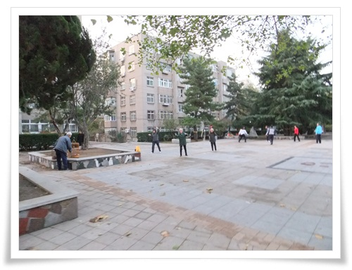

\- 역시 중국의 노인들이 아침을 연다.

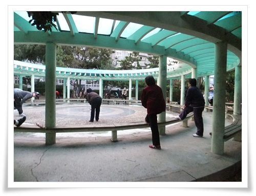

\- 나도 따라 체조를 해 봤다.

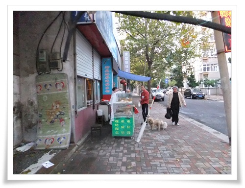

\- 아침을 파는 가게도 여기 주택가는 한산하다.

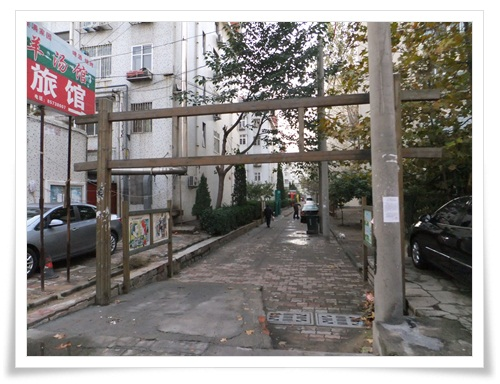

\- 아파트 사잇길이 보이길래 그냥 진입하고 본다.

\- 한 30여분 걷다보니 "청도미식거리"라는 간판이 있다.

이 골목이 먹자골목인가 보다.

\- RT 옆에 있는 시장, 07시 12분 도착.

역시 시장이 볼게 많다.

\- 이렇게 좌판이 펼쳐져 있다.

\- 아침거리를 파는 노점.  줄도 제법 길었다.

\- 2.5위안(우리돈 400원) 주고 한개 샀다.

담백한 튀김으로 제법 맛있었다.

한개 먹으니 배가 부르더군.

\- 아침 6:24분부터 7시 44분까지 1시간 20분동안 4.6킬로를 돌아녔군.

이렇게 한바퀴 돌고 호텔 방으로 들어오니, 전화가 걸려왔다.

김경현과장.  같이 산책가자고 했다.

08:00시.  아침 산책 2탄을 시작했다.

어차피 시장밖에 볼 것은 없을 것 같아 시장골목으로 가 자세히 구경하기로 했다.

\- 토끼도 있고,

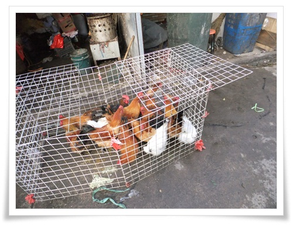

\- 닭하고 비둘기도 식재료로 진열되어 있다

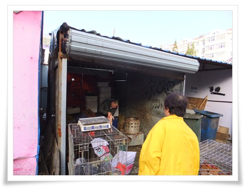

\- 닭,비둘기,토끼 파는 가게.

구입하면, 현장에서 직접 멱을 따고, 뜨거운 물에 담갔다가 털뽑는 기계에 돌려 털을 뽑고, 그 다음 내장 제거해서 준다.

저 닭털 뽑는 기계는 80년대 초반 시장에서 구경해 본게 마지막이라 여기서 다시 보니 감회가 새롭군.

\- 아침식사 2탄은 현지인이 먹는 파전.

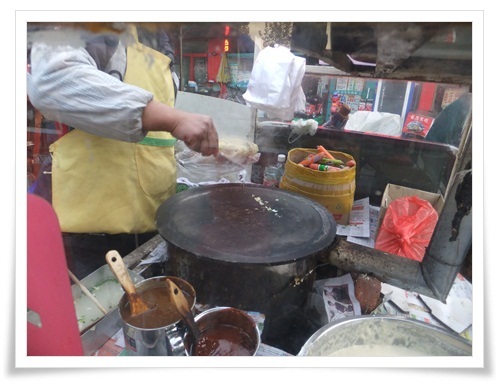

\- 요리한 것은 저렇게 4각으로 되며, 이 또한 아주 맛있다.

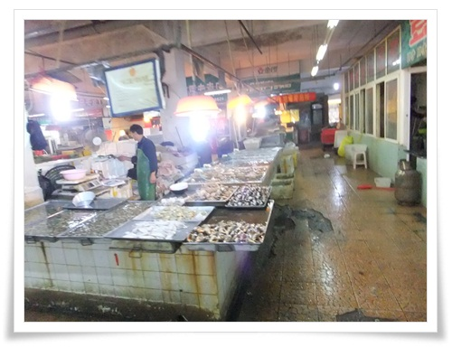

\- 해산물 상가도 들어가 봤다.

\- 맛있게 생긴 쏙이 많다.

어렸을 때 섬에 살았을 때는 저 쏙을 질리도록 먹었었는데, 오랜만에 다시 보니 반갑다.

8시 38분.  아침 산책 2탄을 마치고 호텔로 돌아왔다.

9시.  호텔 로비에 모여 아침을 식사를 하러 KFC로 갔다.

내게서는 아침식사 3탄이 된다.

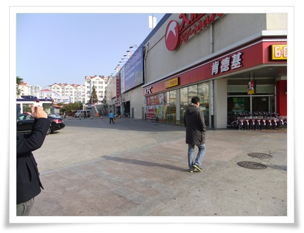

\- RT마트에 붙어 있는 KFC.

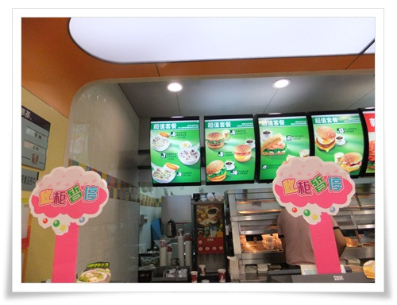

\- 메뉴는 중국 KFC에만 있다는 죽과 튀김으로.

\- 아침 식사.  9시 28분.

이 또한 맛있었지만 아침을 세번째 먹는터라 배가 터질 것 같다.

9시 45분.  아침 식사를 하고 찌모루 짝퉁시장을 향해 택시를 탔다.

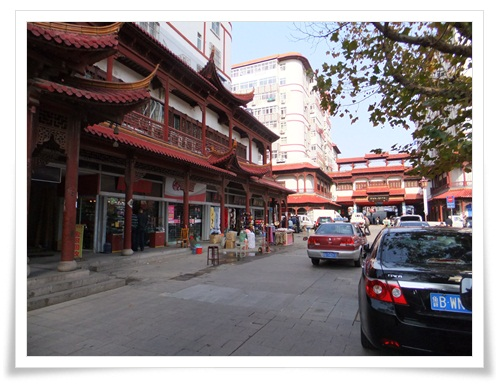

\- 20여분 달려 9시 57분. 찌모루 짝퉁시장에 도착했다.

\- 우리나라 관광객이 많은지 커피숖에 저렇게 크게 한글이 씌여져 있군.

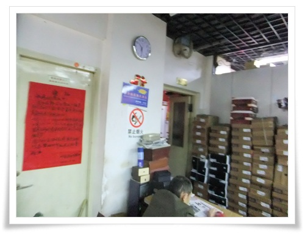

\- 짝퉁시장내는 화장실이 유료다.  1인당 3각(우리돈 50원).

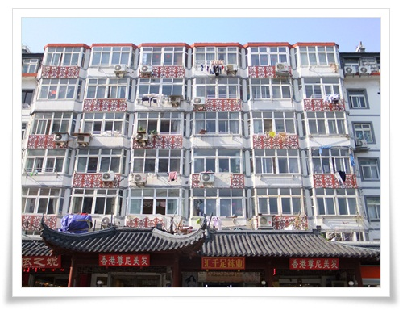

\- 뭔가 중국풍의 건물.

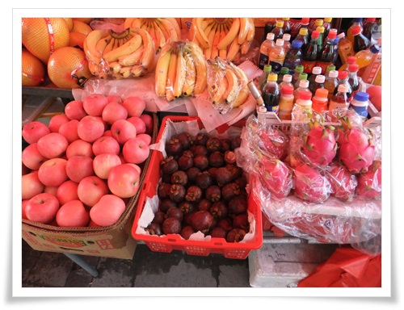

\- 과일가게에서 망고스틴을 발견했다.

\- 잘 익은 망고스틴.

역시 맛있다.

\- 석류도 하나 사서, 4조각으로 나눠 길거리에 먹었다.

새콤하니 맛있다.

11시 46분.  이제 아침밥도 꺼지고 하여 점심 만찬을 향해 택시를 탔다.

북경오리로 유명한 체인점 취안쥐더 주소를 향했다.

\- 15분 달려 12시에 도착한 곳.

그런데 취안쥐더가 안 보인다.

여기가 아닌 것 같다.

또 지도를 보며 위치 확인 중.

\- 취안쥐더를 찾기 위해 헤매는 중.

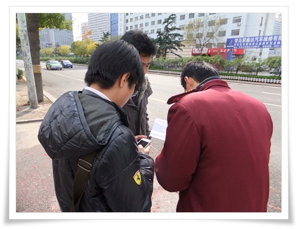

\- 근처 호텔 종업원이 길을 가르켜 줬다.

헌데 큰 도움은 안됐다.

\- 취안쥐더는 5.4광장 바로 옆에 있었다.

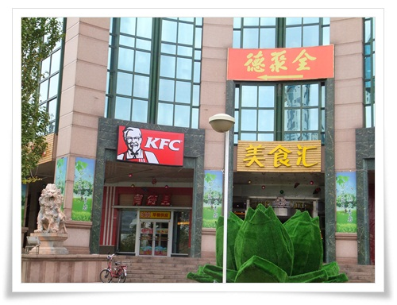

\- 취안쥐더 방향 표지판.

\- 아침먹고 09:40 ~ 13:54분 까지 움직인 경로.

호텔에서 택시타고, 찌모르 짝퉁시장 구경하고, 취안쥐더를 찾기 위해 헤맨 경로다.

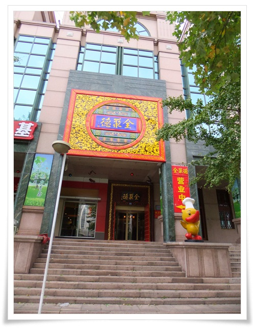

\- 12시 41분.  드디어 취안쥐더 도착.

40여분을 헤맸다.

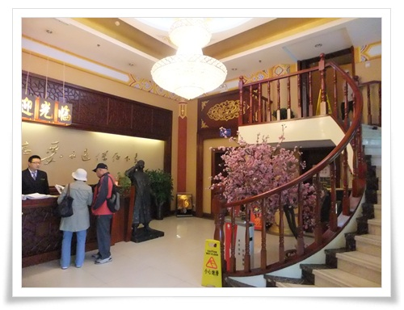

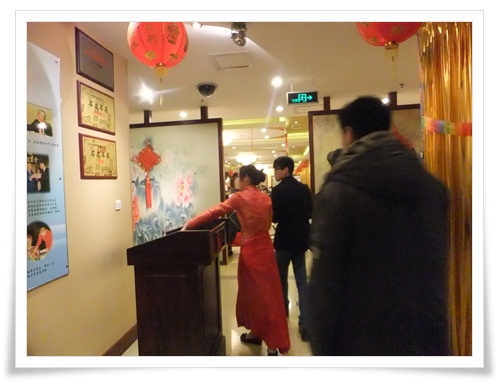

\- 종업원의 안내를 받으며 자리로 가는 중.

\- 북경오리 손질하는 요리사.

\- 새우 야채 볶음.  아주 맛있다.

\- 청경채, 버섯 볶음.  아주 맛있다.

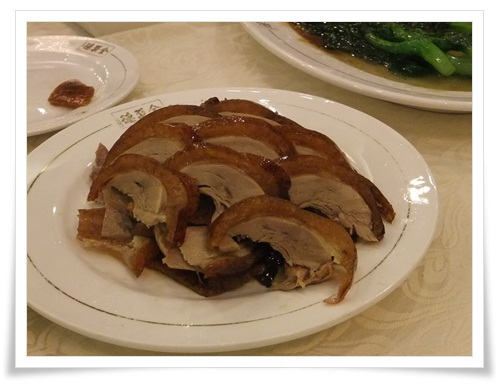

\- 북경 오리.  훌륭한 맛이다.

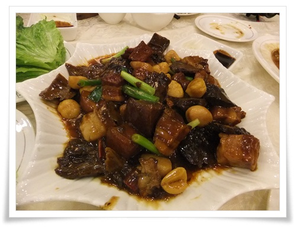

-동파육.  역시 맛있다.

\- 해삼주스.  가격에 비해 맛은 그저그렇다.

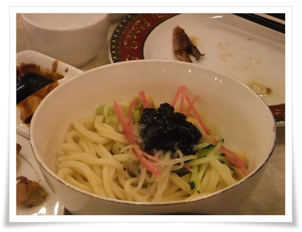

\- 중국식 짜장면.  그냥 호기심일뿐 맛은 별로..

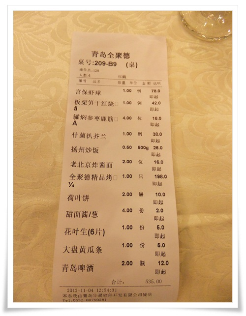

\- 취안쥐더 계산서.  총 535위안(우리돈 10만원).

많이도 먹었다.

2시. 배부른 점심 만찬을 끝냈다.

\- 과식한 배를 꺼뜨리기 위해 5.4 광장 일대 관광을 시작했다.

\- 해변가에는 역시 굴 캐는 사람들이 많다.

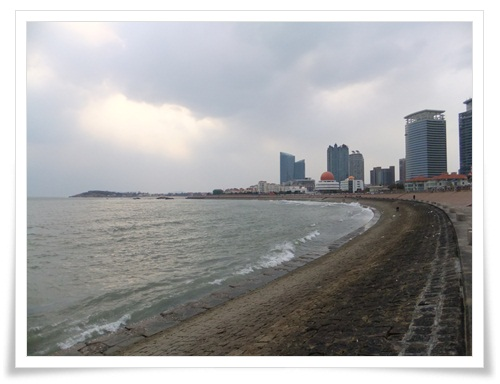

\- 해수욕장.  쭉 걸어갔다.

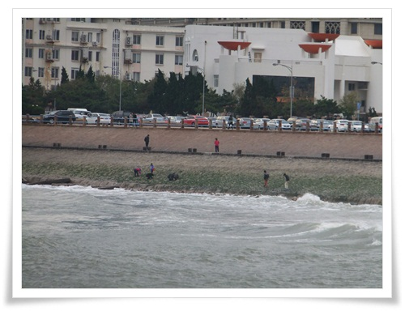

\- 저 멀리 뭔가를 잡는 사람이 보였다.

호기심 충족을 위해 걸어갔다.

\- 걸어가다 지쳐 쓰러진 김경현과장.

\- 광장에 스케이트 보드 타는 여학생이 보인다.

나도 여기서 타보고 싶더군.

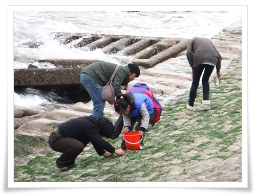

\- 10여분 걸어 도착했다.

나무꼬챙이로 돌틈을 건드려 잡고 있다.

\- 잡은 것은 작은 게다.

2시 42분.  산책으로 배도 어느 정도 꺼뜨렸겠다, 다음 관광지 영빈관으로 가기로 하고 택시를 잡으려 했다.

\- 택시가 안 잡힌다.

2시 58분.  택시 잡는 것을 포기하고, 버스를 탔다.

일단 같은 방향의 버스를 올라타고, 요금을 물어보니 1위안(200원)이라고 했다.

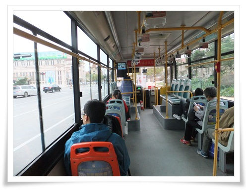

\- 깨끗한 버스 내부.

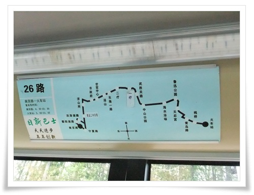

\- 버스 노선표.  어디서 내려야할지 모르겠다.

3시 13분.  해군박물관에서 두어 정거장 지나 내렸다.

내린 곳에서도 빈 택시가 없어, 영빈관까지 걸어갔다.

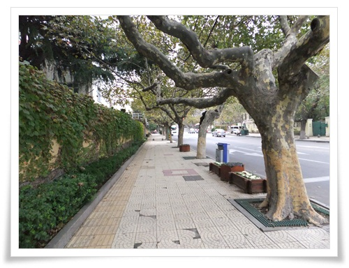

\- 독일 영빈관을 향해 걷는 중.

\- 동근 지붕 건물로 올라가는 매표소가 보인다.

저 산이 신호산이라고 하는군.

\- 영빈관을 향해 계속 걸었다.

3시 30분. 영빈관 입구 도착.

\- 드디어 영빈관 입구 도착했다.

\- 이게 독일 식민지 시절에 지어진 영빈관이라고 한다.

생각보다 건물 크기는 작다.

내부는 사진 촬영 금지라 사진을 안 찍었다.

별로 찍을 만한 것은 없었다.

\- 영빈관에서 내려오면서 본 풍경.

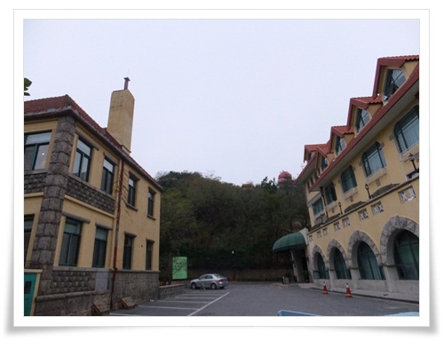

\- 영빈관은 산 7부 능선쯤에 있는 것 갔다.

빨간 둥근 지붕이 보인다.

4시. 영빈관 관람을 마치고 해군박물관으로 가보기로 했다.

역시 빈택시가 없기에, 그냥 걸었다.

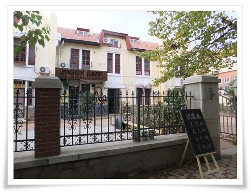

\- 다들 추위에 떨었다.

가는 길에 보인 커피점에 들어갔다.  4시 23분.

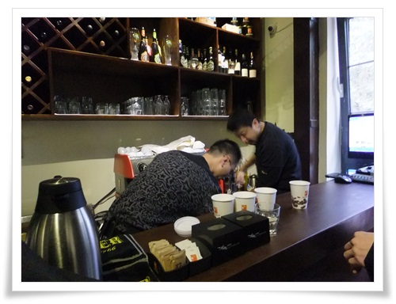

\- 커피숖에서 커피 기다리는 중.

아메리카노가 10위안(우리돈 3천원).

4시 36분.  드디어 빈택시를 잡아 해군박물관으로 향했다.

헌데 해군박물관을 문을 닫았다.

바로 차를 돌려 춘화루가 있는 피차오위안거리로 향했다.

\- 꼬치구이 전문이라는 파차오위안 거리.

\- 생각보다는 골목이 작다.

\- 이 골목은 1902년에 생겼다고 한다.

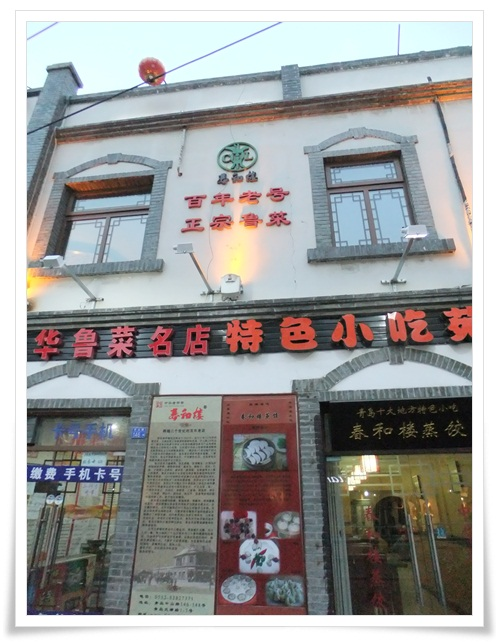

\- 첫날 그렇게 찾아 해멨던 춘화루가 피차오위안 들어갔다.

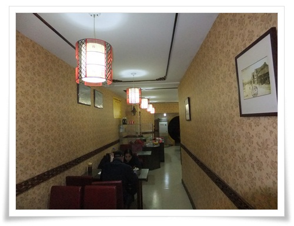

\- 춘화루 1층은 만두만 파는 거이고, 2층이 전문 고급 식당이다.

우리는 그냥 간단이 먹을 거라 1층으로 들어갔다.

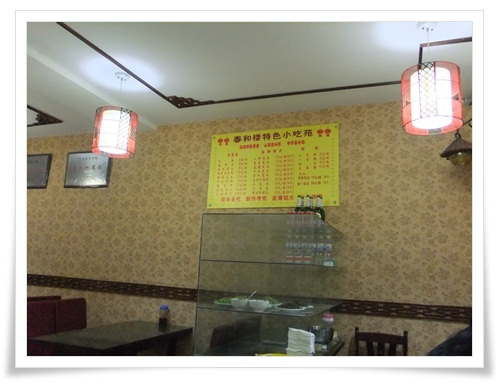

\- 춘화루 내부는 그리 깨끗하지는 않다.

\- 만두.  맛있다.

\- 점심식사이후 2시28분부터 5시 6분까지 해변가와 영빈관을 거쳐 춘화로에 움직인 경로

5시 31분.  춘화루에서 간단한 간식을 마친후 밖으로 나왔다.

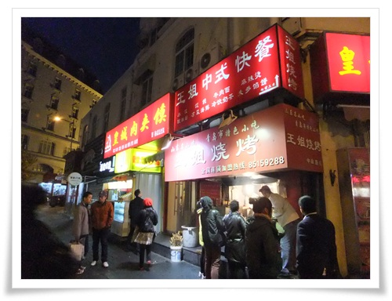

\- 양꼬치 파는 식당.

택시기사가 아주 유명하고 맛있는 곳이라고 한 곳이다.

줄 서서 기다렸다.

\- 많은 사람들이 기다리고 있다.

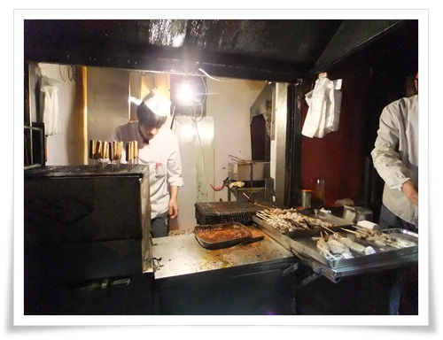

\- 바쁘게 꼬치 굽고 있다.

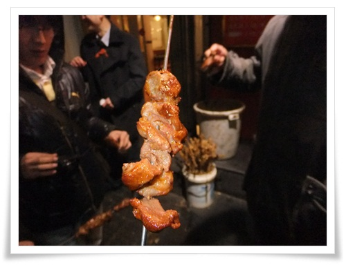

\- 4위안짜리 양꼬치.  맛이 예술이다.  훌륭한 맛이다.

다시금 사진으로만 봐도 침이 고인다.

간식을 먹은 터라, 저녁 만찬을 할 때까지 배를 꺼뜨려야 했다.

근처에 있는 Parkson 백화점이나 구경하기로 하고 들어갔다.

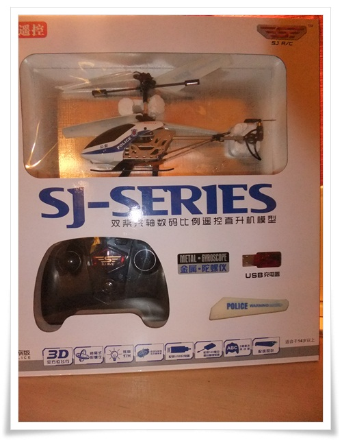

\- 백화점에서 산 3채널 RC헬기.

99위안(우리돈 18,000원).

생각보다 잘 날더군.

6시 36분.  이제 이번 여행의 마지막 만찬을 즐기려 택시를 탔다.

목적지는 칭다오미식거리.

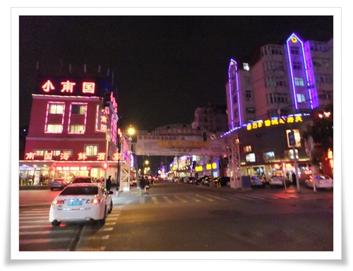

\- 칭다오 먹자골목에 다시 도착.

그런데 그렇게 왁자지껄하지는 않다.

일요일 밤이라서 그런가보다.

일단 거리를 한번 다 휘어저봤지만 크게 땅기는 것은 양꼬치집밖에 없었다.

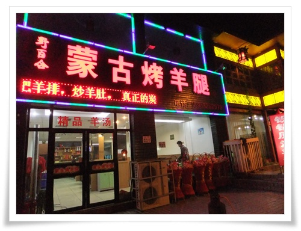

\- 양꼬치집에 들어갔다.

간판에서 보이듯이 몽고식이다.

\- 식당 내부

\- 중국답지 않게 셀프서비스인가 이 식당의 특징이다.

\- 주문한 양꼬치와 토마토계란요리가 나왔다.

양꼬치는 역시 맛있었다.

\- 춘화루에서 칭다오먹자골목 양꼬치식당까지의 이동 경로

9시.  저녁 만찬을 마치고 마트로 갔다.  마지막 군것질을 위해..

마트에서 석류랑 중국 과자를 몇개 사가지고 호텔로 돌아온 시각 밤 10시.

이틀간 너무 무리하게 움직였는지, 입술에 물집이 생기려 했다.

\-\-\--

**2일차 여정**

\\* 06:00 기상

\\* 06:30 ~ 07:50 아침 산책

\\* 08:00 ~ 08:40 김경현과장과 시장 산책

\\* 08:40 ~ 09:00 호텔방에서 휴식

\\* 09:00 ~ 09:00 호텔 로비에서 아침 경로 의논

\\* 09:20 ~ 09:40 KFC에서 아침식사

\\* 09:45 ~ 10:00 지모루 짝퉁시장으로 이동

\\* 10:00 ~ 12:00 짝퉁시장 구경

\\* 11:45 ~ 12:00 까르푸 앞으로 이동

\\* 12:00 ~ 12:40 취안쥐더 시장을 향해 헤메기

\\* 12:40 ~ 14:00 점심 식사 - 북경오리

\\* 14:00 ~ 14:40 5.4 광장과 해변가 산책

\\* 14:40 ~ 15:00 택시 잡기 시도

\\* 15:00 ~ 15:30 독일 영빈관으로 이동

\\* 15:30 ~ 16:00 영빈관 구경

\\* 16:00 ~ 16:20 커피솦으로 이동하여 커피 주문

\\* 16:35 ~ 16:30 해군박물관 가려다 문 닫아 춘화루 있는 곳으로 이동

\\* 17:00 ~ 17:30 춘화루에서 만두

\\* 17:30 ~ 18:00 춘화루 근처에서 양꼬치

\\* 18:00 ~ 18:30 Parkson 백화점 쇼핑

\\* 18:30 ~ 19:30 미식가 거리로 이동

\\* 19:30 ~ 21:00 양꼬치 집에서 저녁식사

\\* 21:00 ~ 21:10 RT 마트로 이동

\\* 21:10 ~ 21:50 RT마트에서 쇼핑

\\* 22:00 호텔 복귀, 취침

**2일차 쓴 돈 : 70,540원**

\\* (공동)KFC에서 아침식사 : 24위안

\\* (공동)지모루까지 택시 : 15위안

\\* (공동)지모루 화장실 : 6각(나&김경현)

\\* 지모루에서 망고스틴 : 25위안(5개)

\\* 석류 : 5위안

\\* (공동)취안쥐더를 가기 위해 까르푸까지 택시 : 17위안

\\* (공동)취안쥐더 식당 : 535위안

\\* (공동)5.4광장에서 영빈관쪽으로 버스 : 4위안 (1인 1위안)

\\* (공동)영빈관 입장료 : 52위안(1인당 13위안)

\\* (공동)영빈관에서 나와 커피숖에서 커피 : 45위안(아메리카노 3잔, 라떼 1잔)

\\* (공동)피차오위안까지 택시비 : 30위안

\\* (공동)춘화루 : 60위안

\\* (공동)춘화루 근처에서 양꼬치 : 14위안(개당 4위안)

\\* Parkson 백화점에서 헬기 : 99위안

\\* (공동)닝샹루 먹자골목까지 택시 : 20위안

\\* (공동)미식거리에서 양꼬치 : 191위안

\\* (공동)호텔까지 택시비 : 9위안

\\* RT마트에서 건전지, 석류 등 구매 : 20위안

**소계**

\\* 현지 교통비 : 95위안(15+17+4+30+20+9)/4명 = 24위안(우리돈 4,160원)

\\* 식비 :  869위안(24+535+45+60+14+191)/4명 + 25 + 5 + 20 = 268위안(우리돈  46,770원)

\\* 장난감구매 : 99위안(우리돈 17,330원)

\\* 관광 : (52)/4명=13위안(우리돈 2,280원)

