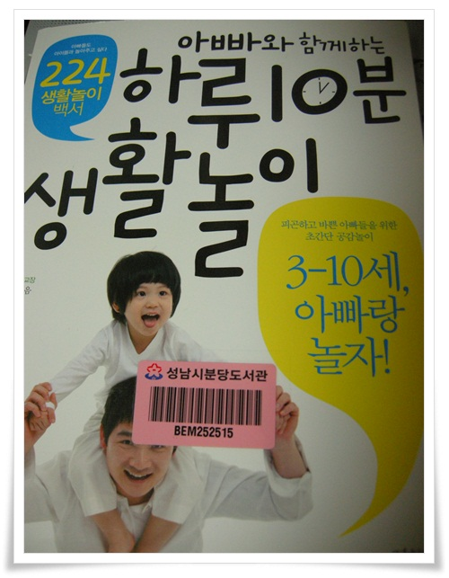
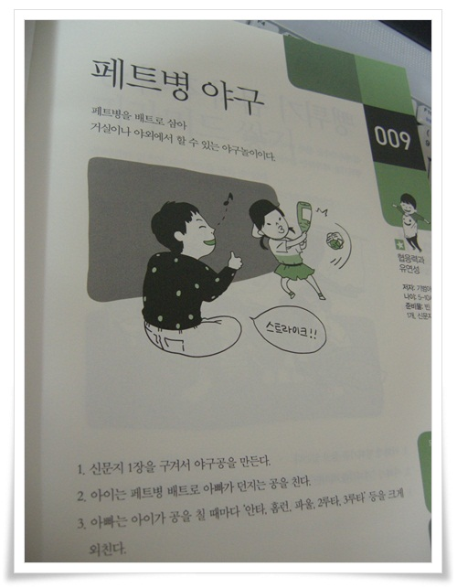

# \[책\]아빠와 함께하는 하루10분 생활놀이

딸내미와 노는 것이 그리 쉽지만은 않다.

놀아 준다고 놀아주지만, 뭐가 재밌게 놀 수 것도 바닥나고 한 차에, 신간 서적 소식이 들렸다.

책 제목이 "아빠와 함께하는 하루 10분 생활놀이".

도서관에 구입신청을 했다.

희망도서로 신청한 책이 왔다는 문자를 받고 도서관에 갔다.

\- 도착한 책.

224가지 집에서 할 수 있는 놀이가 나와 있다.

\- 그 중 한가지, 페트병 야구놀이.

거실에서 하는데, 딸내미가 아주 재미있어 한다.

책에 대한 딸내미의 반응은 아주 좋다.

직접 책을 가지고 와서, 몇번 놀이를 해 보자고 한다.

책 빌려온지 이틀만에 나와있는 놀이들은 한 번씩 다 해 봤다.

책을 읽고 나니, 일단 아는 놀이 가짓수가 늘어, 애와 좀 더 재밌게 놀 수 있다.

