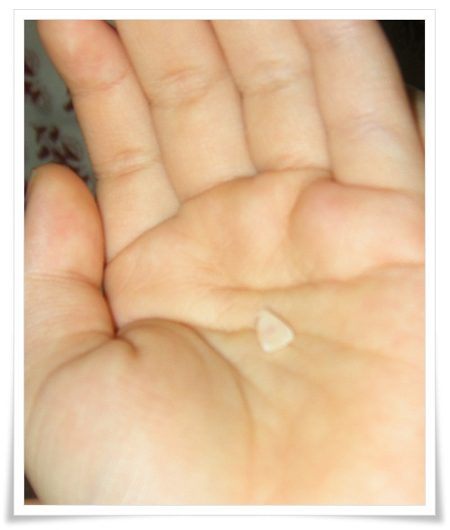
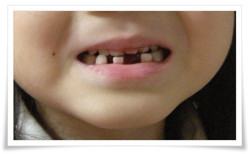

# 딸아이 첫 이빨 뽑기

- 2012/10/06 08:26

딸내미의 이가 흔들린다고 했다.

처음으로 이가 흔들리는 것이 무서웠는지, 딸내미는 거울보며 흔들리는 이를 보며 울고불고했다.

딸내미 이빨 뽑기 작전에 돌입했다.

먼저 어느정도 흔들리는지 확인해보기로 했다.

이를 만질 수 있게 허락받는데 까지 설득의 시간이 필요했다.

이가 많이 흔들려 쉽게 뽑을 수 있을 것 같았다.

어떤 도구를 사용하여 뽑을까를 생각했다.

내 손? 롱노우즈? 실?

가장 대중적인 실로 하기로 하고, 실을 이빨에 걸었다.

이빨에 걸자 딸내미는 더더욱 무서워하였다.

안정을 할 시간을 준 후, 이빨을 뽑겠다고 하고서, 실을 잡아 당겼다.

\- 딸내미 손에 놓인 처음으로 뺀 이빨

\- 이 빠진 모습

나의 어렸을 때 이 뽑던 생각이 난다.

주로 아버지가 니퍼로 이빨 뽑아 주었다.

가끔 격오도서지역 순환 병원선이 오면 그 때 썪은 어금니를 뽑기도 했었는데,...

