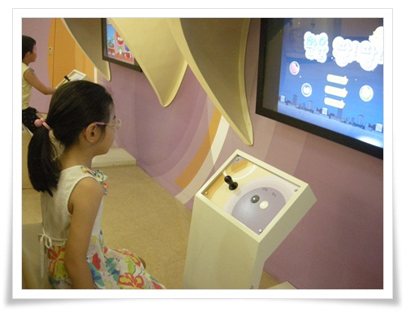
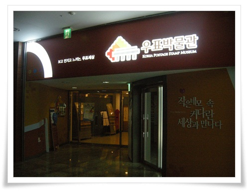

# 명동 화폐금융박물관 우표박물관

명동에 근무한지 어언 2년이 되어간다.

동네탐험을 하면서 언젠가 딸내미 데리고 명동도 한번 와야지라고 생각은 하지만 막상 실행은 지금에서야 했다.

점심 먹고 산책할 때 주로 갔던 곳이 남산, 한국은행 화폐금융박물관, 중앙우체국 우표박물관, 우리은행 은행사박물관.

일요일에는 회사 주차장에 무료 주차할 수 있어 차를 가지고 왔다.

관람코스는 화폐금융박물관과 우표박물관.

\- 먼저 간 곳은 한국은행 화폐금융박물관.

화요일부터 일요일까지 오픈.

\- 박물관 내부.

\- 1층에 어린이 대상 금융지식을 알리는 게임이 있긴 한데 아직 7살인 딸내미에게는 어려운 수준.

\- 이 게임기는 고장.

\- 선택하면 역시 경제 지식을 동영상으로 보여주는 기계.

\- 소리가 너무 작아 전시물로서 별 역할을 못하는 것 같다.

\- 딸내미는 위폐감별하는 방법에 관심을 보인다.

\- 뒷편에는 커피판매점이 있다.

평일 점심시간에는 직장인들로 바글바글대는데 주말엔 한가하군.

주요 가격은 아메리카노 1,200원, 라떼 1,400원, 딸기스무디 2,200원.

\- 2층엔 한은갤러리.  '산세 그 힘찬 움직임'이란 주제로 한국화가 전시되어 있다.

\- 내부 사진 한장 찍었더니, 바로 뒤에 날라오는 '사진 찍으면 안되요'라는 날카로운 음성.

그럴려면 촬영금지라는 표지판이라도 세워놓던지...

혹시 내가 못봤나 해서 유심히 살펴봤지만 역시 그런 푯말 없다.

한은갤러리 데스크에 앉아 있는 사람의 역할이 입장객 감시인가보다.

\- 돈 창고 모형.  가끔 뉴스에서 봤던 모습이다.

\- 그리고 조폐공사에서 사용했던 기계들이 여러개 전시되어 있다.

\- 세계 여러나라의 화폐가 전시된 곳.

\- 스탬프로 돈 모양 도장을 찍을 수도 있다.

\- 퍼즐맞추기.

\- 화폐금융박물관 관람 마치고 스무디킹에서 스무디주문해서 기다리는 중.

비싼 스무디를 내 돈주고 마실리는 없고, 씨티은행에서 인터넷뱅킹가입자에게 날린 기프트콘으로..

\- 다음은 중앙우체국 건물 지하에 있는 우표박물관.

그런데 원래 입구는 막혀있다.

평일에만 이 입구가 열려 있고, 주말에는 1층 로비를 통해 들어가야 한다.

왜 그렇게할까 하는 의구심이 든다.

\- 우표박물관입구.

조명이 어둡고 사람이 별로 없다보니, 꼭 운영안하는 것처럼 보인다.

\- 한가한 박물관 내부.

\- 이곳도 어린이 대상 체험할 수 있는 장치들이 있다.

\- 체험기계들.  몇몇 기계들은 동작안하는 것도 있다.

\- 연도별 우표들이 있는 곳.

\- 딸내미가 가장 재미있어 했던 것은 우표에 색칠하기.

