# 비오는 날 검단산 

지난 번 [용마산](../10912382.html) 에 올라갔을 때 용마산하고 이어져있는 산이 검단산이라는 것을 알았다.

용마산도 마찬가지지만 검단산도 이름만 들었지 존재를 모르고 있었다.

그래서 검단산도 조만간 가봐야지하고 있다 드디어 가기로 했다.

8월25일 토요일 검단산을 향해 분당선을 타, 복정역에서 8호선으로 갈아타 천호역에 갔다.

이번엔 혼자가 아닌 배성이형과 함께다.

천호역에서 만나 112번 버스를 타고 검단산입구로.

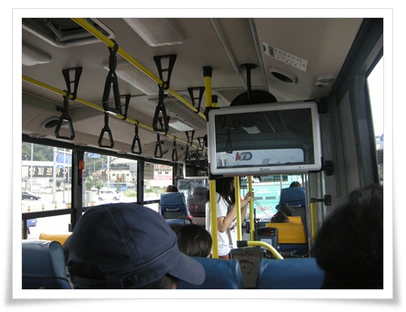

\- 112번 버스안.  역시 주말이라 등산객이 많다.

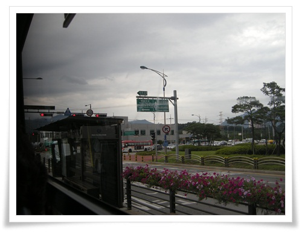

\- 집에서 출발할 때만해도 햇볕이 쨍쨍했는데 검은 구름이 영 불안하다.

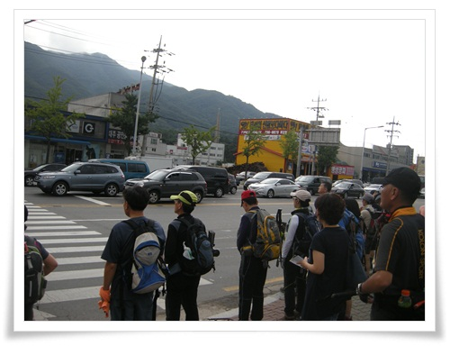

\- 애니메이션고교앞에서 하차하여 신호등 켜지기를 기다리는 중.

횡단보도를 건너자마자 비가 쏟아졌다.

근처 식당에서 비를 피하기는 했지만, 비가 그칠 기미는 안 보여, 그냥 빗줄기가 가늘어졌을 때 걷기 시작했다.

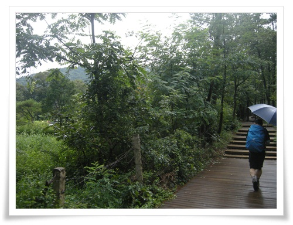

\- 비가 오니 이렇게 우산 쓴 산행객들만 보인다.

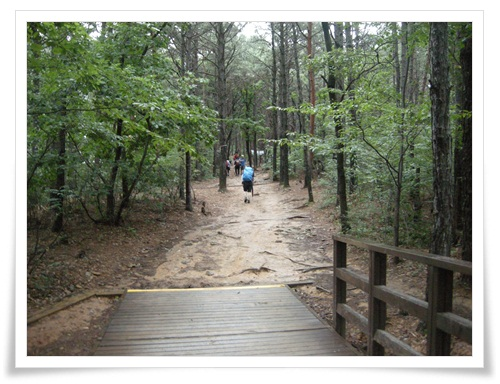

\- 입구에서 한 100m정도는 이렇게 나무바닥이 되어 있다.

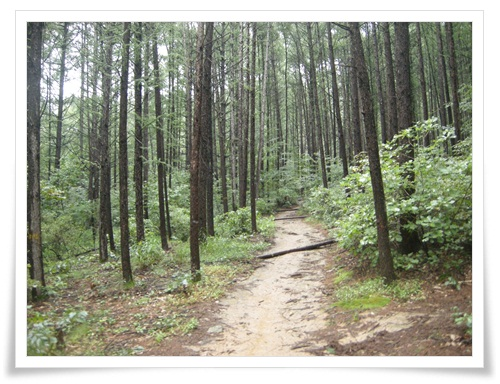

\- 본격적인 산길.

나무가 곧고 제법 울창하여 숲속을 걷는 맛이 난다.

\- 돌무덤도 보이고.

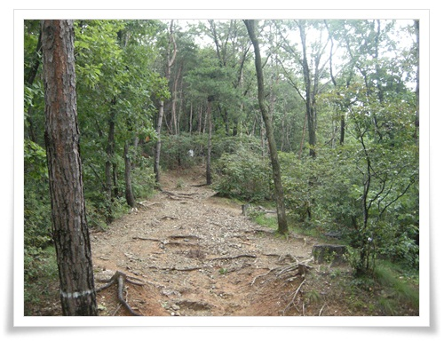

\- 여기서부터 능선 따로 올라가는 길.

올라가는 길은 제법 가파랐다.

그리고 오르막길이 계속 이어져 가벼운 산길은 아니더군.

특히 오르는 내내 비가 쏟아졌다 그쳤다 하여 우중산행이 그리 편하지 않았다.

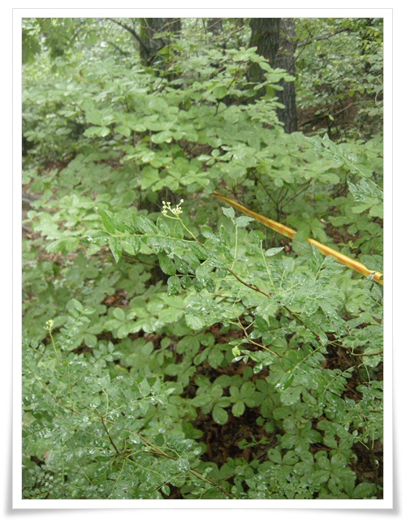

\- 쉬는 도중 만난 산초나무.

이름답게 이 나무의 열매가 추어탕에 쓰이는 산초.

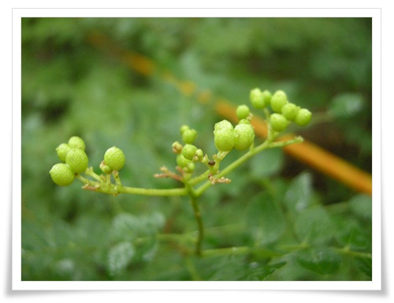

\- 산초열매.

따서 먹어봤다.

알싸한 맛이 추어탕집에서 넣어 먹던 것보다 훨씬 맛이 좋았다.

오늘의 점심 메뉴는 추어탕으로 결정.

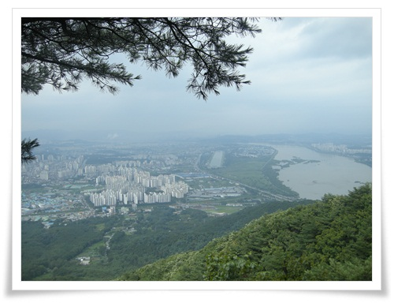

\- 오르는 길 중간에 바라본 하남시와 한강.

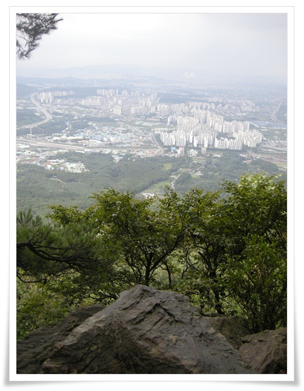

\- 하남시도 고층 아파트가 많이 생겼군.

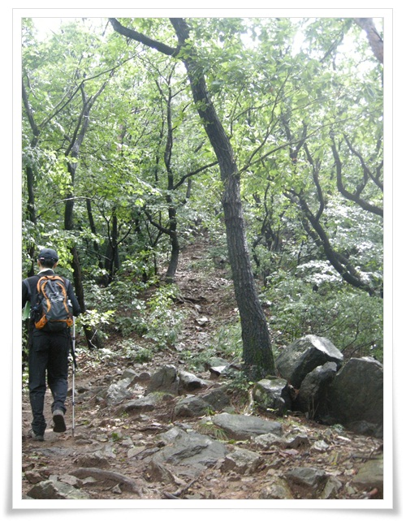

\- 다시 정상을 향해.

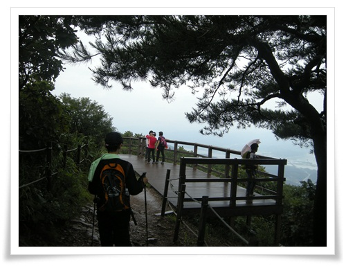

\- 전망대 도착.

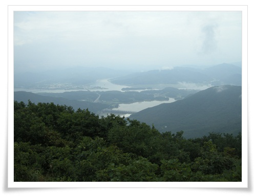

\- 전망대에서 본 북한강,남한강,두물머리,한강

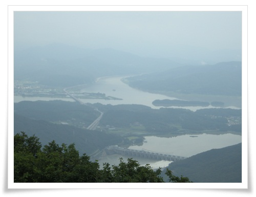

\- 팔당뱀은 수문 3개를 열고 방류중이군.

\- 올라간 거리.  2.3km, 1시간20분.

조금 더 가면 검단산 정상이 있지만, 이번엔 전망대까지만 가기로 했다.

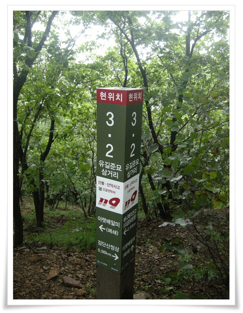

\- 하산길은 유길준묘쪽으로.

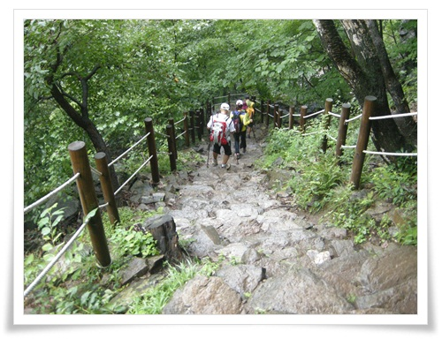

\- 이쪽 길은 돌계단.

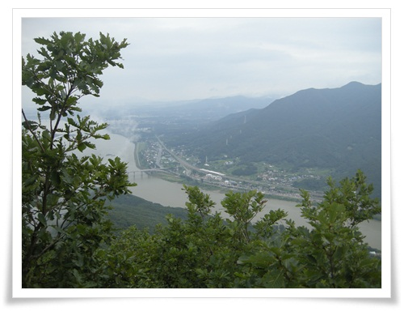

\- 옆에 보이는 한강.  저 길이 양평으로 가는 터널 들어가는 길.

주말답게 외곽으로 나가는 길 정체가 심하다.

저 도로를 타고 운전할 때면 항상 오른쪽으로 보이는 검단산을 보기는 했는데, 이제야 올라와 본다.

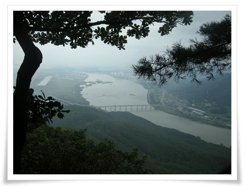

\- 왼쪽에 미사리조정경기장도 보인다.

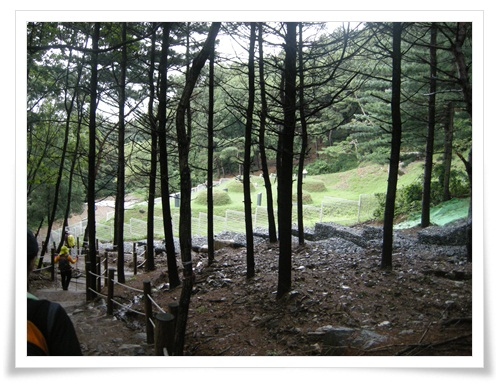

\- 유길준묘.  조선최초의 국비유학생이라고 국사시간에 배운 기억이 난다.

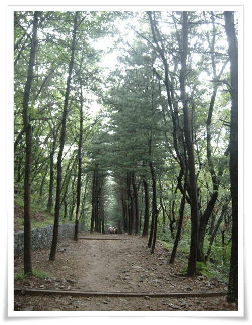

\- 내려가는 길 좌우로 도열해 있는 나무를 보니 가을에 걷기 좋을 듯 하다.

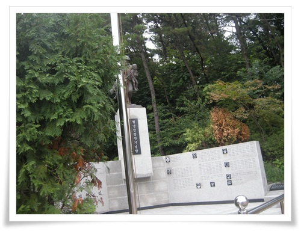

\- 등산로 입구에 있는 월남전 참전 기념탑.

명분도 없는 남의 나라 전쟁에 참전한 것인데 기념을 하는군.

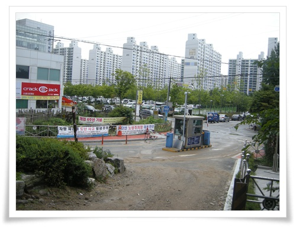

\- 다 내려왔다.

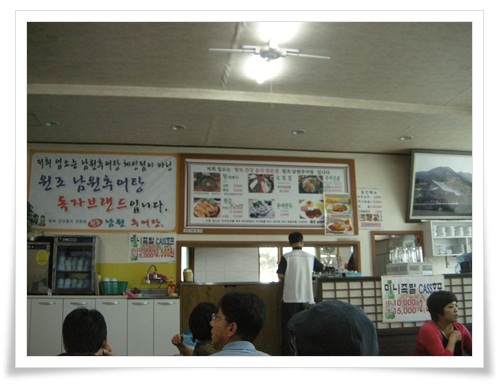

\- 점심은 애니메이션고요 사거리에 있는 남원추어탕집에서 추어탕.

얻어 먹은 점심이라 그런지 더더욱 맛있더군.

