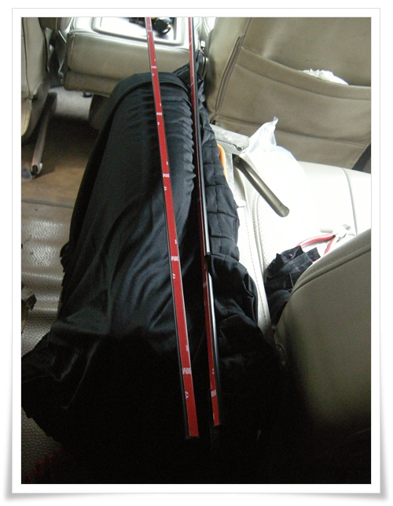
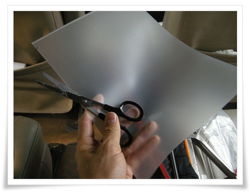
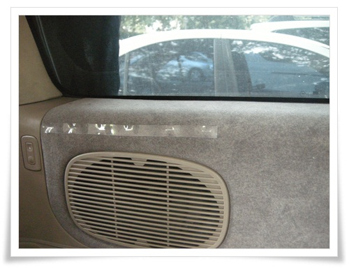
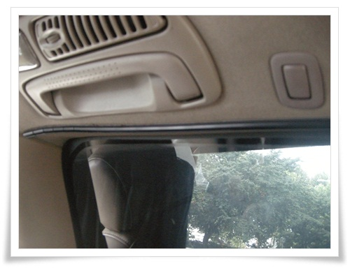
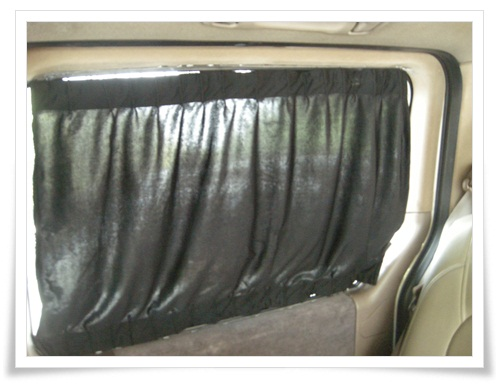
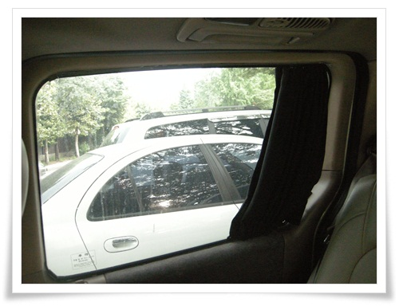

# 카니발에 커튼 직접 단 커튼

카니발이 창문이 꽤 크다.

썬팅이 되어 있지만, 그래도 강렬한 여름 햇볕에서는 뜨겁다.

차에다 커튼을 달아보려 2년전 옥션에서 커튼을 구매했었다.

결과는 실패.  도어트림이 천재질이라 강력양면테잎도 붙어 있질 못했다.

올 여름 뜨거운 햇볕아래 6시간 운전하는 동안, 2열에 앉은 딸내미가 햇볕을 피해 이리저리 움직이는 것을 막아보고자 다시 시도해보기로 했다.  2년전 장착 실패했던 그 것을 다시 꺼내 들었다.

\- 다시 꺼내든 차량용 커튼 세트.

2년전 얼마주고 샀었나 옥션 검색해보니, 한쌍에 18,000원정도 되는 것 같다.

\- 얇은 플라스틱 재질의 종이철을 이용하기로 했다.

\- 길게 자른 것을 커튼 레일 장착 위치에 대해 타카로 박았다.

12년 넘은 차이기에 타카로 박지, 좀 더 젋은 차면 안했을 듯 싶다.

\- 이렇게 비닐을 타카로 박사, 그 비닐과 레일을 양면테잎으로 고정.

\- 2열 설치 완료 모습.  영 후줄근하군.

\- 커튼을 제쳤을 때의 모습.  역시 후줄근하다.

2열과 3열 이렇게 차에다 커튼 단 것 자체는 완료했으나, 만족감은 영...

햇볕 강렬할때 효과는 있겠지만 영 폼이 안난다.

왜 업체에서 차에다 커튼 시공해주는데 왜 30만원이 훌쩍 넘는지 이해가 간다.

