# 라푸마 이벤트로 간 영덕 NOS캠핑장 그리고 고래불해수욕장

rss로 구독중인 예문당 블로그에서 라푸마에서 캠핑 소식을 듣고 일단 응모했다.

응모하기는 했으나, 내가 횡재운이 없는 것을 알기에 그냥 잊고 지내다가 문자를 받았다.

총 50식구를 초대하는 이벤트였는데, 참석 취소자가 제법 되었는지 대기순위로도 한참 떨어지는 내게 순번이 왔다는 거였다.

일정은 7월 29일 일요일부터 31일 화요일까지 2박3일.

장소는 경북 영덕군 창수리 NOS 위성약수 캠핑장.

참석여부는 참가비조로 되어 있는 여행자보험가입비 2만원을 내는 바로 내야하는 거라서, 아내에게 일정 확인을 한 후 입금했다.

본격적인 야영준비를 시작하며, 라푸마 홈페이지의 이벤트 안내문을 자세히 살펴보았다.

응모할때는 자세히 안봐서 몰랐었는데, 라푸마 텐트를 꼭 지참하라고 되어 있었다.

부랴부랴 라푸마 텐트를 빌려보려 했으나, 내 주변에 라푸마 텐트를 가진 사람이 없었다.

텐트 대여하는 업체를 알아보았는데, 이 때가 극성수기여 텐트 자체가 없고, 게다가 라푸마 텐트는 더더욱 없었다.

행사 담당자에게 전화를 걸어서 사정을 설명하니, 그렇다면 다른 텐트아니어도 된다고 하여 가벼운 마음으로 짐을 꾸려 출발했다.

아침 6시반에 출발했다.

영동고속도로 동수원IC로 들어가 중앙고속도로 서안동IC로 나왔다.

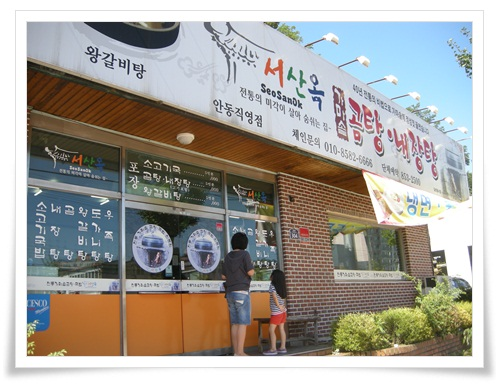

\- 서안동IC에서 나와 안동시내로 들어간 이 서산옥에서 아침을 먹기로 했다.

\- 소고기국밥과 왕갈비탕을 아침으로 먹었다.

맛 괜찮았다.

안동에서 한시간넘겨 구불구불한 산길을 달려 NOS캠핑장에 도착했다.

\- 이곳이  캠핑장 사무실

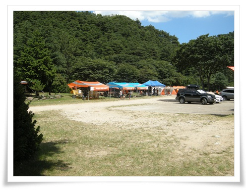

\- 저 곳이 라푸마 행사 진행 본부.

이날 영덕 기온이 38도로 아주 뜨거운 날이었다.

차에서 내리자 몸이 바로 익기 시작했다.

게다가 NOS캠핑장은 그늘이 별로 없었다.

\- 캠핑장 구석에 타프와 텐트를 쳤다.

\- 내 자리에서 바라본 풍경.

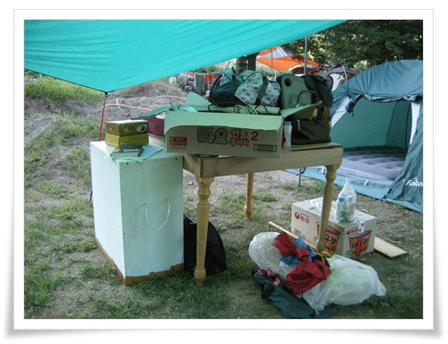

\- 이번 야영의 야심작인 테이블.

자투리 나무를 들고와 타카를 사용해 즉석에서 만들었다.

이 테이블을 1회용으로 2일차 밤에 땔깜으로 다 태웠다.

\- 해가 떨어진 7시쯤 본격적인 행사가 시작되었다.

\- 가위바위보 게임.

역시나 횡재운이 없는 나와 내 식구들은 초반 탈락.

\- 게임후 바로 바베큐 파티.

이 줄이 바케큐와 맥주를 받는 줄.

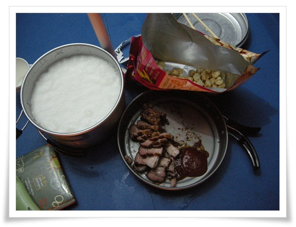

\- 맥주와 바베큐를 코펠에 받아 왔다.

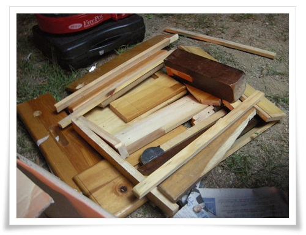

\- 이번에 태울려고 가져온 자투리 나무들.

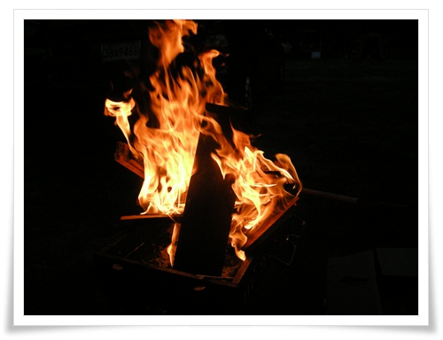

\- 폭염속에서 땔감으로 불장난하는 중.

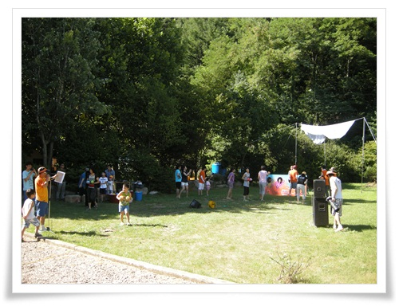

\- 2일차 아침은 물풍선 터트리기 게임 하나.

해가 뜨면 도저히 캠핑장에 있을 수가 없기에 서둘러 바다로 갔다.

네비게이션에 고래불해수욕장을 찍구 출발했다.

한 20분 정도 가니 해수욕장에 도착.

\- 고래불(실제로는 영리)해수욕장.

사람도 붐비지 않고, 물도 깨끗하였다.

\- 딸내미와 바다에서 놀고,

\- 그리고 모래성 쌓기도 하면서 10시부터 5시까지 놀았다.

그 덕이 이 하루만에 온 몸에 다 타서, 피부가 화끈거리는 상태가 되어 버렸다.

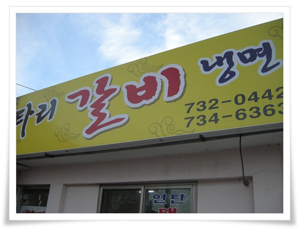

\- 저녁은 영해읍에 있는 로타리갈비집에 돼지고기.

자고로 지방에 있는 맛집을 별로 신뢰하지 않은 편이다.

지방에서 맛있는 식당은 결국 서울로 올라오게 되어 있고, 결국 서울에 있는 식당들이 치열한 경쟁을 하기 때문에 서울의 식당이 전국에서 제일 맛있다라는 생각을 가지고 있다.

특히 극성수기 피서지에서 뭘 먹을거라면 가장 편차가 덜한 돼지고기가 제일 낫다.

그리고 위치도 뜨내기 관광객대상이 아닌 현지인이 이용한 식당으로 가기 위해 영해읍내로 갔다.

그중 맘에 드는 간판이 로타리갈비.

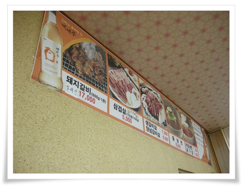

\- 돼지갈비 한판에 17,000원.  냉면 8,000원.

\- 연탄으로 초벌구이한 돼지갈비가 석판에 올라왔다.

제법 맛있었다.

그리고 물냉면을 시켜먹었는데, 국물이 정말 맛있었다.

\- 3일차 아침은 종이비행기 날리기 행사로 시작.

결과는 역시나 탈락.

장비 철수를 마치고 다시 해변으로 갔다.

이번엔 진짜 고래불해수욕장.

\- 보라카이 해변이 생각나는 바다다.

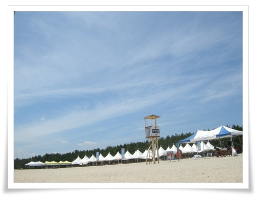

\- 연일 폭염이라는 하늘은 아주 맑다.

\- 집으로 복귀하는 길에 점심식사는 영덕군 읍내에 있는 시골밥상 식당.

\- 식당모양은 가정집 모양인데, 천정 높이가 제법 됐다.

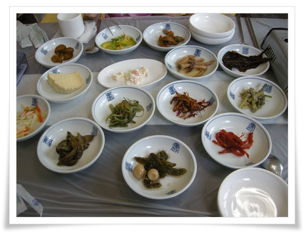

\- 반찬이 정갈하게 잘 나왔다.

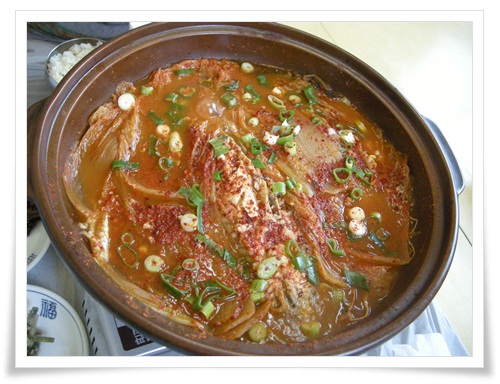

\- 시킨 음식은 이집의 주력메뉴라는 묵은지 고등어찜.

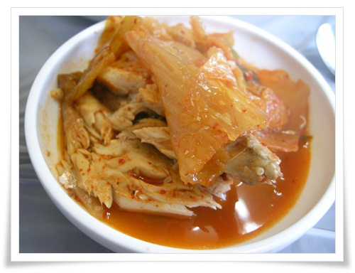

\- 고등어찜 이것 참 맛있었다.

\- 다시 집으로...

안동으로 가는 길에 지나간 안동댐.

극성수기에 갑작스런 캠핑이었는데, 참 재미있었고, 기억에 남는다.

후유증도 만만치 않아, 새까맣게 탄 피부로 회사에 복귀하니 휴가갔다온 것을 너무 티낸다는 말까지 들었다.

이번에 쓴 돈을 계산해 보았다.

1일차.

 - 고속도로통행료 : 10,500

\- 안동 서산옥에서 소고기국밥과 왕갈비탕 : 13,000

\- 안동 뚜레주르에서 빵 : 8,000

2일차.

\- 점심으로 즉석발열도시락 3개 : 15,000

\- 영덕 영해면 로타리갈비집에서 갈비와 냉면 : 30,000

3일차.

\- 고래불해수용장에서 샤워장 사용료 : 3,500

\- 영덕군 영덕읍 시골밥상에서 점심 : 28,000

\- 단양휴게소에서 구슬아이스크림과 커피 : 7,600

\- 고속도로통행료 : 10,500

\- 집근처에서 저녁 : 20,000

기타.

\- 캠프 참가비겸 여행자보험료 : 20,000

\- 왕복 600km 기름값 : 100,000

\- 과일등 기타 음식 : 50,000

총 316,100원.  막상 계산해보니 제법 나오는구나..

암튼, 이 초 극성수기에 난민촌이 아닌 괜찮은 캠핑장에서 휴가를 보낼 수 있게 해준 라푸마도 고맙고, 대기순위이 나에게 순번에 돌아올 수 있게 참가 취소한 앞선 사람들도 고맙고, 무엇보다 이런 정보를 알려준 [예문당](http://yemundang.com/) 에 감사함을 느낀다.

