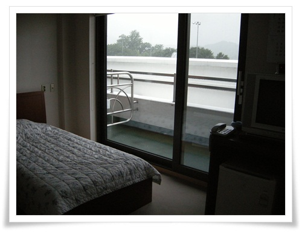

# 밥이 참 맛있었던 Kobaca 연수원

[작년에 이어](../10717877.html) 올해도 Kobaco 연수원에서 합숙 교육을 받았다.

2박3일간의 합숙 교육이라 설레는 시간이다.

교육때문이 아니라, 경치 좋은 곳에서 먹고 자고 뭘 한다는 것이 꼭 군대에서 야외기동훈련가던 그런 느낌이 든다(좋은 쪽으로..)

교육은 7월 18일 수요일부터 7월 20일 금요일까지 2박 3일.

Kobaco 연수원이 있는 양평군 강상면 화양리까지의 직선 거리가 40km가 채 안되어 집에서 한시면 가겠다 싶어 늑잠을 피우며 출발했는데, 출근 시간대 광주를 통과하는 길은 꽤 막혔다.  거의 두시간이 걸려 도착했다.  가까스로 지각을 면한 상태로 도착했다.

\- 축축히 비가 내리는 연수원 건물.

수요일밤부터 태풍이 서해를 통과하려 북상하여 비가 왔다.

내가 딱 좋아 하는 날씨다.

\- 비가 내리는 남한강을 유리창 너머로 바라보며 감상에 젖어보기도 한다.

\- 4인 1실의 숙소.  콘도에 비할바는 아니지만 그래도 괜찮다.

첫날 비가 와서 빗소리를 들으려 창문을 조금 열고 잤다.

\- 아침을 먹으로 가는 길.  역시 비 내리는 풍경은 좋다.

\- Kobaco연수원의 매력포인트는 바로 식당.

\- 오늘의 아침 메뉴.

한끼 단가가 9천원이라고 하더군.

\- 배식구

\- 나의 아침 식사.

이곳은 기본적으로 한식, 중식, 양식 이렇게 세가지가 한꺼번에 나오는 것이 특징인 것 같다.

모두 다 정갈하고 맛있다.

그래서 아침부터 과식을 아니 할 수 없게 만들었다.

\- 식사를 마치고는 남한강변을 잠시 산책한다.

\- 통유리 앞에 앉아 경치를 감상하기도 하고.

\- 교육시간중에는 이런 회의실에서 교육을 받는다.

\- 야간 교육시간때 야식으로 전달된 피자.

세끼를 과식하며 먹고 있는데, 매일 야식으로 피자, 통닭, 맥주까지 전달되어 살이 안찔래야 안 찔수가 없었다.

\- 이 연수원에 있는 야외수영장

\- 비 때문에 이날은 손님이 없었다.

이 야외 수영장이 일반인에게도 개방을 하더군.

대인 8천원, 소인 7천원.

나중에 딸내미 데리고 와야겠다.

