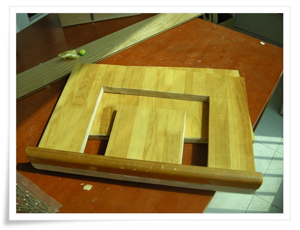
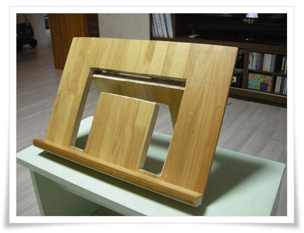

# [DIY] 독서대 만들기

아파트에 버려진 장롱 문짝이 원목이길래 일단 떼어 내고 봤다.

그걸로 뭘 만들어 볼까 하다가, 이번엔 독서대를 만들어 보기로 했다.

실용성은?   글쎄  없다.

실용성을 따진다면 다이소에서 파는 플라스틱으로 만든 중국산 독서대가 가격대성능비도 우수하고 훨씬 실용적이겠지.

나무에 대충 자를 위치를 표시후, 톱질 시작.

역시 톱질은 어렵다.

삐뚤빼뚤하다.

그리고 자르고 나면 항상 1~2mm의 오차.  그 오차로 안 맞았다.

톱질의 오류를 사포질로 가려보겠다고 사포질을 해 보지만, 사포질을 할 수록 모양은 점점 시궁창으로..

\- 암튼 뒷면에 경첩을 달아 마무리한 완성작

원래 계획은  뒷면에 나무판을 하나 더 대서 높이 조절을 할 수 있도록 하려 했으니, 오랜 사포질로 인한 피로감으로 그냥 미끄럼 방지 고무를 붙이는 것으로 마무리했다.

세상에 쉬운 일은 없군.  어렵다.

