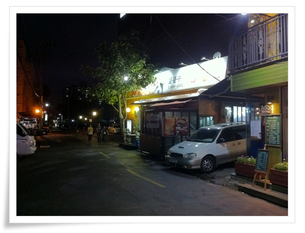
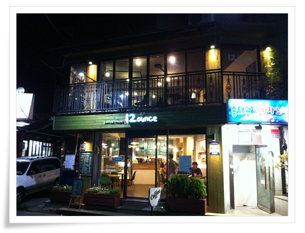
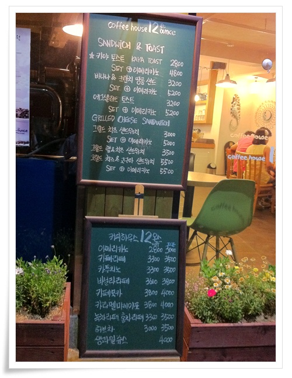
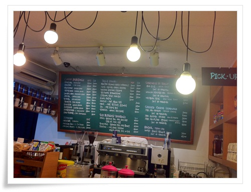
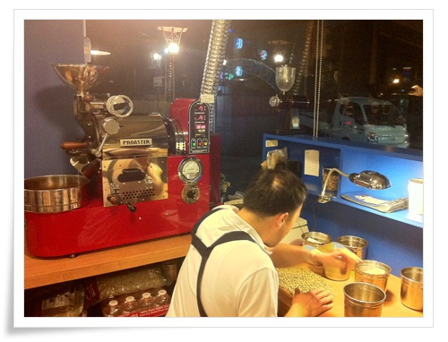
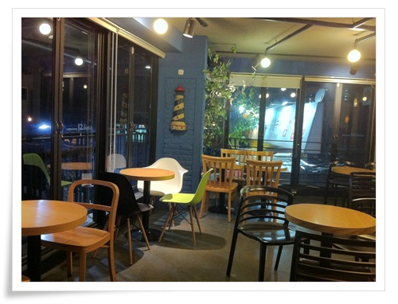

# 성수동 커피전문점 12온스

토요일 저녁 성수동 커피전문점 12온스에 갔다.

12온스라고 하기에 또 무슨 새로운 커피 체인점인가 했는데, 체인점은 아닌 자체 가게명이라는군.

내가 커피를 잘 마시지 않기도 하거니와 커피샾에서 커피 먹는것 자체가 이미 나이대가 지났다라고 여기는터라 갈 일이 없다.

위치가 성수역 먹자골목 성수족발근처, 예전 성수동으로 출근할 때 그 회사에서 멀지 않은 곳에 있었다.

성수먹자골목은 손님많다고 손님에게도 영 불친절한 성수족발때문에 내겐 인상이 좋지 않은 동네다.

그 동네에 나의 잘 아는 분이 운영하기 시작한 곳이라 어떻게 생겼나 구경을 간 셈이다.

성수동 출근하더 시절에 있었으면, 동네 탐험도 할겸 자주 놀러갔을 텐데 아쉽군.

\- 성수동은 여전히 어두컴컴하다.

특히 이 동네도 직장인이 많은 동네라 주말 저녁은 한산하다.

\- 동네분위기가 커피전문점과는 왠지 잘 안 어울리는 듯.

바로 바로 옆 송대관노래방과 왼쪽의 삼겹살집하고는 특히..

그래도 1,2층으로 되어 나름 멋지군.

\- 문앞에 메뉴와 가격표가 있는게 맘에 드는군.

가격을 먼저 확인하여 들어갈 지 말지 결정할 수 있으니..

\- 1층 주문대.

주문대 왼편에 로스팅하는 기기가 있고, 실제 거기서 로스팅을 한다는군.

\- 로스팅이라는 게 이렇게 하는 거로군.

원두에서 불량콩을 찾아서 제거한 다음 로스팅기계로 볶는 건가 보다.

\- 2층 내부.  두면이 통 창으로 되어 있어 실내가 꽤 괜찮다.

이런 곳이 내 작업장이면 참 좋겠다라는 생각을 해 본다.

커피 전문점 와서 정작 내가 시켜먹은 먹은 것은 달달한 카페모카.

나에게 커피는 자고는 단맛(모카)으로 먹거나, 시원한 맛(아이스아메리카노)으로 먹거는 것이기에..

커피를 먹으면서 새삼 생각는 것은 6년전 독일 출장지 호텔에서 매일 아침 먹던 에스프레소.

좋은 기억이 많은 출장지라 모든게 다 좋게 느껴져서그런가, 그때의 커피맛이 그리워진다.

